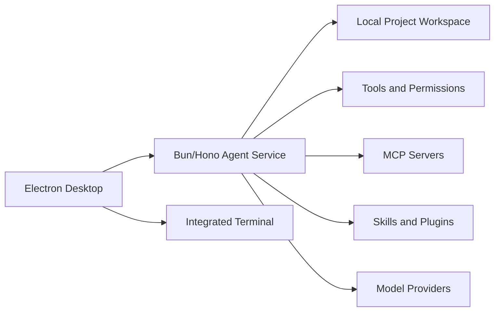

<div align="center">
  

  <h1>Anybox</h1>

  <p><strong>Open-source desktop workspace for local AI agents.</strong></p>
  <p>Run agent sessions, review tool traces, manage MCP servers, and work with local projects from one inspectable desktop app.</p>

  <p>
    English |
    <a href="./README.zh-CN.md">简体中文</a> |
    <a href="https://github.com/fanfan-de/anybox/releases/latest">Download</a> |
    <a href="./packages/site/src/docs/content">Documents</a> |
    <a href="./docs/anybox-third-party-plugin-development.md">Development</a> |
    <a href="https://github.com/fanfan-de/anybox/issues">Feedback</a>
  </p>

  <p>
    <a href="https://github.com/fanfan-de/anybox/releases/latest"></a>
    <a href="https://github.com/fanfan-de/anybox/actions"></a>
    <a href="./LICENSE"></a>
    
    
  </p>

  <p>
    
  </p>

  <table>
    <tr>
      <td align="center"><strong>Official Site</strong><br /><sub>Placeholder for public website URL</sub></td>
      <td align="center"><strong>Community</strong><br /><sub>Placeholder for Discord, Telegram, or WeChat</sub></td>
      <td align="center"><strong>Showcase</strong><br /><sub>Placeholder for media, awards, or launch cards</sub></td>
    </tr>
  </table>
</div>

## Overview

Anybox is an open-source desktop workspace for working with AI agents on local projects. It brings project folders, agent conversations, terminals, model and provider settings, skills, MCP servers, permissions, patches, and tool traces into one inspectable Electron app.

The repository is a `pnpm` workspace. The main desktop product lives in `packages/desktop`; the local agent runtime and HTTP service live in `packages/anyboxagent`.

## Highlights

- Open local project folders as agent workspaces.
- Run multi-turn agent sessions with visible reasoning, assistant output, tool calls, permission requests, errors, and patches.
- Use a managed local agent service by default, or connect the desktop app to a custom agent endpoint.
- Work with an integrated terminal powered by `node-pty` and `xterm`.
- Configure model providers, MCP servers, skills, plugins, and project-scoped settings from the app.
- Review workspace changes and use Git-oriented desktop workflows for commits and pushes.
- Pair with the companion mobile app package for remote desktop control workflows under active development.

## Download

Installers are published from GitHub Releases:

- [Latest release](https://github.com/fanfan-de/anybox/releases/latest)
- Current primary desktop targets: Windows x64 and macOS Apple Silicon.

## Platform Status

| Platform | Status | Notes |
| --- | --- | --- |
| Windows x64 | Early access | Primary desktop target |
| macOS Apple Silicon | Early access | Primary macOS target |
| Android | In development | Companion app package lives in `packages/mobile-app` |
| Linux | Planned | Desktop packaging is not a primary target yet |

## Architecture



## Quick Start

### Requirements

- Node.js 22+
- pnpm 10.28+
- Bun 1.3+

### Install

```bash
corepack enable
pnpm install
```

### Run The Desktop App

```bash
pnpm dev
```

The desktop app starts the local Anybox agent service automatically by default.

### Run The Agent Service Manually

Use this when you want to inspect or debug the backend independently:

```bash
cd packages/anyboxagent
bun run dev:server
```

The service listens on `http://127.0.0.1:4096` by default.

To make the desktop app connect to an already running service instead of starting its managed service:

```powershell
$env:ANYBOX_DISABLE_MANAGED_AGENT="1"
$env:ANYBOX_AGENT_BASE_URL="http://127.0.0.1:4096"
pnpm dev
```

## Common Commands

```bash
pnpm dev
pnpm build
pnpm dist
pnpm test
pnpm typecheck
pnpm verify:versions
```

Package-specific checks:

```bash
pnpm --filter anybox-desktop-agent typecheck
pnpm --filter anybox-desktop-agent test
pnpm --filter anyboxagent exec tsc --noEmit -p tsconfig.json
pnpm --filter @anybox/shared typecheck
pnpm --filter @anybox/shared test
pnpm --filter @anybox/platform typecheck
pnpm --filter @anybox/platform test
pnpm site:build
```

## Repository Layout

```text
.
|-- .github/                 GitHub Actions and contribution templates
|-- docs/                    Architecture, plugin, connector, and feature notes
|-- packages/
|   |-- desktop/             Electron desktop application
|   |-- anyboxagent/         Bun/Hono agent service and core runtime
|   |-- shared/              Shared API and IPC contracts
|   |-- platform/            Platform adapter utilities
|   |-- monitor/             Monitor web UI
|   |-- site/                Public website and docs
|   |-- mobile-app/          Companion mobile app
|   |-- browser-extension/   Browser integration package
|   `-- browser-native-host/ Native host for browser integration
|-- plugins/                 Bundled and local plugin packages
|-- scripts/                 Repository maintenance scripts
|-- package.json             Workspace entrypoint scripts
`-- pnpm-workspace.yaml      Workspace package configuration
```

## Documentation

- [Desktop package notes](./packages/desktop/README.md)
- [Third-party plugin development](./docs/anybox-third-party-plugin-development.md)
- [Connector development guide](./docs/connector-development-guide.md)
- [Plugin module v1](./docs/plugin-module-v1.md)
- [Local connector design](./docs/plugin-local-connectors-design.md)
- [Automation feature design](./docs/automation-feature-design.md)
- [Planner module design](./docs/planner-module-design.md)
- [Thread view frontend design](./docs/thread-view-frontend-design.md)
- [Mobile desktop control implementation](./docs/anybox-mobile-desktop-control-implementation.md)
- [Public website docs](./packages/site/src/docs/content)

## Roadmap

- Replace the placeholder cards above with official website, community, and launch links.
- Publish richer screenshots for chat, cowork, code, MCP, and Git workflows.
- Continue polishing mobile companion workflows and desktop remote-control support.
- Expand public documentation for plugin authors and connector developers.

## Environment Variables

| Variable | Purpose | Default |
| --- | --- | --- |
| `ANYBOX_AGENT_BASE_URL` | Agent service URL used by the desktop app | `http://127.0.0.1:4096` |
| `ANYBOX_AGENT_WORKDIR` | Default working directory for new sessions | Current process working directory |
| `ANYBOX_DISABLE_MANAGED_AGENT` | Set to `1` to prevent the desktop app from starting its managed agent | Unset |
| `ANYBOX_BUN_BINARY` | Bun executable path used by the managed agent | Auto-detected |
| `ANYBOX_SERVER_HOST` | Agent service host | `127.0.0.1` |
| `ANYBOX_SERVER_PORT` | Agent service port | `4096` |
| `ANYBOX_AGENT_DATA_DIR` | Agent config, cache, log, state, and database directory | App-managed |

## Contributing

See [CONTRIBUTING.md](./CONTRIBUTING.md) for development workflow and pull request expectations. Security reports should follow [SECURITY.md](./SECURITY.md).

## License

This project is licensed under the MIT License. See [LICENSE](./LICENSE) for details.
