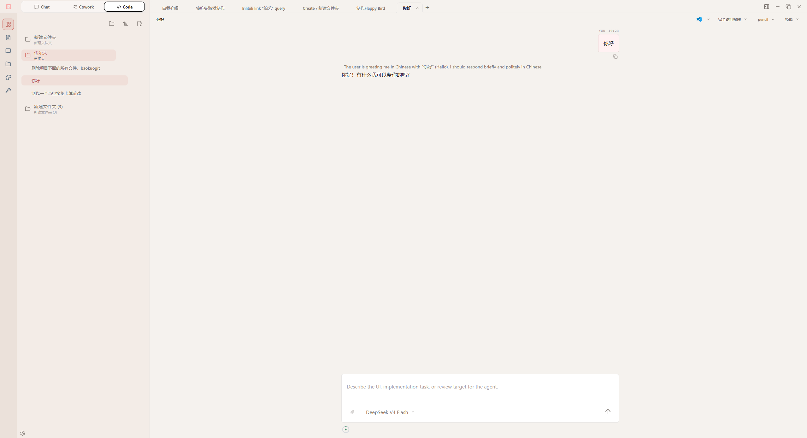
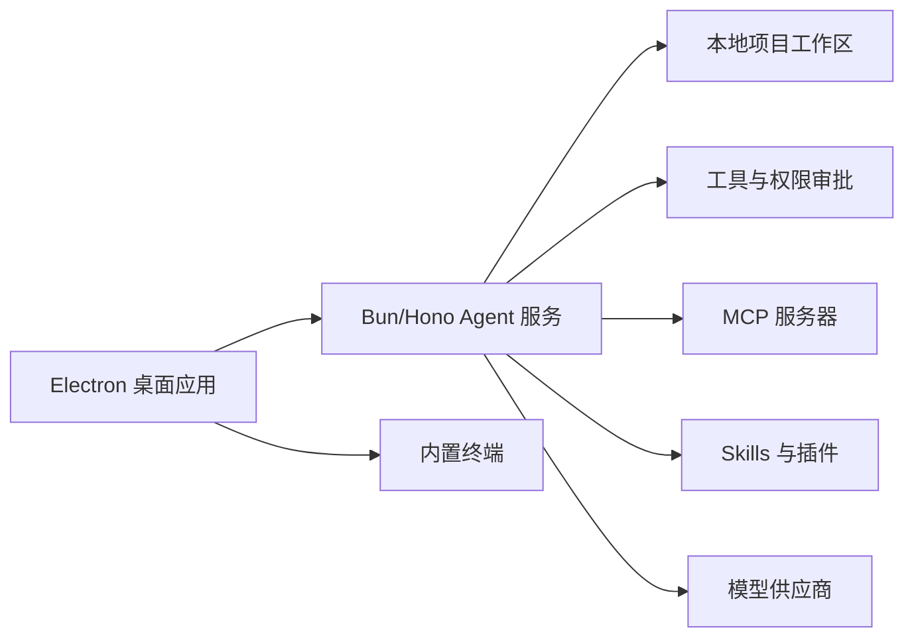

<div align="center">
  

  <h1>Anybox</h1>

  <p><strong>面向本地项目的开源 AI Agent 桌面工作台。</strong></p>
  <p>在一个可检查、可追踪的桌面应用里运行 Agent 会话、查看工具轨迹、管理 MCP 服务器，并协作处理本地项目。</p>

  <p>
    <a href="./README.md">English</a> |
    简体中文 |
    <a href="https://fanfande-studio.pages.dev/">官网</a> |
    <a href="https://github.com/fanfan-de/anybox/releases/latest">下载</a> |
    <a href="./packages/site/src/docs/content">文档</a> |
    <a href="./docs/anybox-third-party-plugin-development.md">开发</a> |
    <a href="https://github.com/fanfan-de/anybox/issues">反馈</a>
  </p>

  <p>
    <a href="https://github.com/fanfan-de/anybox/releases/latest"></a>
    <a href="https://github.com/fanfan-de/anybox/actions"></a>
    <a href="./LICENSE"></a>
    
    
  </p>

  <p>
    
  </p>

  <table>
    <tr>
      <td align="center"><a href="https://fanfande-studio.pages.dev/"><strong>官网</strong></a><br /><sub>产品介绍与下载安装入口</sub></td>
      <td align="center"><strong>社区</strong><br /><sub>占位：Discord、Telegram 或微信群</sub></td>
      <td align="center"><strong>展示</strong><br /><sub>占位：媒体推荐、奖项或发布卡片</sub></td>
    </tr>
  </table>
</div>

## 概览

Anybox 是一个开源的 AI Agent 桌面工作台，面向本地项目协作场景。它把项目文件夹、Agent 会话、终端、模型与供应商配置、Skills、MCP 服务器、权限审批、补丁和工具调用轨迹放到一个可检查、可追踪的 Electron 应用里。

这个仓库使用 `pnpm` workspace 管理。核心桌面产品位于 `packages/desktop`，本地 Agent 运行时和 HTTP 服务位于 `packages/anyboxagent`。

## 核心能力

- 将本地项目文件夹作为 Agent 工作区打开。
- 运行多轮 Agent 会话，并展示 reasoning、助手回复、工具调用、权限请求、错误和补丁。
- 默认由桌面端托管本地 Agent 服务，也可以连接到自定义 Agent 服务地址。
- 内置基于 `node-pty` 和 `xterm` 的终端。
- 在应用内配置模型供应商、MCP 服务器、Skills、插件和项目级设置。
- 查看工作区变更，并使用面向 Git 的桌面工作流完成提交和推送。
- 包含正在开发中的移动端配套包，用于远程桌面控制等工作流。

## 下载

安装包发布在 GitHub Releases：

- [Latest release](https://github.com/fanfan-de/anybox/releases/latest)
- 当前主要桌面目标平台：Windows x64 和 macOS Apple Silicon。

## 平台状态

| 平台 | 状态 | 说明 |
| --- | --- | --- |
| Windows x64 | 早期访问 | 主要桌面目标平台 |
| macOS Apple Silicon | 早期访问 | 主要 macOS 目标平台 |
| Android | 开发中 | 配套移动端包位于 `packages/mobile-app` |
| Linux | 计划中 | 当前不是主要桌面打包目标 |

## 架构概览



## 快速开始

### 环境要求

- Node.js 22+
- pnpm 10.28+
- Bun 1.3+

### 安装依赖

```bash
corepack enable
pnpm install
```

### 启动桌面应用

```bash
pnpm dev
```

默认情况下，桌面应用会自动启动本地 Anybox Agent 服务。

### 单独启动 Agent 服务

当你需要独立调试后端服务时，可以直接启动 Agent 服务：

```bash
cd packages/anyboxagent
bun run dev:server
```

默认监听地址是 `http://127.0.0.1:4096`。

如果希望桌面应用连接到已经启动的 Agent 服务，而不是自动托管服务：

```powershell
$env:ANYBOX_DISABLE_MANAGED_AGENT="1"
$env:ANYBOX_AGENT_BASE_URL="http://127.0.0.1:4096"
pnpm dev
```

## 常用命令

```bash
pnpm dev
pnpm build
pnpm dist
pnpm test
pnpm typecheck
pnpm verify:versions
```

按包执行检查：

```bash
pnpm --filter anybox-desktop-agent typecheck
pnpm --filter anybox-desktop-agent test
pnpm --filter anyboxagent exec tsc --noEmit -p tsconfig.json
pnpm --filter @anybox/shared typecheck
pnpm --filter @anybox/shared test
pnpm --filter @anybox/platform typecheck
pnpm --filter @anybox/platform test
pnpm site:build
```

## 仓库结构

```text
.
|-- .github/                 GitHub Actions 和贡献模板
|-- docs/                    架构、插件、连接器和功能设计文档
|-- packages/
|   |-- desktop/             Electron 桌面应用
|   |-- anyboxagent/         Bun/Hono Agent 服务和核心运行时
|   |-- shared/              共享 API 与 IPC 契约
|   |-- platform/            平台适配工具
|   |-- monitor/             Monitor Web UI
|   |-- site/                官网和文档站点
|   |-- mobile-app/          配套移动端应用
|   |-- browser-extension/   浏览器集成扩展
|   `-- browser-native-host/ 浏览器集成本机宿主
|-- plugins/                 内置和本地插件包
|-- scripts/                 仓库维护脚本
|-- package.json             workspace 入口脚本
`-- pnpm-workspace.yaml      workspace 包配置
```

## 文档入口

- [桌面端包说明](./packages/desktop/README.md)
- [第三方插件开发](./docs/anybox-third-party-plugin-development.md)
- [连接器开发指南](./docs/connector-development-guide.md)
- [Plugin module v1](./docs/plugin-module-v1.md)
- [本地连接器设计](./docs/plugin-local-connectors-design.md)
- [自动化功能设计](./docs/automation-feature-design.md)
- [Planner 模块设计](./docs/planner-module-design.md)
- [Thread view 前端设计](./docs/thread-view-frontend-design.md)
- [移动端控制桌面实现](./docs/anybox-mobile-desktop-control-implementation.md)
- [官网文档内容](./packages/site/src/docs/content)

## 路线图

- 将顶部剩余占位卡片替换为社区和发布展示链接。
- 补充 chat、cowork、code、MCP、Git 工作流等更丰富的截图。
- 继续完善移动端配套能力和桌面远程控制支持。
- 扩展面向插件作者和连接器开发者的公开文档。

## 环境变量

| 变量 | 作用 | 默认值 |
| --- | --- | --- |
| `ANYBOX_AGENT_BASE_URL` | 桌面应用连接的 Agent 服务地址 | `http://127.0.0.1:4096` |
| `ANYBOX_AGENT_WORKDIR` | 新会话的默认工作目录 | 当前进程工作目录 |
| `ANYBOX_DISABLE_MANAGED_AGENT` | 设为 `1` 时禁止桌面应用自动启动托管 Agent | 未设置 |
| `ANYBOX_BUN_BINARY` | 托管 Agent 使用的 Bun 可执行文件路径 | 自动检测 |
| `ANYBOX_SERVER_HOST` | Agent 服务监听 host | `127.0.0.1` |
| `ANYBOX_SERVER_PORT` | Agent 服务监听端口 | `4096` |
| `ANYBOX_AGENT_DATA_DIR` | Agent 配置、缓存、日志、状态和数据库目录 | 由应用管理 |

## 贡献

开发流程和 PR 要求见 [CONTRIBUTING.md](./CONTRIBUTING.md)。安全问题请按照 [SECURITY.md](./SECURITY.md) 说明报告。

## License

本项目使用 MIT License。详见 [LICENSE](./LICENSE)。
