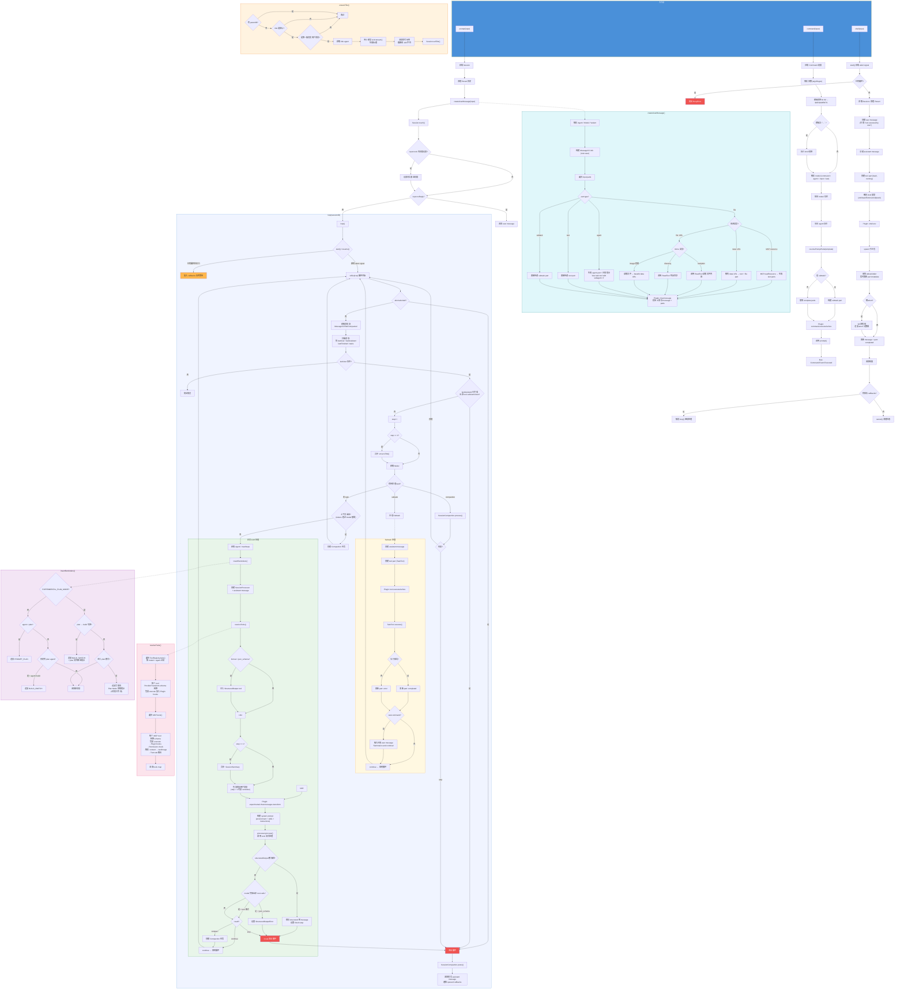
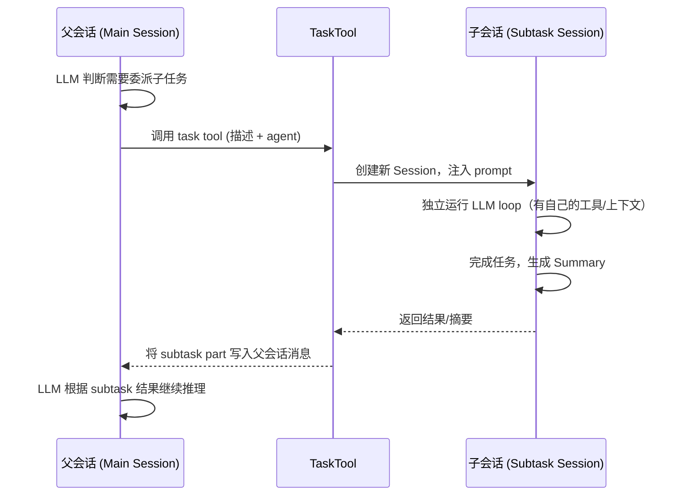

# SessionPrompt 模块流程图



## 模块核心逻辑说明

| 组件 | 职责 |
|------|------|
| **`prompt()`** | 总入口：创建用户消息 → 启动主循环 |
| **`loop()`** | 核心状态机：每次迭代检测待处理任务（subtask / compaction / 溢出 / 正常LLM调用），直到模型完成或被取消 |
| **`createUserMessage()`** | 将输入 parts（文件/agent/@引用/MCP资源）展开为具体的消息内容并持久化 |
| **`resolveTools()`** | 聚合 ToolRegistry + MCP 工具，统一包装权限检查和 Plugin 钩子 |
| **`insertReminders()`** | 根据 agent 类型（plan/build）和实验标志注入系统提示 |
| **`shell()`** | 独立的 shell 命令执行流，绕过 LLM 直接 spawn 进程 |
| **`command()`** | 斜杠命令处理：模板替换 → 参数解析 → 决定是否作为 subtask → 调用 `prompt()` |
| **`ensureTitle()`** | 首次对话时异步调用小模型生成会话标题 |

### 主循环（`loop`）的状态转移逻辑：

```
┌─────────────────────────────────────────────────────────┐
│                    while(true)                          │
│                                                         │
│  ① aborted? ──────────────────────────→ EXIT            │
│  ② 无 lastUser? ──────────────────────→ ERROR           │
│  ③ assistant 已完成(非tool-calls)? ───→ EXIT            │
│  ④ 有 pending subtask? ──→ 执行 TaskTool ──→ CONTINUE  │
│  ⑤ 有 pending compaction? ──→ 压缩处理 ──→ CONTINUE    │
│  ⑥ 上下文溢出? ──→ 创建 compaction ──→ CONTINUE        │
│  ⑦ 正常处理:                                           │
│     - 构建工具集 + system prompt                        │
│     - 调用 LLM (processor.process)                      │
│     - structured output 捕获? ──→ EXIT                  │
│     - model 完成? ──→ EXIT                              │
│     - result=stop? ──→ EXIT                             │
│     - result=compact? ──→ 创建 compaction ──→ CONTINUE  │
│     - 否则 ──→ CONTINUE                                 │
└─────────────────────────────────────────────────────────┘
```


# Subtask 设计解析

根据代码结构和流程图，**subtask** 是一种 **层级化任务委派机制**，允许主 LLM 会话将工作拆分并委派给子会话执行。以下是详细分析：

---

## 核心目的

### 1. 上下文隔离

主会话的 context window 是有限的。如果所有工作都在同一个会话中完成，上下文很快会被撑满。Subtask 将子任务放到**独立的子 Session** 中运行，避免污染主会话的上下文。

### 2. 分而治之（Divide & Conquer）

对于复杂任务（如"重构整个模块"），LLM 可以通过 `TaskTool` 将其拆解为多个子任务：

```
主会话: "重构 auth 模块"
  ├── subtask 1: "分析当前 auth 模块的依赖关系"
  ├── subtask 2: "重写 token 验证逻辑"
  └── subtask 3: "更新相关的单元测试"
```

每个 subtask 拥有独立的会话生命周期，完成后将**摘要/结果**回传给主会话。

### 3. Agent 专业化

从代码中可以看到 `agent` part 类型会生成提示：

```
"Use task tool with subagent: X"
```

这意味着不同的 subtask 可以指定**不同的 Agent**（可能配置了不同的 system prompt、工具集、甚至不同的模型），让专业的 agent 处理专业的事情。

---

## 在代码中的位置

| 组件 | 作用 |
|---|---|
| `TaskTool` (`@/tool/task`) | LLM 可调用的工具，用于创建和执行 subtask |
| `subtask` part type | 消息中的一种 part 类型，表示对子任务的引用/结果 |
| `agent` part type | 用户附加的 agent 指令，触发 subtask 委派 |
| `SessionSummary` | 子任务完成后生成摘要，回传给父会话 |
| `SessionProcessor` | 管理会话的执行流程，包括子任务的调度 |

---

## 数据流



---

## 与 `SessionCompaction` 的协作

注意代码中还引入了 `SessionCompaction`（上下文压缩）。Subtask 和 Compaction 是互补的两种策略：

- **Subtask**：事前隔离 —— 把可能占用大量上下文的工作提前分离出去
- **Compaction**：事后压缩 —— 对已经过长的上下文进行摘要压缩

两者共同确保会话不会因为 context window 溢出而降低质量。

---

## 类比

如果你熟悉操作系统的概念，这本质上就是 **进程 fork** 的思路：
- 父进程（父会话）fork 出子进程（子会话）
- 子进程有独立的地址空间（上下文）
- 子进程完成后通过 IPC（subtask part / summary）将结果传回父进程

这种设计在 Claude Code、Cursor 等 AI 编程工具中越来越常见，通常被称为 **sub-agent** 或 **orchestrator pattern**。