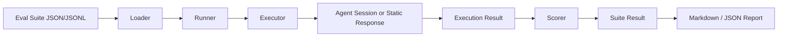

# Agent Eval Module Design

## Goal

The Eval module gives Anybox Agent a repeatable way to measure behavior across prompts, tools, models, skills, and regressions. It is intentionally separate from the production session runtime: the runtime executes work, while Eval defines datasets, runs cases, scores outputs, and reports failures.

## Module Layout

- `packages/anyboxagent/src/eval/schema.ts`: Zod schemas for suites, cases, inputs, and assertions.
- `packages/anyboxagent/src/eval/scorer.ts`: deterministic assertion scoring and weighted case scores.
- `packages/anyboxagent/src/eval/runner.ts`: suite orchestration, concurrency, repetitions, tag/case filtering, and aggregation.
- `packages/anyboxagent/src/eval/executor.ts`: executor interface plus static and live prompt executors.
- `packages/anyboxagent/src/eval/loader.ts`: JSON and JSONL suite loading.
- `packages/anyboxagent/src/eval/report.ts`: JSON and Markdown reports.
- `packages/anyboxagent/src/eval/cli.ts`: local CLI entrypoint.

## Data Model

An eval suite is a collection of cases. Each case has:

- `input`: prompt, optional system prompt, agent name, skills, model, and metadata.
- `assertions`: deterministic checks such as output containment, regex, status, tool calls, latency, token usage, cost, and metadata equality.
- `threshold`: minimum weighted score for the case.
- `tags`: filtering labels.
- `repetitions`: optional per-case override for nondeterminism checks.

Assertions are weighted. A case score is the weighted average of assertion scores. A case passes when every repetition meets the threshold. A suite passes when every selected case passes and the suite score meets `defaultThreshold`.

## Execution Flow



## Executor Boundary

The runner only depends on this shape:

```ts
type EvalExecutor = {
  run(testCase, context): Promise<EvalExecution>
}
```

This keeps evaluation decoupled from Anybox session internals. The live executor creates a fresh session per case through `Instance.provide`, `Session.createSession`, and `Prompt.prompt`. The static executor is used for unit tests, offline baselines, and future replay-based evals.

## Scoring Strategy

The first implementation focuses on deterministic checks because they are stable enough for regression gates:

- final status
- output exact / contains / not contains / regex / length
- required or forbidden tool calls
- tool call count ranges
- metadata equality
- latency ceiling
- token ceiling
- cost ceiling

The schema also includes `custom` assertions. A future LLM-as-judge scorer can plug into `customScorers` without changing suite execution.

## CLI

Run a live suite from the agent package:

```bash
pnpm --filter anyboxagent eval -- packages/anyboxagent/evals/smoke.eval.json --directory C:\Projects\Anybox
```

Useful options:

- `--format markdown|json`
- `--output <path>`
- `--tags smoke,text`
- `--cases case-a,case-b`
- `--concurrency 2`
- `--repetitions 3`

The CLI exits with code `1` when the selected suite fails.

## Roadmap

- Add a server route for listing and running suites from the desktop UI.
- Persist eval runs in SQLite for trend charts and model comparisons.
- Add replay executors from stored sessions and traces.
- Add custom LLM judge scorers for semantic quality, style adherence, and task completion.
- Add dataset generation from production traces with privacy filters.
- Add golden-file diffing for code-editing tasks and workspace snapshot checks.
