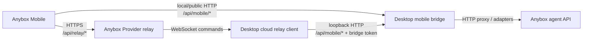

# Anybox 手机端控制桌面端当前实现

最后核对时间：2026-06-05

本文档说明当前仓库中 Anybox Mobile 控制 Anybox Desktop 的实现方式。这里的“控制”是应用级控制：手机端通过桌面端暴露的移动桥接 API 创建/继续/停止 Agent 会话、发送提示词、查看工作区/文件/任务、处理权限审批；不是远程桌面画面、鼠标或键盘控制。

## 1. 总体架构

当前实现由三层组成：

- 手机端：`packages/mobile-app`，Expo/React Native Android 客户端。
- 桌面端：`packages/desktop`，Electron 主进程启动本地 mobile bridge HTTP 服务，渲染进程提供“Mobile connection”连接页。
- 桌面 Agent：`packages/anyboxagent`，真正执行项目、会话、消息、权限审批等业务 API。

控制链路有两种传输方式：

- 本地/公共 bridge：手机直接请求桌面端 mobile bridge 暴露的 `/api/mobile/*`。
- Cloud relay：桌面端先反连 Anybox Provider relay，手机请求 `/api/relay/*`，relay 再通过桌面端 WebSocket 把请求转成本机 `/api/mobile/*` 调用。



## 2. 桌面端 mobile bridge

桌面端启动时会先启动 managed agent，再启动 mobile bridge。入口在 `packages/desktop/src/main/index.ts`，调用 `ensureMobileBridgeServerRunning()`。

mobile bridge 的核心实现是 `packages/desktop/src/main/mobile-bridge-server.ts`：

- 默认监听 `0.0.0.0:4896`。
- 可通过 `ANYBOX_MOBILE_BRIDGE_HOST` 和 `ANYBOX_MOBILE_BRIDGE_PORT` 调整监听地址和端口。
- 默认公共地址是 `https://anybox.com.cn`，可通过 `ANYBOX_MOBILE_BRIDGE_PUBLIC_URL` 调整或关闭。
- 如果公共地址可用且未禁用 tunnel，会启动 SSH reverse tunnel，把远端端口转发到本机 bridge。
- 运行状态、配对链接、设备列表通过 IPC 暴露给桌面渲染进程。

bridge 状态对象包含：

- `publicUrl` / `localUrl` / `urls`：高级 token 登录 URL。
- `publicPairingUrl` / `pairingLocalUrl` / `pairingUrls`：一次性配对 URL。
- `pairingExpiresAt`：本地配对码过期时间。
- `devices`：已配对设备记录。
- `cloudRelay`：relay 注册、连接和 relay 配对码状态。

桌面端还会写入 `%APPDATA%\anybox-desktop-agent\mobile-bridge-handoff.json`，供 Android smoke/handoff 脚本自动读取最新配对深链。

## 3. 桌面连接页和二维码

桌面连接页是 `packages/desktop/src/renderer/src/app/connections/MobileConnectionPage.tsx`。

该页面通过 preload 暴露的 IPC 调用：

- `desktop:get-mobile-bridge-status`
- `desktop:refresh-mobile-pairing-code`
- `desktop:rotate-mobile-bridge-token`
- `desktop:revoke-mobile-device`

二维码内容优先级如下：

1. 如果 cloud relay 已启用，且 relay pairing deep link 未过期，使用 `anybox-mobile://pair?code=...&url=https%3A%2F%2Fanybox.com.cn`。
2. 否则使用 bridge pairing URL 包装成 `anybox-mobile://connect?url=<encoded pairing URL>`。
3. pairing URL 优先选公共 URL；没有公共 URL 时再选局域网或 loopback URL。

连接页还提供：

- 刷新 QR：同时刷新本地 pairing code，并尝试刷新 relay pairing code。
- 复制深链和 Android 验收命令。
- 高级 token access：复制长期 bridge token 或 token URL，主要用于排障和旧浏览器页面。
- 设备管理：列出、刷新和 revoke 已配对 Android 设备。

## 4. 配对流程

### 4.1 手机端入口

手机端支持两类深链：

- `anybox-mobile://connect?url=...`
- `anybox-mobile://pair?code=...&url=...`

相关实现：

- `packages/mobile-app/app/scan.tsx`：扫描 QR，只接受含 pairing code 的 Anybox 配对码。
- `packages/mobile-app/app/connect.tsx`：预览配对信息，确认后执行配对。
- `packages/mobile-app/src/api/mobile-api.ts`：解析深链、标准化连接、调用配对 API。

`normalizeConnectionInput()` 会把输入归一成：

- `baseUrl`
- `token`
- `transport`，本地 bridge 可省略，relay 为 `"relay"`
- `desktopID`
- `pairingCode`

### 4.2 配对预览

手机扫码后不会立即消耗配对码，而是先预览：

- bridge：`GET /api/mobile/pair/preview?code=...`
- relay：`GET /api/relay/pair/preview?code=...`

预览返回桌面名称、版本、能力列表、配对码是否有效、过期时间和服务器时间。手机端在确认页展示这些信息，让用户确认要连接的桌面。

### 4.3 本地 bridge 配对

确认连接后，手机端调用：

```http
POST /api/mobile/pair?code=<pairing-code>
Authorization: Bearer <bridge-token 可选>
Content-Type: application/json

{"name":"Anybox Android"}
```

桌面端处理逻辑：

- pairing code 有效且未过期时允许配对，并立即消费该 code。
- 高级 token 流可以用 bridge token 直接配对。
- 生成设备 ID 和设备 token。
- 桌面端只保存设备 token 的 SHA-256 hash，不保存明文 token。
- 设备记录写入 Electron `userData` 下的 `mobile-devices.json`。
- 返回明文 token、设备信息和能力列表给手机端。

本地 pairing code TTL 当前是 5 分钟。

### 4.4 relay 配对

relay QR 使用 `anybox-mobile://pair?code=...&url=...`。手机端确认后调用：

```http
POST /api/relay/pair
Content-Type: application/json

{"code":"<relay-pairing-code>","name":"Anybox Android"}
```

如果手机端已登录 Anybox Provider 账号，会同时带上账号 bearer token，便于 Provider 侧绑定账号上下文。

relay 返回：

- mobile token
- desktop 信息
- mobile device 信息

手机保存为 relay 连接，后续请求会带 `transport: "relay"` 和 `desktopID`。

### 4.5 保存连接和替换连接

手机端连接状态保存在 `expo-secure-store`，实现位于 `packages/mobile-app/src/state/connection.tsx`。保存字段：

- `anybox.mobile.baseUrl`
- `anybox.mobile.token`
- `anybox.mobile.deviceID`
- `anybox.mobile.transport`
- `anybox.mobile.desktopID`

如果用户连接新桌面，手机端会在新连接成功后尝试 revoke 旧连接的设备 token。

## 5. 鉴权和授权

mobile bridge 接受两类凭证：

- bridge token：桌面端运行时生成，属于高级/内部 token，拥有所有 mobile bridge 能力。
- device token：配对后发给手机端，桌面端按 hash 匹配未 revoke 的设备记录。

请求 token 来源：

- `Authorization: Bearer <token>`
- 或 URL query `token=<token>`，主要给旧 HTML 页面和高级 token URL 使用。

设备 token 每次鉴权成功后会更新 `lastSeenAt`，但写入有节流，当前间隔是 60 秒。

每个已配对设备有能力列表，当前默认能力：

- `workspace:read`
- `session:read`
- `session:create`
- `message:send`
- `task:cancel`
- `approval:read`
- `approval:respond`
- `workspace-file:read`

bridge 在处理每个路由前会做 capability 检查，并写审计日志。设备 revoke 后，后续请求会返回未授权。

## 6. 手机端如何发起控制请求

手机端所有桌面控制能力集中在 `packages/mobile-app/src/api/mobile-api.ts`：

- `getStatus()`
- `getWorkspaces()`
- `createSession()`
- `getMessages()`
- `sendPrompt()`
- `resumeSession()`
- `cancelSession()`
- `getSessionTasks()`
- `getWorkspaceFiles()`
- `searchWorkspaceFiles()`
- `getWorkspaceFileContent()`
- `getWorkspaceDiff()`
- `getApprovals()`
- `respondApproval()`
- `revokeCurrentDevice()`

本地 bridge 连接时，手机直接请求：

```ts
fetch(`${connection.baseUrl}${path}`, {
  headers: { authorization: `Bearer ${connection.token}` }
})
```

relay 连接时，普通 HTTP 请求会变成：

```http
POST /api/relay/commands
Authorization: Bearer <mobile-token>

{
  "desktopID": "<desktop-id>",
  "type": "mobile.http",
  "payload": {
    "method": "GET|POST",
    "path": "/api/mobile/...",
    "body": "...",
    "headers": {"content-type":"application/json"}
  }
}
```

流式请求会走：

- GET event stream：`/api/relay/mobile/stream?desktopID=...&path=/api/mobile/.../stream`
- POST stream：`POST /api/relay/mobile/stream`

relay 模式下，手机端不会直接访问桌面端端口。

## 7. relay 桌面端实现

relay 桌面端实现位于 `packages/desktop/src/main/desktop-cloud-relay-client.ts`。

主要流程：

1. 桌面端读取或创建 relay identity，保存到 `mobile-relay-device.json`。
2. 桌面端向 Provider relay 注册：`POST /api/relay/desktop/register`。
3. 注册 payload 包含 desktopID、desktop token、桌面名称、版本、能力列表，以及是否刷新 pairing code。
4. 如果桌面端已登录 Anybox Provider，会从 agent 的 `/api/providers/anybox/auth/relay-session` 读取账号 session，并用该 session 绑定 relay 注册。
5. 桌面端打开 WebSocket：`/api/relay/desktop/connect?desktopID=...&token=...`。
6. relay 下发 `mobile.http` 或 `mobile.stream` 命令。
7. 桌面端把命令转成本机 bridge 请求：`http://127.0.0.1:<bridge-port>/api/mobile/...`。
8. 本机 bridge 请求使用 bridge token 鉴权。
9. 桌面端把响应状态、响应体或 stream chunk 回传给 relay。

relay 客户端对转发请求做了限制：

- 只允许 GET/POST。
- path 必须以 `/api/mobile/` 开头。
- 禁止包含完整 URL，避免任意 SSRF。
- HTTP 普通命令不允许 `/stream`，stream 通过单独 `mobile.stream` 命令处理。
- relay 回传时过滤 `set-cookie` 等不需要透传的头。

## 8. bridge 暴露的主要 API

### 公共和配对

- `GET /api/mobile/status`：不需要鉴权，返回 bridge 在线状态、桌面名称、版本和能力列表。
- `GET /api/mobile/pair/preview?code=...`：不消耗 pairing code，用于手机端确认页。
- `POST /api/mobile/pair?code=...`：消费 pairing code 或验证 bridge token，生成设备 token。

### 设备

- `POST /api/mobile/devices/me/revoke`：当前手机设备主动吊销自己的 token。

### 工作区和会话

- `GET /api/mobile/workspaces`：列出工作区及最近会话。
- `GET /api/mobile/workspaces/:workspaceID/sessions`：列出某工作区会话。
- `POST /api/mobile/workspaces/:workspaceID/sessions`：在工作区创建移动端会话。
- `GET /api/mobile/workspaces/:workspaceID/diff`：读取工作区 Git diff 摘要。

### 文件

- `GET /api/mobile/workspaces/:workspaceID/files?path=...`
- `GET /api/mobile/workspaces/:workspaceID/files/search?q=...`
- `GET /api/mobile/workspaces/:workspaceID/files/content?path=...`

这些接口会转发到 agent 的 workspace files API，并把 `workspaceID` 映射为目录参数。

### 消息和任务

- `GET /api/mobile/sessions/:sessionID/messages?view=active`
- `POST /api/mobile/sessions/:sessionID/messages/stream`
- `POST /api/mobile/sessions/:sessionID/resume/stream`
- `POST /api/mobile/sessions/:sessionID/cancel`
- `GET /api/mobile/sessions/:sessionID/tasks`
- `GET /api/mobile/sessions/:sessionID/events/stream`

这些接口主要代理到 agent session API。

### 审批

- `GET /api/mobile/approvals?status=pending&sessionID=...`
- `POST /api/mobile/approvals/:approvalID/approve`
- `POST /api/mobile/approvals/:approvalID/deny`

approve/deny 会被转换成 agent permission request 的 `allow` / `deny` 决策，并默认带 `resume: true`。

## 9. 事件和刷新

手机端使用 SSE 做轻量实时刷新。

全局事件：

- 手机 hook：`packages/mobile-app/src/hooks/use-mobile-events.ts`
- URL：`/api/mobile/events/stream`
- bridge 事件源：每 5 秒轮询工作区和审批快照，比较签名后发事件。
- 事件类型包括 `sync.ready`、`sync.updated`、`workspace.updated`、`session.created`、`session.updated`、`approval.requested`、`approval.updated`。

会话事件：

- 手机 hook：`packages/mobile-app/src/hooks/use-session-events.ts`
- URL：`/api/mobile/sessions/:sessionID/events/stream`
- bridge 直接代理 agent session events stream。

手机端收到事件后不会完全依赖事件 payload 更新本地状态，而是延迟几百毫秒触发重新拉取，避免部分状态不一致。

## 10. 手机端界面能力映射

当前手机端主要页面和控制能力：

- `app/index.tsx`：首页，展示连接状态、Provider relay 桌面列表、工作区、最近会话和待处理审批入口。
- `app/provider.tsx`：Provider/relay 连接诊断、账号信息、桌面设备列表和切换桌面。
- `app/workspaces/[workspaceID].tsx`：工作区详情、会话列表、创建会话、文件和 diff 入口。
- `app/workspaces/[workspaceID]/file.tsx`：工作区文件只读浏览和预览。
- `app/sessions/[sessionID].tsx`：会话消息、发送 prompt、resume、cancel、处理会话内审批。
- `app/approvals.tsx`：审批列表和审批历史，允许 approve/deny。
- `app/connect.tsx` / `app/scan.tsx`：扫码、预览和确认配对。

## 11. Anybox Provider 账号和 no-scan relay

Provider 账号登录和 relay 桌面发现实现位于：

- `packages/mobile-app/src/api/account-api.ts`
- `packages/mobile-app/app/account.tsx`
- `packages/mobile-app/app/provider.tsx`

手机端账号接口：

- `POST /api/agent/password/register`
- `POST /api/agent/password/login`
- `GET /api/agent/me`
- `POST /api/agent/oauth/refresh`
- `POST /api/agent/oauth/revoke`
- `GET /api/relay/desktops`
- `POST /api/relay/desktops/:desktopID/connect`

当桌面端也登录了 Anybox Provider 并成功注册 relay 后，手机端登录同一 Provider 账号可以列出在线桌面，并通过 `connectAccountRelayDesktop()` 直接连接在线桌面，不一定需要扫码。

## 12. 安全边界

当前实现的安全措施：

- pairing code 短期有效，且本地 bridge pairing code 成功配对后即被消费。
- device token 只在手机端保存明文，桌面端保存 hash。
- 已配对设备可以从桌面连接页或手机端主动 revoke。
- mobile bridge 对设备 token 做能力检查。
- bridge API 返回 `no-store`，避免缓存敏感结果。
- browser HTML 场景只允许 same-origin CORS；React Native 直连通常没有 Origin。
- relay 桌面端只转发 `/api/mobile/*`，并限制方法和 headers。
- relay 桌面端使用本机 loopback bridge token 调用本地 bridge，手机端拿不到 bridge token。

需要注意的边界：

- 高级 bridge token 拥有完整 mobile bridge 能力，只应作为排障入口。
- 如果使用公共 bridge URL，依赖服务端反向隧道和公网入口配置；配对码和 device token 仍是主要访问控制。
- Android 配置了 `usesCleartextTraffic: true`，是为了支持局域网 `http://` bridge fallback。

## 13. 已知限制

- 当前不是远程桌面控制，没有屏幕流、鼠标、键盘或 OS 级控制。
- 手机端对工作区文件是只读浏览和预览。
- relay Provider 服务端实现不在当前仓库的主要 packages 中；本仓库实现的是移动端调用、桌面端注册和桌面端命令执行。
- bridge 内部仍保留一个旧的内联 HTML 手机页面，用于浏览器 token 访问；Expo Android 客户端是当前主路径。
- relay 普通命令不处理 stream path，stream 必须走 relay 的 mobile stream 通道。

## 14. 测试和验收入口

常用验证命令：

```powershell
corepack pnpm --filter anybox-desktop-agent test -- src/main/mobile-bridge-server.test.ts
corepack pnpm --filter anybox-desktop-agent test -- src/renderer/src/app/connections/MobileConnectionPage.test.tsx
corepack pnpm --filter anybox-mobile-app run android:smoke:pairing
corepack pnpm --filter anybox-mobile-app run android:smoke:bridge -- --url "anybox-mobile://connect?url=..."
corepack pnpm --filter anybox-mobile-app run android:handoff-check -- --use-desktop-handoff
```

桌面连接页的“Copy test command”会复制当前 QR 对应的 real bridge smoke 命令。

## 15. 关键文件

- `packages/desktop/src/main/index.ts`：桌面启动时启动 agent 和 mobile bridge。
- `packages/desktop/src/main/mobile-bridge-server.ts`：本地 mobile bridge、配对、鉴权、API 转发、事件流、handoff 文件。
- `packages/desktop/src/main/desktop-cloud-relay-client.ts`：桌面端 cloud relay 注册、WebSocket、relay command 到本地 bridge 的转发。
- `packages/desktop/src/main/ipc.ts`：桌面 IPC handler，把 bridge 管理能力暴露给渲染进程。
- `packages/desktop/src/preload/index.ts`：`window.desktop` bridge 管理 API。
- `packages/desktop/src/shared/desktop-ipc-contract.ts`：桌面 IPC 类型定义。
- `packages/desktop/src/renderer/src/app/connections/MobileConnectionPage.tsx`：桌面端移动连接页、二维码、设备管理。
- `packages/mobile-app/src/api/mobile-api.ts`：手机端 bridge/relay API 封装、深链解析、SSE 解析。
- `packages/mobile-app/src/api/account-api.ts`：Provider 账号和 relay 桌面发现 API。
- `packages/mobile-app/src/state/connection.tsx`：手机端安全保存连接 token 和 transport 状态。
- `packages/mobile-app/app/scan.tsx`：扫码入口。
- `packages/mobile-app/app/connect.tsx`：连接确认和配对入口。
- `packages/mobile-app/app/provider.tsx`：Provider/relay 连接管理和诊断。
- `packages/mobile-app/app/workspaces/[workspaceID].tsx`：工作区控制页面。
- `packages/mobile-app/app/sessions/[sessionID].tsx`：会话控制页面。
- `packages/mobile-app/app/approvals.tsx`：权限审批控制页面。
