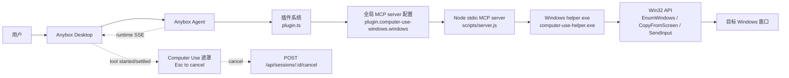

# Computer Use Windows 插件实现说明

本文介绍仓库当前的 `computer-use-windows@0.1.1` 插件是如何工作的。它不是一个独立的“超级自动化引擎”，而是把现有 Anybox/Fanfande 的插件、MCP、权限审批、Skill 和桌面端会话流串起来，让 Agent 可以在受控条件下观察和操作 Windows 桌面窗口。

一句话概括：它给 Agent 提供“看窗口截图”和“发鼠标键盘输入”的能力，同时在插件 manifest、MCP server、Windows helper、桌面遮罩和会话取消这几层都加了闸门。

## 相关文件

核心实现分布在这些位置：

- `plugins/Anybox-Plugins/computer-use-windows/plugin.meta.json`：远程/市场 catalog 元数据，包含下载包信息、展示文案、工具预览和权限说明。
- `plugins/Anybox-Plugins/computer-use-windows/0.1.1/.anybox-plugin/plugin.json`：真正安装时读取的插件 manifest。
- `plugins/Anybox-Plugins/computer-use-windows/0.1.1/.fanfande-plugin/plugin.json`：兼容旧入口的 manifest。
- `plugins/Anybox-Plugins/computer-use-windows/0.1.1/skills/computer-use/SKILL.md`：给 Agent 的使用规则。
- `plugins/Anybox-Plugins/computer-use-windows/0.1.1/scripts/server.js`：本地 stdio MCP server，负责暴露工具、校验参数、管理窗口引用和调用 helper。
- `plugins/Anybox-Plugins/computer-use-windows/0.1.1/helper/ComputerUse.Helper/Program.cs`：Windows helper 源码，真正调用 Win32 API 截图和输入。
- `plugins/Anybox-Plugins/computer-use-windows/0.1.1/helper/win32-x64/computer-use-helper.exe`：已打包的 Windows helper 可执行文件。
- `packages/anyboxagent/src/plugin/plugin.ts`：插件系统的扫描、校验、安装、MCP 绑定生成和 Skill 根目录发现。
- `packages/anyboxagent/src/config/config.ts`：项目选择插件后，把插件生成的全局 MCP server 注入到项目可用工具列表。
- `packages/desktop/src/main/computer-use-overlay.ts`：桌面端蓝色边框遮罩、Esc 取消、会话流事件识别。
- `packages/desktop/src/main/ipc.ts`：把会话 SSE 事件转交给遮罩管理器，并在 Esc 时调用后端取消接口。
- `packages/desktop/src/main/computer-use-overlay.test.ts`：遮罩和 Esc 取消逻辑的单元测试。

## 总体架构



可以把它理解成四个层次：

1. **插件声明层**：`plugin.json` 说明这个插件有哪些能力、风险等级、工具列表、审批策略，以及如何启动 MCP server。
2. **Agent 接入层**：`plugin.ts` 把插件变成全局 MCP server 和可发现 Skill；项目选择插件后，相关工具才进入该项目的可用工具集合。
3. **本地执行层**：`scripts/server.js` 是 MCP server；它不直接碰 Windows API，而是启动 helper exe，通过 JSON 行协议发命令。
4. **桌面安全提示层**：Desktop 主进程监听运行时工具事件，显示“Anybox is using your computer - Esc to cancel”遮罩，并允许用户随时按 Esc 中断。

## 插件如何被发现和安装

插件系统的源头在 `packages/anyboxagent/src/plugin/plugin.ts`。

它会扫描几个来源：

- 内置插件目录：`packages/anyboxagent/plugins/builtin`
- 仓库 workspace 插件目录：`plugins/Anybox-Plugins`
- 用户安装目录：`ANYBOX_PLUGIN_INSTALL_DIR`，默认落在 Agent 数据目录下的 `plugins/installed`
- 远程 registry：默认 index 是 `https://raw.githubusercontent.com/fanfan-de/fanfande_studio/master/plugins/Anybox-Plugins/index.json`

`computer-use-windows` 出现在 `plugins/Anybox-Plugins/index.json` 里，并且本地也有完整包：

```text
plugins/Anybox-Plugins/computer-use-windows/
  plugin.meta.json
  0.1.1/
    .anybox-plugin/plugin.json
    .fanfande-plugin/plugin.json
    skills/computer-use/SKILL.md
    scripts/server.js
    helper/win32-x64/computer-use-helper.exe
    helper/ComputerUse.Helper/Program.cs
```

安装时，插件系统主要做这些事：

- 读取并校验 manifest。当前支持 `.anybox-plugin/plugin.json`，同时兼容 `.fanfande-plugin/plugin.json`。
- 归一化插件 ID。这里的插件 ID 是 `computer-use-windows`。
- 生成 MCP server ID。manifest 中 server id 是 `windows`，因此最终全局 MCP server ID 是：

```text
plugin.computer-use-windows.windows
```

- 生成 Skill ID。`skills/computer-use/SKILL.md` 会变成：

```text
plugin:computer-use-windows:computer-use
```

- 写入 `installed_plugins` 表，记录版本、启用状态、生成的 MCP server IDs、Skill IDs、插件配置等。
- 调用 `Config.setMcpServer` 写入全局 MCP 配置。

项目侧不是安装后无条件拿到所有插件能力。`config.ts` 的 `resolveProjectMcpServers` 会读取项目选择的插件 ID，然后把全局里以 `plugin.<pluginID>` 开头的 MCP server 合并进项目运行时。也就是说，插件安装和项目启用是两步。

## Manifest 声明了什么

`computer-use-windows` 的 manifest 是插件的“说明书”和“接线图”。

关键字段如下：

- `name`: `computer-use-windows`
- `version`: `0.1.1`
- `category`: `Automation`
- `risk`: 通过 MCP server 标为 `high`
- `permissions`:
  - 列出可见 Windows 应用窗口
  - 捕获选中窗口截图
  - 经审批后向选中窗口发送鼠标和键盘输入
- `skills`: `skills`
- `mcpServers[0].id`: `windows`
- `runtime.transport`: `stdio`
- `runtime.command`: `node`
- `runtime.args`: `${PLUGIN_ROOT}/scripts/server.js`
- `runtime.cwd`: `${PLUGIN_ROOT}`
- `runtime.timeoutMs`: `30000`

manifest 还把工具分成两类审批策略：

| 工具 | 策略 | 原因 |
| --- | --- | --- |
| `computer_health_check` | `auto` | 只检查 helper 是否可用 |
| `list_windows` | `auto` | 只列窗口 |
| `get_window` | `auto` | 只解析窗口引用 |
| `get_window_state` | `auto` | 只截图/返回状态 |
| `activate_window` | `ask` | 会改变本机窗口焦点 |
| `click` | `ask` | 会发送鼠标输入 |
| `scroll` | `ask` | 会发送鼠标滚轮输入 |
| `press_key` | `ask` | 会发送键盘输入 |
| `type_text` | `ask` | 会输入文本 |
| `drag` | `ask` | 会拖拽鼠标 |

这意味着观察类工具可以自动运行，输入类工具默认要经过 MCP tool policy 的审批流程。

## MCP Server：Node 层做什么

`scripts/server.js` 是一个轻量 MCP server。它通过 stdin/stdout 接 JSON-RPC 消息，支持：

- `initialize`
- `tools/list`
- `tools/call`
- `ping`
- `roots/list`

它暴露 10 个工具：

| 工具 | 作用 | 是否需要窗口引用 | 是否需要截图引用 |
| --- | --- | --- | --- |
| `computer_health_check` | 检查平台和 helper exe 是否可用 | 否 | 否 |
| `list_windows` | 列出可控窗口 | 否 | 否 |
| `get_window` | 通过 `windowRef`、标题片段或进程名解析窗口 | 可选 | 否 |
| `get_window_state` | 捕获窗口截图并生成 `snapshotRef` | 是 | 否 |
| `activate_window` | 激活窗口 | 是 | 否 |
| `click` | 在截图相对坐标点击 | 是 | 是 |
| `scroll` | 在截图相对坐标滚动 | 是 | 是 |
| `press_key` | 发送快捷键或按键数组 | 是 | 否 |
| `type_text` | 输入文本 | 是 | 否 |
| `drag` | 在截图相对坐标拖拽 | 是 | 是 |

### windowRef 和 snapshotRef

插件不把原始 `hwnd` 直接暴露给 Agent 作为长期操作凭据，而是包装成临时引用：

- `windowRef`：形如 `win_<random>`，对应某个 Windows 窗口句柄。
- `snapshotRef`：形如 `snap_<random>`，对应某次窗口截图。

这两个引用都有 10 分钟 TTL：

- `WINDOW_TTL_MS = 10 * 60 * 1000`
- `SNAPSHOT_TTL_MS = 10 * 60 * 1000`

输入动作会验证：

- `windowRef` 是否存在且未过期
- 目标窗口是否仍可解析
- 目标窗口是否被安全规则阻止
- 如果是坐标动作，`snapshotRef` 是否属于同一个 `windowRef`
- 坐标是否落在最近截图边界内

这套设计的目的很直接：Agent 必须先观察，再操作；不能拿一个旧坐标长期乱点，也不能拿 A 窗口的截图去操作 B 窗口。

### 安全参数 purpose 和 safety

所有会产生输入的 action 工具都要求传：

- `purpose`：这次操作的简短目的，不能为空。
- `safety`：风险分类。

当前支持的 `safety` 值：

```text
normal
submit_or_send
delete
upload
install
auth_or_secret
finance
security_settings
```

其中这三类会被 Node server 直接拒绝：

```text
auth_or_secret
finance
security_settings
```

这四类会被标记为更高审查语义：

```text
submit_or_send
delete
upload
install
```

需要注意：当前 `server.js` 里 `validateInputAction` 会计算 `elevatedReview`，但这个值没有继续用于额外分支。实际是否弹审批，主要还是由 manifest 里的 `toolPolicies` 决定：输入类工具是 `ask`。

### 被阻止的进程和窗口标题

Node server 有一层硬阻止列表。典型被阻止进程包括：

- 终端和 shell：`cmd.exe`、`powershell.exe`、`pwsh.exe`、`windowsterminal.exe`、`wt.exe`、`bash.exe`、`wsl.exe`
- 密码管理器：`1password.exe`、`bitwarden.exe`、`dashlane.exe`、`keepass.exe`、`keepassxc.exe`、`lastpass.exe`
- 系统安全/凭据相关：`consent.exe`、`credentialui.exe`、`lockapp.exe`、`securityhealthsystray.exe`

标题阻止规则包括：

- `CAPTCHA`
- `Credential`
- `User Account Control`
- `Windows Security`
- `security warning`
- `deceptive site ahead`
- `privacy error`
- `your connection is not private`

如果窗口命中这些规则，`list_windows` 仍可把它列出来并标记 `blocked`，但 action 工具会拒绝操作。

## Windows Helper：真正触碰系统的一层

`Program.cs` 编译成 `computer-use-helper.exe`。它是一个 `net9.0-windows`、`win-x64`、self-contained、single-file 的控制台程序，并启用了 Windows Forms，主要是为了处理剪贴板。

Node server 启动 helper 的方式：

```js
spawn(HELPER_EXE, [], {
  cwd: PLUGIN_ROOT,
  stdio: ["pipe", "pipe", "pipe"],
  windowsHide: true,
})
```

两边通信采用一行一个 JSON：

```json
{"id":"1","command":"list_windows","params":{}}
```

helper 返回：

```json
{"id":"1","ok":true,"result":{"windows":[]}}
```

### helper 支持的命令

| helper 命令 | 被哪个 MCP 工具使用 | 作用 |
| --- | --- | --- |
| `health_check` | `computer_health_check` | 返回平台、版本、截图后端、输入后端 |
| `list_windows` | `list_windows` | 枚举可见窗口 |
| `resolve_window` | `get_window` 和各 action 前刷新 | 根据 hwnd 重新读取窗口信息 |
| `activate_window` | `activate_window` | 恢复并前置窗口 |
| `capture_window` | `get_window_state` | 捕获窗口截图 |
| `send_input` | `click`、`scroll`、`press_key`、`type_text`、`drag` | 发送鼠标键盘输入 |

### 窗口枚举

helper 使用 Win32 API 枚举窗口：

- `EnumWindows`
- `IsWindow`
- `IsWindowVisible`
- `DwmGetWindowAttribute` 检查 cloaked 窗口
- `GetWindowTextLength` / `GetWindowText` 读取标题
- `DwmGetWindowAttribute(DWMWA_EXTENDED_FRAME_BOUNDS)` 优先读取扩展边界
- `GetWindowRect` 作为边界回退
- `GetClientRect` + `ClientToScreen` 计算 client bounds
- `GetWindowThreadProcessId` + `Process.GetProcessById` 读取进程名和进程路径
- `GetDpiForWindow` 读取 DPI 缩放

返回给 Node server 的窗口对象包含：

```text
hwnd
pid
title
processName
processPath
bounds
clientBounds
dpiScale
```

Node server 再把它包装成带 `windowRef` 的 public window。

### 截图实现

当前 helper 的截图后端是：

```text
win32-copy-from-screen
```

源码里 `CaptureWindow` 会先：

1. `RestoreAndActivate(hwnd)`
2. `Thread.Sleep(120)`
3. 用 `Graphics.CopyFromScreen(...)` 把窗口屏幕区域拷贝成 bitmap
4. 保存成 PNG
5. 返回 base64、宽高和窗口信息

这点很重要：当前仓库里的 `computer-use-windows` 不是 Windows.Graphics.Capture，也没有真正实现 UI Automation 树。它会激活目标窗口，然后从屏幕拷贝像素。被遮挡、最小化或不可见窗口的截图可靠性因此取决于实际屏幕状态。

`get_window_state` 的 `includeAccessibility` 参数目前只是预留字段。返回结构里：

```text
accessibility: null
accessibilityStatus: "not_implemented"
```

### 输入实现

所有输入前 helper 都会：

1. 确认 hwnd 仍是有效窗口
2. `RestoreAndActivate(hwnd)`
3. 等待约 60ms
4. 调用具体输入动作

具体动作：

- `click`：把截图相对坐标转换成屏幕坐标，`SetCursorPos` 后用 `SendInput` 发送左键/右键 down/up。
- `scroll`：移动鼠标到坐标点，用 `SendInput` 发送垂直/水平滚轮。
- `drag`：从起点移动到终点，中间分 18 步，按下左键、移动、松开。
- `press_key`：把按键名映射到 virtual key，然后按顺序 key down，再反向 key up。
- `type_text`：
  - ASCII 文本逐字符用 Unicode keyboard input 发送。
  - 非 ASCII 文本走剪贴板粘贴：暂存剪贴板、写入目标文本、按 `Ctrl+V`、尽量恢复原剪贴板。

按键映射目前覆盖：

- `ctrl` / `control`
- `shift`
- `alt`
- `win` / `meta`
- `enter` / `return`
- `tab`
- `escape` / `esc`
- `backspace`
- `delete` / `del`
- `space`
- 方向键、`home`、`end`、`pageup`、`pagedown`
- 单字符键
- `F1` 到 `F24`

虽然 helper 里有 `win` / `meta` 映射，但插件 Skill 和安全规则要求不要自动化 Windows 键组合；实际使用时应遵守 Skill 约束。

## Skill：给 Agent 的使用规矩

`skills/computer-use/SKILL.md` 是插件随包提供的操作说明。它强调几件事：

- 必须先从 `list_windows` 或 `get_window` 选择目标窗口。
- 坐标动作前必须先调用 `get_window_state`。
- 只能使用插件返回的 `windowRef` 和 `snapshotRef`，不能编造。
- 坐标是截图相对像素，左上角是 `(0, 0)`。
- 状态改变后要再次 `get_window_state` 验证。
- 一次只控制一个明确目标窗口。
- action 必须带 `purpose` 和 `safety`。
- 不自动化认证对话框、Windows 安全设置、支付、CAPTCHA、密码管理器、浏览器安全警告、锁屏或终端窗口。

这份 Skill 是运行时提示的一部分。插件安装并启用后，Skill 发现逻辑会把它作为 `plugin:computer-use-windows:computer-use` 暴露给 Agent。

## 桌面遮罩和 Esc 取消

Computer Use 有外部副作用，所以桌面端提供了可见反馈。

`packages/desktop/src/main/computer-use-overlay.ts` 监听 Agent 的 runtime SSE 事件。它识别两类信号：

- 工具名以 `mcp_plugin_computer_use_windows_windows_` 开头
- 或工具标题以 `Computer Use Windows/` 开头

这些名字来自 MCP server ID 和工具名。例如：

```text
plugin.computer-use-windows.windows + click
```

在运行时工具 ID 里会变成类似：

```text
mcp_plugin_computer_use_windows_windows_click
```

当检测到 Computer Use 工具开始、等待审批或 pending 时，桌面端会：

- 创建覆盖所有显示器的透明 `BrowserWindow`
- 设置 `alwaysOnTop`
- 让窗口不接收鼠标事件，避免挡住用户操作
- 显示蓝色边框和顶部横幅：

```text
Anybox is using your computer - Esc to cancel
```

遮罩的可见性管理有两个小保护：

- `DEFAULT_MIN_VISIBLE_MS = 700`：避免闪一下就消失。
- `DEFAULT_IDLE_HIDE_MS = 250`：工具结束后稍等再隐藏，避免连续工具之间频繁闪烁。

遮罩会持续到该 turn settle。也就是说，即使单个 Computer Use 工具调用结束，只要 turn 还没完成，遮罩仍可能保持，方便覆盖连续动作。

### Esc 取消

遮罩显示时，桌面端注册全局快捷键：

```text
Esc
Escape
```

用户按下后：

1. 清空当前 Computer Use 活跃调用状态
2. 隐藏遮罩
3. abort 当前前端到 Agent 的请求
4. 调用：

```text
POST /api/sessions/:backendSessionID/cancel
```

请求体：

```json
{
  "cancelQueued": true,
  "reason": "user"
}
```

还有一个细节：如果 Computer Use 自己正在执行 `press_key`，并且输入里包含 `Esc` 或 `Escape`，桌面端会临时取消全局 Esc 监听，避免“Agent 想给目标应用按 Esc”被误判成“用户要取消 Agent”。

这部分在 `computer-use-overlay.test.ts` 里有覆盖：

- 能识别 Computer Use 工具开始和结束
- 忽略普通 MCP 工具
- turn completed / failed / cancelled 时清理状态
- Computer Use 自己发送 Esc 时抑制取消快捷键
- 连续工具之间保持遮罩直到 turn settle

## 一次完整调用会发生什么

以“点击记事本窗口里的某个按钮”为例：

1. 项目已启用 `computer-use-windows` 插件。
2. Agent 看到 Skill，知道必须先观察再操作。
3. Agent 调用 `list_windows`。
4. Node server 启动 helper，helper 用 `EnumWindows` 返回可见窗口。
5. Node server 给每个窗口生成 `windowRef`，并标记是否 blocked。
6. Agent 选中目标窗口，调用 `get_window_state`。
7. helper 激活窗口并截图，返回 PNG base64。
8. Node server 生成 `snapshotRef`，把截图作为 MCP image content 返回。
9. Agent 根据截图决定坐标。
10. Agent 调用 `click`，传入 `windowRef`、`snapshotRef`、`x`、`y`、`purpose`、`safety`。
11. MCP tool policy 因为 `click` 是 `ask`，进入审批。
12. 用户批准后，Node server 校验引用、窗口、坐标和安全分类。
13. helper 激活目标窗口，用 `SetCursorPos` + `SendInput` 点击。
14. Desktop 期间显示 Computer Use 遮罩；用户可按 Esc 中止。
15. Agent 再调用 `get_window_state` 验证结果。

## 当前实现和常见 Computer Use 能力的差异

仓库里的 `computer-use-windows` 是一个更小、更直接的本地插件实现。需要避免把它和其他 Computer Use runtime 混为一谈。

当前已有：

- 列窗口
- 按窗口标题/进程名解析窗口
- 捕获窗口截图
- 激活窗口
- 点击、滚动、按键、输入文本、拖拽
- 基于 manifest 的工具审批策略
- Node 层安全拒绝列表
- 桌面端遮罩和 Esc 取消
- 插件 Skill 集成

当前没有：

- `list_apps`
- `launch_app`
- UI Automation 元素树
- 元素 index 点击
- Windows.Graphics.Capture 后端
- 后台无激活截图
- 跨平台支持
- 针对 Office、浏览器、IDE 等应用的高级语义操作

因此它更像“受控窗口截图 + 坐标输入”工具，而不是完整桌面机器人框架。

## 安全模型

它的安全性不是靠某一处完成，而是分层完成。

### 第一层：插件风险声明

manifest 把 MCP server 标为 `high`，并在 `installReview` 里提示：

- 插件可以观察和交互本地桌面应用
- 输入动作默认需要审批
- 不应在不可信项目里启用

### 第二层：工具策略

manifest 的 `toolPolicies` 把观察类工具设为 `auto`，输入类工具设为 `ask`。MCP manager 会把这个配置转成有效策略：

- `auto`：配置允许自动执行
- `ask`：需要用户批准
- `disabled`：禁用

如果没有配置，MCP manager 会根据工具 annotation 推荐策略：只读倾向 `auto`，非只读倾向 `ask`。

### 第三层：Node server 参数和目标校验

Node server 会拒绝：

- 空 `purpose`
- 不支持的 `safety`
- `auth_or_secret` / `finance` / `security_settings`
- 已过期或未知的 `windowRef`
- 已过期、未知或不属于该窗口的 `snapshotRef`
- 越界坐标
- 命中阻止列表的进程或窗口标题

### 第四层：helper 只接受具体 hwnd 和动作

helper 不知道 Agent，也不解析自然语言。它只执行 Node server 发来的有限命令。这样职责比较清楚：安全策略在 Node server，系统调用在 helper。

### 第五层：桌面可见反馈和人工中止

Desktop 主进程监听 Computer Use 工具事件，显示遮罩，并提供 Esc 中止当前 turn 的通道。

## 已知限制和实现注意点

### 1. 当前截图不是 Windows.Graphics.Capture

源码里使用的是 `Graphics.CopyFromScreen`，并且截图前会激活目标窗口。文案或外部说明如果写“遮挡也能截图”或“Windows.Graphics.Capture”，就和当前仓库实现不一致。

### 2. Accessibility 仍是预留

`get_window_state` 接受 `includeAccessibility`，但返回 `accessibility: null` 和 `accessibilityStatus: "not_implemented"`。所以当前不能根据 UI Automation 元素树点击按钮，只能根据截图和坐标操作。

### 3. helper exe 可能没有跟源码版本同步

源码和 Node server 都写的是 `0.1.1`。本地健康检查启动 `computer-use-helper.exe` 时，返回的 helper version 是 `0.1.0`。这通常意味着已打包 exe 可能不是由当前 `Program.cs` 重新发布出来的。发版前建议重新构建 helper 并再次打包 zip。

### 4. 输入动作依赖前台焦点

helper 会 `RestoreAndActivate`，再用 `SendInput`。如果系统阻止前台切换、窗口被系统对话框挡住、UAC 出现、锁屏或目标窗口不可见，操作可能失败或作用到非预期位置。Node 层已经阻止了部分高风险目标，但不能替代最终人工确认。

### 5. 非 ASCII 文本会使用剪贴板

输入中文等非 ASCII 文本时，helper 会临时写剪贴板并按 `Ctrl+V`。它会尽量恢复剪贴板，但恢复是 best effort。如果剪贴板被其他应用占用，可能恢复失败。

### 6. 按键支持有限

`press_key` 适合常见控制键、方向键、单字符和 F1-F24。复杂输入应优先用 `type_text`，复杂应用操作应先截图确认。

### 7. `elevatedReview` 目前未进一步使用

`submit_or_send`、`delete`、`upload`、`install` 会被识别为更高风险语义，但当前代码没有基于 `elevatedReview` 做额外流程。真正的审批仍来自 MCP `toolPolicies`。

## 调试建议

### 检查 helper 是否可用

可以通过 MCP 工具 `computer_health_check` 检查。它会返回：

- 是否是 Windows
- helper exe 路径
- helper 是否存在
- helper 平台和版本
- 截图后端
- 输入后端

### 工具列表异常

如果插件已安装但工具不可见，按顺序检查：

1. 插件是否在 catalog 中：`computer-use-windows`
2. 插件是否 installed 且 enabled
3. 全局 MCP server 是否存在：`plugin.computer-use-windows.windows`
4. 当前项目是否选择了该插件
5. MCP server runtime 的 `${PLUGIN_ROOT}` 是否解析到 `0.1.1` 包目录
6. `scripts/server.js` 是否能被 `node` 启动
7. `helper/win32-x64/computer-use-helper.exe` 是否存在

### windowRef 过期

错误类似：

```text
Window reference expired: win_...
```

处理方式：重新调用 `list_windows` 或 `get_window`。

### snapshotRef 过期或不匹配

错误类似：

```text
Snapshot expired: snap_...
snapshotRef does not belong to the selected windowRef.
```

处理方式：重新调用 `get_window_state`，再基于新截图操作。

### 坐标越界

错误类似：

```text
coordinate is outside the latest snapshot bounds.
```

处理方式：检查截图宽高，确认坐标是截图相对坐标，不是屏幕绝对坐标。

### 目标窗口被阻止

如果 `list_windows` 里看到 `blocked: true` 或 action 报 `Blocked target process/title`，不要绕过。应让用户接管或换一个安全目标。

## 建议的回归验证

修改插件系统时：

```powershell
cd C:\Projects\fanfande_studio\packages\anyboxagent
bun test Test/plugin.test.ts
```

修改桌面遮罩时：

```powershell
cd C:\Projects\fanfande_studio\packages\desktop
corepack pnpm test src/main/computer-use-overlay.test.ts
```

修改 helper 时，建议至少做三步：

1. 重新 publish `ComputerUse.Helper.csproj` 生成 `computer-use-helper.exe`。
2. 用 `computer_health_check` 确认 helper 版本、截图后端、输入后端。
3. 在低风险窗口里测试 `list_windows`、`get_window_state`、`click`、`type_text` 和 `press_key`。

## 小结

当前 `computer-use-windows` 插件的实现重点是“受控”。它没有试图理解所有桌面应用，也没有做复杂的 UI 自动化树解析，而是把能力收敛到少数可审计动作：

- 看：列窗口、取截图。
- 选：用 `windowRef` 锁定窗口，用 `snapshotRef` 锁定观察时刻。
- 动：在审批后发送有限的鼠标键盘输入。
- 防：阻止高风险窗口和高风险 safety 分类。
- 停：桌面端显示遮罩，用户可按 Esc 中止。

这套实现适合先做明确、低风险、可截图验证的桌面操作。后续如果要增强能力，最自然的方向是补上 Windows.Graphics.Capture、UI Automation accessibility tree、应用启动能力，以及让 `elevatedReview` 真正接入更细的审批体验。
