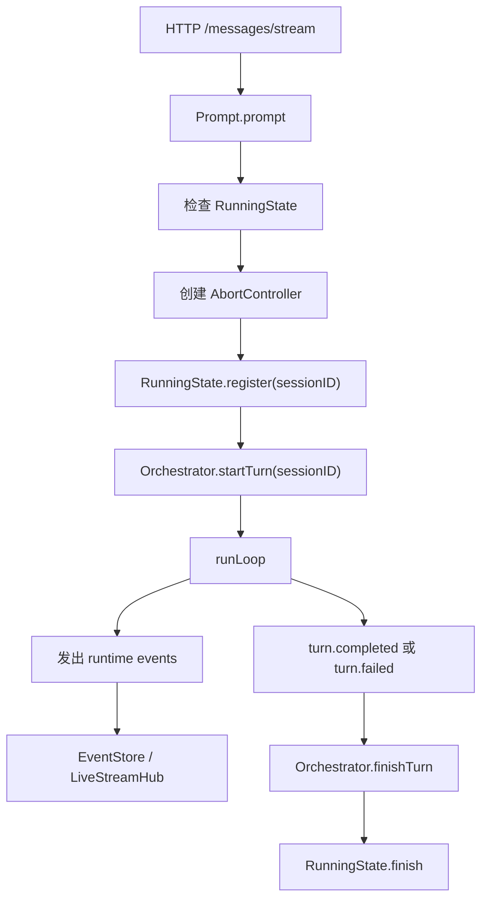
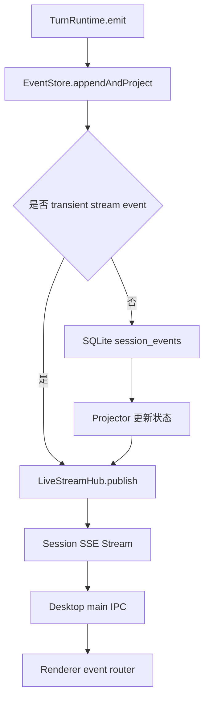
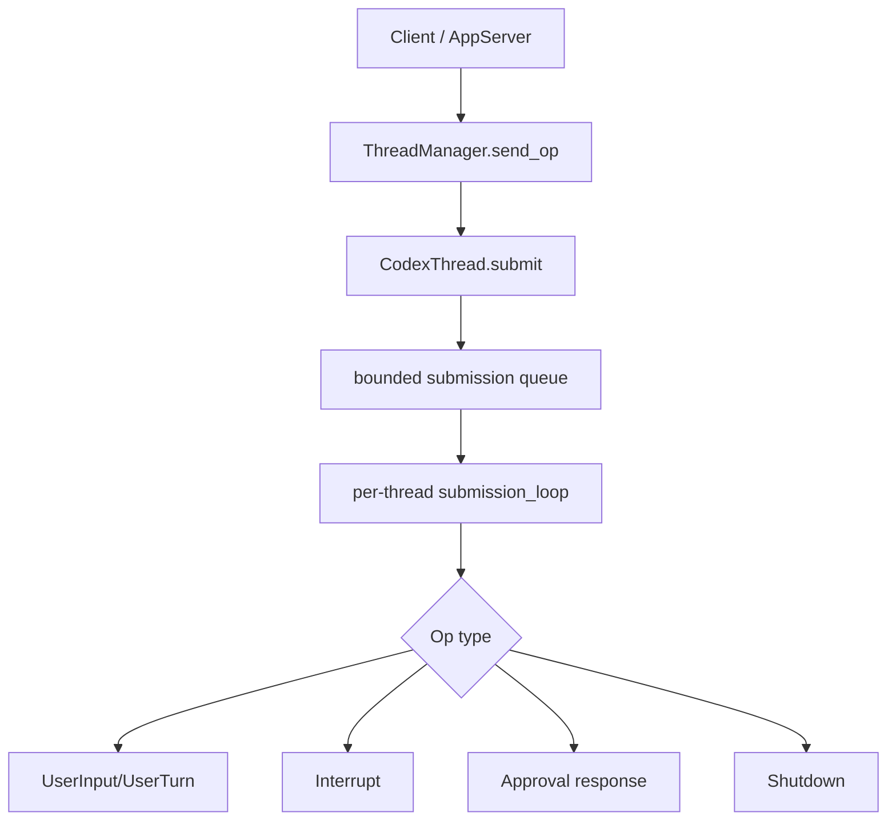
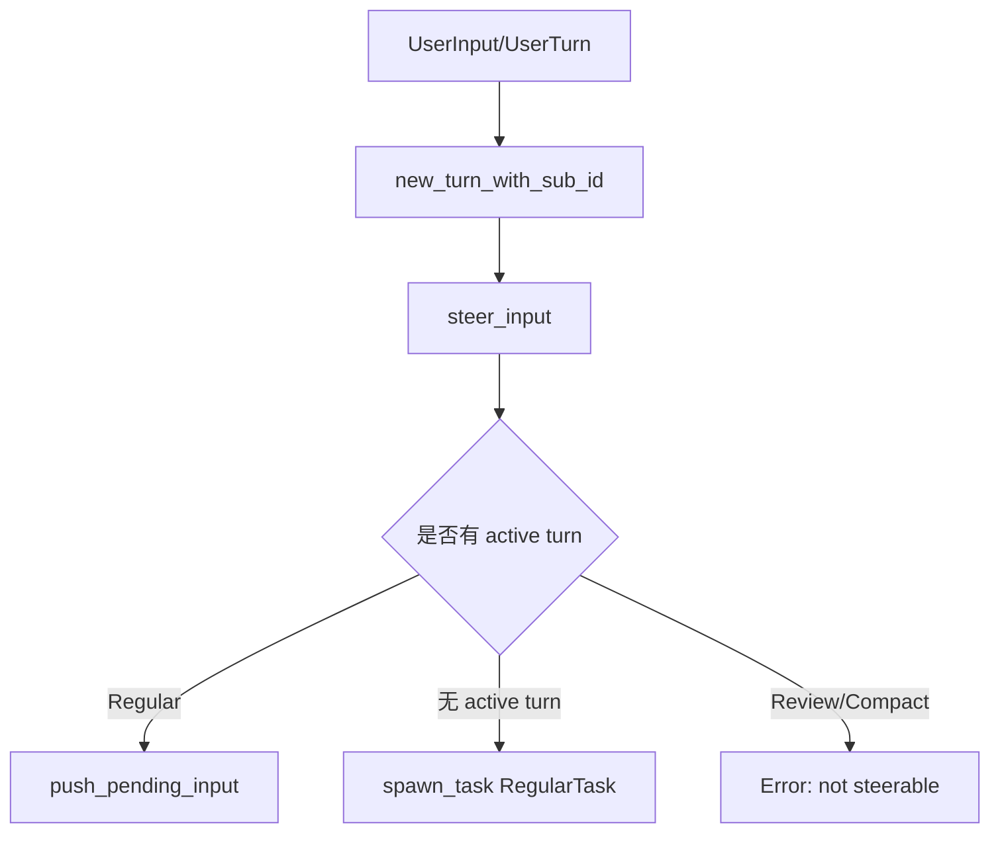

# 多 Session 并行运行实现对比报告

撰写日期：2026-05-06

## 1. 背景与范围

本文对比两个项目中“多 session 并行运行”的实现方式：

- `C:\Projects\anybox`：当前项目，TypeScript/Node 后端 + Electron 桌面端。
- `C:\Projects\codex`：Rust/Tokio 核心 + app-server。

为便于对比，本文将以下概念视作同一层级：

- `anybox` 的 `sessionID`
- `codex` 的 `ThreadId` / `conversation_id` / `CodexThread`

这里的“多 session 并行运行”主要指：

- 不同 session/thread 是否可以同时运行。
- 同一个 session/thread 内是否允许多个 turn/task 并发。
- 新输入、resume、cancel/interrupt 如何与正在运行的任务交互。
- 事件流如何路由到前端或客户端。
- 是否有队列、背压、限流、subagent 等更高级的并发控制。

## 2. 总体结论

`anybox` 采用的是“全局内存表 + 请求驱动执行”的模型。

它通过全局 `runningSessions` 记录正在运行的 session，通过 `activeTurns` 记录当前 active turn。同一个 `sessionID` 上一次只能有一个运行中的 prompt/resume。不同 session 之间没有共享互斥，因此可以依靠 Node.js async runtime 并行运行多个 session。

`codex` 采用的是更完整的 actor 模型。

它通过 `ThreadManager` 管理多个 `CodexThread`。每个 `CodexThread` 有自己的 bounded submission queue 和自己的后台 `submission_loop`。同一个 thread 内所有操作按队列串行分发；不同 thread 拥有独立 loop，因此天然并行运行。真正执行 turn 时，又通过 `SessionTask` + `ActiveTurn` 管理任务生命周期。

简化对比：

| 维度 | `anybox` | `codex` |
|---|---|---|
| 并行单位 | `sessionID` | `CodexThread` / `ThreadId` |
| 同 session 运行策略 | 基本拒绝或等待 | 操作入队串行处理，active regular turn 可被 steer |
| 运行状态 | 全局 `runningSessions` / `activeTurns` | 每个 `Session` 内部 `active_turn` |
| 调度模型 | HTTP/SSE 请求触发执行 | 每 thread 一个 actor loop |
| 输入背压 | 主要在 SSE subscriber 队列 | app-server channel + per-thread submission queue |
| 取消方式 | `AbortController` | `CancellationToken` + task abort + `TurnAborted` |
| 多 agent | 未见一等 subagent/thread tree 模型 | `AgentControl` + `AgentRegistry` |
| 复杂度 | 简单直接 | 复杂但扩展性强 |

## 3. `anybox` 的实现方法

### 3.1 核心运行状态：`runningSessions`

核心文件：

- `C:\Projects\anybox\packages\anyboxagent\src\session\runtime\running-state.ts`

该文件维护一个进程内全局对象：

```ts
const runningSessions: Record<string, RunningSession> = Object.create(null)
```

每个正在运行的 session 对应一个记录，主要包含：

- `AbortController`
- `startedAt`
- `reason`

关键行为：

- `register(sessionID, controller)`：如果该 `sessionID` 已存在，则返回 `false`，表示不能重复启动。
- `finish(sessionID, controller?)`：结束运行状态；如果传入 controller，则只清理匹配的运行记录。
- `waitForStop(sessionID)`：轮询等待 session 不再运行。
- `cancel(sessionID)`：调用 `AbortController.abort()`，然后删除 `runningSessions[sessionID]`。

这意味着 `anybox` 的同 session 互斥主要依赖这个全局 map。

优点是实现直接，几乎没有调度抽象成本；缺点是它只是“运行中标记”，不是完整的 session actor，也不是操作队列。

### 3.2 Turn 运行状态：`activeTurns`

核心文件：

- `C:\Projects\anybox\packages\anyboxagent\src\session\runtime\orchestrator.ts`

该文件维护：

```ts
const activeTurns = new Map<string, TurnRuntime>()
```

`activeTurns` 的 key 是 `sessionID`。`startTurn()` 会检查同一 session 是否已有 active turn：

- 如果已有 active turn，抛错。
- 如果没有，则创建 `TurnRuntime` 并放入 map。

`TurnRuntime` 负责发出运行时事件，例如：

- `turn.started`
- `turn.completed`
- `turn.failed`
- transient stream delta

流式 delta 会被合并并通过 `setTimeout(0)` 延迟 flush，以减少高频事件直接冲击事件系统。

因此，`runningSessions` 和 `activeTurns` 是两层防线：

- `runningSessions` 防止同 session 多个 prompt/resume 同时开始。
- `activeTurns` 防止同 session 多个 turn runtime 同时存在。

### 3.3 状态分类与语义边界

当前实现里，“状态”不是单一字段，而是按职责拆成几类：

1. `SessionRunnerStatus`

   定义在 `packages\anyboxagent\src\session\runtime\session-runner.ts`，描述一个 session runner 当前的调度状态。

   - `idle`：没有正在执行的 active operation，也没有需要继续处理的队列。
   - `running`：当前 session 有一个 active operation，通常对应一个 active turn。
   - `cancelling`：已经对 active operation 调用 `AbortController.abort()`，正在等待执行链路自然退出并清理。
   - `stopped`：类型里保留的状态；当前 `SessionRunner` 代码里没有明显的实际赋值路径。

2. `SessionExecutionMode`

   同样定义在 `session-runner.ts`，但它不是 runner 的长期状态。它的主体是“本次用户输入对应的 operation/request”，含义是这一次输入被 runner 如何安排。这个结果会出现在 `SessionExecutionHandle.mode` 上，并通过 SSE 的 `execution.mode` 事件推送给前端。

   - `new-turn`：这次输入提交时，runner 没有 active operation，所以这次输入会直接启动一个新 turn。
   - `queued`：这次输入提交时，同 session 正在运行或取消中，所以这次输入会进入队列等待。
   - `steer`：这次输入提交时，同 session 正在运行，且当前 active turn 允许接收并发输入，所以这次输入会作为 steer/接管类输入交给当前 active turn。

   因此，`SessionRunnerStatus` 和 `SessionExecutionMode` 不是重复分类。前者回答“这个 session runner 现在处于什么状态”，后者回答“这条刚来的输入被如何安排，并返回/推送给调用方”。例如 runner 可以保持 `running`，同时新输入返回 `queued` 或 `steer`。

3. `TurnRuntimePhase`

   定义在 `packages\anyboxagent\src\session\runtime\runtime-event.ts`，通过 `turn.state.changed` 推送，描述一个 active turn 正在做哪一步。

   - `preparing`：准备请求阶段，例如记录用户消息、构造上下文、准备模型调用。
   - `waiting_llm`：已进入模型调用流程，等待模型开始返回。
   - `reasoning`：模型正在输出 reasoning 内容。
   - `responding`：模型正在输出普通 assistant 文本。
   - `executing_tool`：正在准备或执行工具调用。
   - `waiting_approval`：工具调用需要权限审批，正在等待用户或权限系统决定。
   - `retrying`：遇到可重试问题，准备重试模型调用或相关流程。
   - `blocked`：turn 没有失败，但被阻塞，常见原因是等待权限或等待用户回答问题。
   - `continued_by_user`：当前 turn 被新的用户输入接续，旧 turn 以“由用户继续”结束。
   - `completed`：正常完成。
   - `cancelled`：被取消，例如用户取消、客户端断开或 shutdown。
   - `failed`：执行失败，属于错误终态。

4. turn 终态事件

   runtime 里真正的终态事件是：

   - `turn.completed`
   - `turn.failed`
   - `turn.cancelled`

   其中 `turn.completed.payload.status` 还能细分为 `completed`、`blocked`、`stopped`、`continued_by_user`。也就是说，`blocked` 和 `continued_by_user` 是“非失败结束”，会走 `turn.completed`；`failed` 和 `cancelled` 则有独立终态事件。

5. `TurnRuntime` 内部控制状态

   `TurnRuntime` 还维护一些不直接展示给用户的控制字段：

   - `terminalEvent`：已经发出终态事件后，后续 emit 会直接返回该终态，避免重复结束。
   - `closed`：turn 已关闭，并从 `activeTurns` map 移除。
   - `acceptingSteer`：当前 turn 是否还允许接收 steer 输入。
   - `preparingToolCallIDs`：正在准备中的工具调用集合；如果不为空，并发输入策略倾向 `interrupt`，否则是 `steer`。

6. 前端展示状态

   renderer 里的 `AssistantTurnPhase` 是 UI 层状态，定义在 `packages\desktop\src\renderer\src\app\types.ts`。它会把后端 phase 映射成更适合展示的状态，例如：

   - `requesting`、`waiting_first_event`：前端本地状态，表示请求已经发出但还没有收到后端 runtime event。
   - `tool_running`：前端对后端 `executing_tool` 的展示名。
   - `reasoning`、`waiting_approval`、`responding`、`completed`、`cancelled`、`failed` 等基本对应后端语义。

整体关系可以概括为：

```ts
runner.status = 当前 session runner 的机器状态
execution.mode = 本次输入的调度决策
turn.phase = 当前 active turn 的执行阶段
terminal event = 当前 turn 的结束方式
assistant runtime phase = 前端展示层状态
```

### 3.4 Prompt 执行流程

核心文件：

- `C:\Projects\anybox\packages\anyboxagent\src\session\core\prompt.ts`

典型 prompt 流程：



关键点：

- prompt 启动时会同步创建 `AbortController`。
- 如果 `RunningState.register()` 失败，说明同 session 已经在运行。
- `Orchestrator.startTurn()` 再次确保同 session 没有 active turn。
- finally 阶段清理 active turn 和 running state。

### 3.5 Resume 执行流程

`resume()` 和 `prompt()` 的主要差异是：resume 会先等待该 session 停止。

核心行为：

```ts
await waitForStop(input.sessionID)
```

这说明当前实现对 resume 的态度是“等待旧运行结束后再恢复”，而不是把 resume 作为一个 op 放入同 session 队列。

优点是简单，不需要设计队列语义；缺点是 `waitForStop()` 是轮询，且无法表达更复杂的调度策略，例如“排队 resume”、“替换当前 turn”、“注入当前 turn”。

### 3.6 Cancel 执行流程

核心文件：

- `C:\Projects\anybox\packages\anyboxagent\src\session\core\prompt.ts`
- `C:\Projects\anybox\packages\anyboxagent\src\session\runtime\running-state.ts`

取消路径会做几件事：

- 如果有 active turn，则发出 `turn.cancelled`。
- 更新 turn 状态。
- 调用 `RunningState.cancel(sessionID)`。
- `RunningState.cancel()` 调用 `AbortController.abort()` 并删除 running record。

这里有一个实现细节值得注意：

`RunningState.cancel()` 会立即删除 `runningSessions[sessionID]`，但 `activeTurns` 通常要等 prompt/resume 的 finally 才清理。如果用户在 cancel 后极快发起新 prompt，新请求可能先通过 `RunningState` 检查，然后在 `Orchestrator.startTurn()` 处遇到旧 active turn。

这不是必然 bug，但说明当前模型里“运行标记”和“turn runtime 生命周期”不是一个原子状态机。

### 3.7 事件流：`EventStore` + `LiveStreamHub`

核心文件：

- `C:\Projects\anybox\packages\anyboxagent\src\session\runtime\event-store.ts`
- `C:\Projects\anybox\packages\anyboxagent\src\session\runtime\live-stream-hub.ts`
- `C:\Projects\anybox\packages\anyboxagent\src\server\usecases\session-stream.ts`

事件链路大致如下：



`EventStore` 的设计要点：

- transient stream events 主要用于实时流，不持久化到 SQLite。
- 非 transient events 会写入 `session_events`，再投影状态，再发布给 live subscribers。

`LiveStreamHub` 的设计要点：

- 按 `sessionID` 管理 subscribers。
- 每个 subscriber 有自己的队列。
- 对 stream delta 做 coalescing。
- 队列满时优先丢弃 transient delta；无法腾出空间时关闭慢 subscriber。

这套事件设计比较适合 Electron + SSE 的实时 UI。

### 3.8 桌面端请求与订阅

核心文件：

- `C:\Projects\anybox\packages\desktop\src\main\ipc.ts`

主进程维护两类状态：

- `activeAgentSessionRequests`
  - key: `webContentsID:clientTurnID`
  - 用于当前主动发起的 prompt/resume stream。
- `sessionStreamSubscriptions`
  - key: `webContentsID:sessionID`
  - 用于 session 事件订阅和重连。

主动执行和被动订阅是两条流：

- 主动请求流：`/messages/stream` 或 `/resume/stream`
- 订阅流：`/events/stream`

renderer 侧再根据 `backendSessionID`、`clientTurnID`、`turnID` 做事件合并和去重。

这种设计很贴合桌面 UI：

- 用户发起 turn 时，request stream 能立刻关联到本地 UI turn。
- 打开的 canvas/session 可以订阅后台事件。
- 断线可通过 `Last-Event-ID` 做重连。

## 4. `codex` 的实现方法

### 4.1 核心对象：`ThreadManager`

核心文件：

- `C:\Projects\codex\codex-rs\core\src\thread_manager.rs`

`ThreadManager` 维护所有 live thread：

```rust
threads: Arc<RwLock<HashMap<ThreadId, Arc<CodexThread>>>>
```

主要职责：

- `start_thread`
- `resume_thread`
- `fork_thread`
- `send_op(thread_id, op)`
- `shutdown_all_threads_bounded`

它还持有一组跨 thread 共享的 manager：

- `AuthManager`
- `ModelsManager`
- `EnvironmentManager`
- `SkillsManager`
- `PluginsManager`
- `McpManager`

这说明 `codex` 的并行单位不是“一个请求”，而是长期存在的 `CodexThread`。

### 4.2 每个 thread 的 submission queue

核心文件：

- `C:\Projects\codex\codex-rs\core\src\codex.rs`

`Codex` 对外暴露的是一对队列：

- `tx_sub: Sender<Submission>`
- `rx_event: Receiver<Event>`

创建时：

```rust
let (tx_sub, rx_sub) = async_channel::bounded(SUBMISSION_CHANNEL_CAPACITY);
let (tx_event, rx_event) = async_channel::unbounded();
```

其中 `SUBMISSION_CHANNEL_CAPACITY` 是 `512`。

每个 session/thread 启动时都会创建一个后台 loop：

```rust
tokio::spawn(async move {
    submission_loop(session_for_loop, config, rx_sub).await;
});
```

因此：

- 同一个 thread 的 op 进入同一个 bounded queue。
- `submission_loop` 逐个消费 op。
- 不同 thread 有不同 queue 和不同 loop，可以并行运行。

这就是 `codex` 多 session 并行的核心。

### 4.3 `submission_loop`：同 thread 内串行分发

核心文件：

- `C:\Projects\codex\codex-rs\core\src\codex.rs`

`submission_loop` 接收 `Submission`，然后按 `Op` 类型分发：

- `Op::Interrupt`
- `Op::UserInput`
- `Op::UserTurn`
- `Op::ExecApproval`
- `Op::PatchApproval`
- `Op::DynamicToolResponse`
- `Op::Compact`
- `Op::Review`
- `Op::Shutdown`
- 等等

这是一种 actor 风格设计：



这个设计让同 thread 的状态变更天然串行化，避免多个请求同时直接修改 session 状态。

### 4.4 `Session` 状态：一个 active turn

核心文件：

- `C:\Projects\codex\codex-rs\core\src\codex.rs`
- `C:\Projects\codex\codex-rs\core\src\tasks\mod.rs`

`Session` 内部有：

```rust
active_turn: Mutex<Option<ActiveTurn>>
idle_pending_input: Mutex<Vec<ResponseInputItem>>
```

源码注释明确说明：

> A session has at most 1 running task at a time, and can be interrupted by user input.

也就是说，`codex` 在跨 thread 上并行，但在单个 thread 内保持一个 active turn/task。

### 4.5 同 thread 新输入：steer，而不是简单拒绝

核心文件：

- `C:\Projects\codex\codex-rs\core\src\codex.rs`

`handlers::user_input_or_turn()` 的核心行为：

1. 根据 `Op::UserInput` 或 `Op::UserTurn` 创建当前 turn context。
2. 调用 `sess.steer_input(items, None)`。
3. 如果当前有 active regular turn，则输入被加入该 turn 的 pending input。
4. 如果没有 active turn，则启动新的 regular task。
5. 如果 active turn 是 review/compact 等不可 steer 类型，则返回错误。

简化流程：



这是和 `anybox` 最大的同 session 行为差异之一。

`anybox` 更偏向“同 session 正在运行就拒绝或等待”；`codex` 则允许把新输入注入 active regular turn。

### 4.6 Task 生命周期：`SessionTask`

核心文件：

- `C:\Projects\codex\codex-rs\core\src\tasks\mod.rs`

`codex` 把不同工作流抽象成 `SessionTask`：

- `RegularTask`
- `ReviewTask`
- `CompactTask`
- `UndoTask`
- `UserShellCommandTask`
- `GhostSnapshotTask`

`SessionTask` trait 负责：

- 标识任务类型：`kind()`
- 提供 tracing span name：`span_name()`
- 执行任务：`run(...)`
- 处理中断清理：`abort(...)`

`Session::spawn_task()` 会先：

```rust
self.abort_all_tasks(TurnAbortReason::Replaced).await;
```

再启动新 task。

`start_task()` 会：

- 创建 `CancellationToken`
- 创建 `Notify`
- `tokio::spawn` 真正的 task runner
- 将 `RunningTask` 放入 `ActiveTurn`
- 在 task 完成时统一调用 `on_task_finished`

这比 `anybox` 的 `AbortController + Promise finally` 更重，但生命周期边界更明确。

### 4.7 Interrupt / Cancel

核心文件：

- `C:\Projects\codex\codex-rs\core\src\tasks\mod.rs`
- `C:\Projects\codex\codex-rs\core\src\codex.rs`

`Op::Interrupt` 进入同 thread 的 submission queue 后，由 `handlers::interrupt()` 调用：

```rust
sess.interrupt_task().await;
```

如果有 active turn，则：

- `abort_all_tasks(TurnAbortReason::Interrupted)`
- `take_active_turn()`
- 遍历并 drain 所有 running tasks
- 对每个 task 调用 `handle_task_abort`

`handle_task_abort` 的行为：

- cancel `CancellationToken`
- 等待 task 最多 100ms 优雅退出
- abort Tokio handle
- 调用 task 自己的 `abort()`
- 如果是用户 interrupt，写入 interrupted marker 到历史和 rollout
- flush rollout
- 发出 `TurnAborted`

相比 `anybox`，`codex` 的 interrupt 更像完整状态转移，而不是只 abort controller。

### 4.8 app-server 事件监听

核心文件：

- `C:\Projects\codex\codex-rs\app-server\src\codex_message_processor.rs`
- `C:\Projects\codex\codex-rs\app-server\src\thread_state.rs`
- `C:\Projects\codex\codex-rs\app-server\src\outgoing_message.rs`

app-server 侧维护：

- `ThreadStateManager`
- 每 thread 的 listener state
- 每连接订阅了哪些 thread
- pending interrupts
- 当前 active turn snapshot

`ensure_listener_task_running_task()` 会为 thread 启动 listener task，核心循环：

- `conversation.next_event()`
- 更新 thread-local state
- 找到订阅该 thread 的 connection ids
- 用 `ThreadScopedOutgoingMessageSender` 发送通知
- 同时处理 listener command，例如 resume response、server request resolve

这相当于把 core 的 event receiver 转换为 app-server 的 typed JSON-RPC notification。

### 4.9 subagent / multi-agent

核心文件：

- `C:\Projects\codex\codex-rs\core\src\agent\control.rs`
- `C:\Projects\codex\codex-rs\core\src\agent\registry.rs`

`codex` 的多 session 并行不只服务 UI 多会话，也服务 subagent。

`AgentControl` 的设计说明：

- 每个 root thread/session tree 共享一个 `AgentControl`。
- `AgentControl` 持有指向 `ThreadManagerState` 的 weak handle。
- 它可以 spawn/resume/send_input/interrupt agent thread。

`AgentRegistry` 限制 multi-agent 能力：

- 当前 root session tree 下的 active agents。
- total subagent count。
- `agent_max_threads`。
- agent path / nickname。

这使 `codex` 可以支持模型主动创建并行 subagents，并通过 `send_input`、`wait_agent`、`close_agent` 等工具进行协作。

## 5. 两者关键差异

### 5.1 调度模型不同

`anybox`：

- 没有 session 专属 actor loop。
- 每次 prompt/resume 请求进入后，直接尝试注册 running state 并运行。
- session 并行依赖 Node.js 的异步并发。

`codex`：

- 每个 thread 有独立 actor loop。
- 所有 op 都先进入该 thread 的 queue。
- 同 thread 状态修改天然串行。
- 跨 thread 靠 Tokio task 并行。

影响：

- `anybox` 更简单，延迟更低，代码路径短。
- `codex` 更适合复杂交互和长期运行的 agent runtime。

### 5.2 同 session 策略不同

`anybox`：

- prompt：同 session 运行中通常直接拒绝。
- resume：等待运行停止。
- cancel：abort 当前 controller。

`codex`：

- 新输入先作为 op 入队。
- 如果 active regular turn 存在，可 steer 注入当前 turn。
- 如果无 active turn，启动新 task。
- 如果不可 steer，返回错误。

影响：

- `anybox` 的行为更可预测：一个 session 一次只跑一个 turn。
- `codex` 的交互更强：用户可以在模型运行时追加输入或引导当前 turn。

### 5.3 取消语义不同

`anybox`：

- cancel 是外部直接 abort。
- running state 会立即删除。
- turn runtime 清理依赖执行路径 finally。

`codex`：

- interrupt 是一个 `Op`。
- 进入同 thread queue 后串行处理。
- task cancel、history marker、rollout flush、`TurnAborted` 事件都在统一路径里完成。

影响：

- `anybox` 取消实现轻，但可能出现 running state 和 active turn 短暂不一致。
- `codex` 取消更重，但状态转移更完整，客户端更容易依赖事件语义。

### 5.4 事件系统不同

`anybox`：

- 以 `EventStore` 和 `LiveStreamHub` 为中心。
- SQLite event store 是重要事实来源。
- SSE 更贴合 Electron renderer。

`codex`：

- core 通过 `rx_event` 输出事件。
- app-server listener 消费 `CodexThread.next_event()` 并转发给订阅连接。
- rollout/history 是核心持久化路径之一。

影响：

- `anybox` 更容易做 session event replay、UI 订阅和状态投影。
- `codex` 更像 runtime event stream，app-server 再做协议转换和 UI 状态同步。

### 5.5 背压与限流不同

`anybox`：

- 没看到全局 session 并发上限。
- 没看到每 session 输入 op queue。
- 主要背压在 live stream subscriber 队列。

`codex`：

- app-server transport channel 有容量限制。
- 每个 `Codex` submission queue 容量为 `512`。
- subagent 有 `agent_max_threads` 限制。

影响：

- `anybox` 在大量 session 同时运行时，更依赖外部资源和运行环境自然承压。
- `codex` 至少在请求入口和 subagent 维度有明确限制点。

### 5.6 多 agent 能力不同

`anybox`：

- 当前代码主要围绕用户 UI session。
- 没看到完整 subagent tree、agent registry、agent send/wait/close 机制。

`codex`：

- subagent 是核心能力。
- 每个 subagent 本质是一个独立 thread。
- parent/root session tree 共享 `AgentControl` 和 registry。

影响：

- `anybox` 的模型更像“多聊天会话并发”。
- `codex` 的模型更像“多 actor agent runtime”。

## 6. 各自优劣

### 6.1 `anybox` 的优点

1. 实现简单

   `runningSessions` 和 `activeTurns` 都是直接的内存结构，读代码很快能理解同 session 互斥逻辑。

2. 和 Electron/SSE UI 贴合

   主动执行流、订阅流、renderer 事件路由分工清晰，适合桌面端实时展示。

3. 事件持久化和投影直观

   非 transient runtime events 写入 SQLite，再投影再发布，适合做会话历史、状态恢复、事件回放。

4. 开发和调试成本低

   相比 actor runtime，没有太多跨层抽象。定位 session 是否运行，直接看 `runningSessions` 和 `activeTurns`。

### 6.2 `anybox` 的不足

1. 缺少同 session op queue

   prompt、resume、cancel 是独立请求语义，不是统一进入同 session 队列的操作。

2. 取消状态存在短暂不一致风险

   `RunningState.cancel()` 立即删除 running record，但 active turn 可能尚未 finish。

3. resume 使用轮询等待

   `waitForStop()` 简单有效，但不是事件驱动，也无法表达更复杂的调度策略。

4. 不支持 active turn steer

   如果未来要支持“模型运行中追加指令并被当前 turn 消费”，当前模型需要扩展。

5. 缺少全局并发上限

   多 session 同时运行时，没有看到类似 `max_running_sessions` 或 `agent_max_threads` 的统一限制。

### 6.3 `codex` 的优点

1. actor 边界清晰

   每个 thread 自己拥有 queue 和 loop。同 thread 串行，跨 thread 并行。

2. 同 thread 交互能力强

   active regular turn 可以被 steer，用户输入不一定要等当前 turn 结束。

3. 任务生命周期完整

   `SessionTask`、`RunningTask`、`CancellationToken`、`TurnComplete`、`TurnAborted` 构成统一生命周期。

4. subagent 能力成熟

   `AgentControl` 和 `AgentRegistry` 让多 agent 并行成为一等能力，并支持数量限制。

5. 背压点更明确

   app-server transport channel、thread submission queue、subagent max threads 都是明确控制点。

### 6.4 `codex` 的不足

1. 复杂度高

   从 app-server 到 core 再到 task/listener，链路较长，调试需要跨多个模块。

2. 抽象层较多

   `ThreadManager`、`CodexThread`、`Codex`、`Session`、`ActiveTurn`、`SessionTask`、app-server listener 都要同时理解。

3. 运行时状态分散

   core 有 session state，app-server 有 thread state，agent registry 又有 subagent state。功能强，但心智负担更重。

4. 资源占用更高

   每个 thread 都有 queue、loop、watch/status、event receiver 等结构。大量 thread idle 时也有一定管理成本。

## 7. 对 `anybox` 的设计启发

如果只是维持当前桌面端“多个会话可同时跑”的能力，`anybox` 当前模型可以继续使用。它简单、直接，并且和现有 SSE/UI 架构匹配。

如果未来要支持更强的 agent 能力，可以考虑吸收 `codex` 的几个设计点。

### 7.1 引入 per-session runner

可以将当前全局 `runningSessions` 演进为：

```ts
type SessionRunner = {
  sessionID: string
  queue: AsyncQueue<SessionOp>
  activeTurn: TurnRuntime | null
  status: "idle" | "running" | "cancelling" | "stopped"
  abortController: AbortController | null
}
```

每个 session 一个 runner：

- prompt/resume/cancel 都变成 `SessionOp`。
- 同 session op 串行处理。
- 不同 session runner 并行运行。

这样可以保留当前简单模型，同时减少 running state 和 active turn 不一致的问题。

### 7.2 用事件或 promise 替代 `waitForStop` 轮询

当前 `resume()` 依赖 `waitForStop()` 轮询。

可以改成：

- runner 内部维护 `stoppedPromise`。
- active turn 完成时 resolve。
- resume op 进入 queue 后自然等待前序 op。

这样可以避免轮询，也能更精确表达“resume 排在当前运行之后”。

### 7.3 明确 cancel 状态机

建议将 cancel 分成几个状态：

- `running`
- `cancelling`
- `cancelled`
- `finished`

不要在 abort 发出后立即把 session 视为完全 idle。可以等 finally 完成后再允许新 turn，或者显式支持“cancel 后排队下一 turn”。

### 7.4 决定是否支持 steer

如果产品希望支持“运行中追加输入”，需要引入类似 `codex` 的 pending input：

- active regular turn 可接收 pending input。
- review/compact 等不可 steer turn 返回错误。
- run loop 在合适时机检查 pending input。

如果产品不需要这个能力，继续拒绝同 session prompt 是更简单也更稳定的选择。

### 7.5 增加并发限制

可以增加几类限制：

- 全局最大 running sessions。
- 单 project/directory 最大 running sessions。
- 单 session 最大 queued ops。
- SSE subscriber 最大数量。

这能避免同时启动大量 session 时资源不可控。

## 8. 适用场景判断

### 8.1 更适合 `anybox` 当前模型的场景

- 桌面端 UI 驱动的多会话聊天。
- 用户通常一次只操作一个 session。
- 同 session 不需要运行中追加输入。
- 更重视实现简单、状态可见、事件持久化。

### 8.2 更适合 `codex` 模型的场景

- 需要大量 session/thread 长期共存。
- 需要 subagent 并行工作。
- 同 session 运行中要支持 steer、approval、tool response、interrupt 等多类 op。
- 需要明确的队列、背压、状态转移和任务生命周期。

## 9. 结论

两者不是简单的“谁更好”，而是面向不同复杂度。

`anybox` 的实现是轻量 session 并发模型：用全局 running map 做互斥，用 active turn map 管 turn 生命周期，用 SSE hub 做实时事件分发。它适合当前桌面端产品形态，代码路径短，改动成本低。

`codex` 的实现是 actor 化 agent runtime：每个 thread 一个 queue 和 loop，同 thread 串行、跨 thread 并行，并在此基础上实现 task 生命周期、interrupt、subagent、app-server listener 和并发限制。它更复杂，但更适合多 agent 和长期演进。

如果 `anybox` 后续只需要稳定支持多个独立 session 并行，建议保留当前大体架构，只修正 cancel 状态一致性和增加并发限制。如果要演进成更强的 agent runtime，则应优先引入 per-session runner/queue，而不是直接复制 `codex` 的全部抽象。
