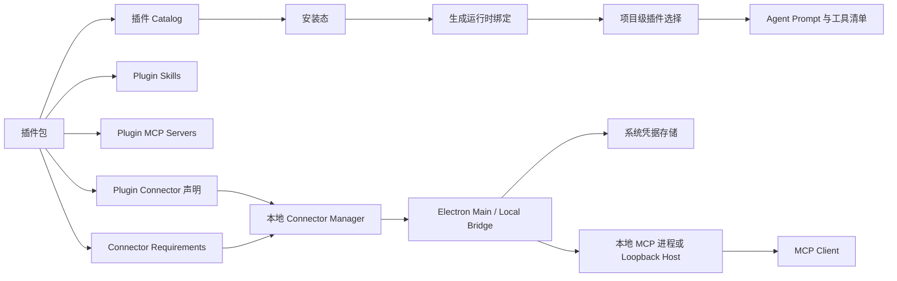

# Fanfande Studio 插件模块与本地 Connector 设计

## 结论

插件模块可以借鉴 Codex 的包结构、manifest、catalog、安装态、MCP/Skill 绑定和项目级选择机制，但 connector 不建议照搬 Codex。

Codex 的 plugin app 更偏向 ChatGPT 远程 App Connector；Fanfande Studio 更适合把 connector 设计成桌面端本地能力：凭据、OAuth、运行时解析、诊断、本地进程启动都由本地桌面栈管理。只有当某个 connector 必须访问外部服务时，才把请求发到远程 API。

## 现有基础

当前项目已经有可复用的基础：

- `packages/fanfandeagent/src/plugin/plugin.ts`：插件 manifest、catalog、安装态、生成 MCP 绑定、plugin connector 状态、plugin skill root。
- `packages/fanfandeagent/src/connector/connector.ts`：平台 connector 定义、凭据、OAuth、运行时解析、诊断。
- `packages/fanfandeagent/src/mcp/client.ts`：MCP 连接时按 `connectorId` 解析远程运行时。
- `packages/desktop/src/renderer/src/app/plugins/PluginsPage.tsx`：插件管理页面。
- `packages/desktop/src/renderer/src/app/connectors/ConnectorsPage.tsx`：connector 管理页面。

当前概念拆分是合理的：

- `mcpServers`：插件自带 MCP server。
- `skills`：插件自带 Skill。
- `connectorRequirements`：插件依赖一个共享平台 connector。
- `apps`：插件自带 connector 声明。这个名字继承自 Codex，建议后续作为兼容字段保留，长期公开语义改成 `connectors`。

## 从 Codex 复用什么

保留这些设计：

1. 插件是能力包，不是新的执行引擎。
2. 安装插件只生成运行时绑定，不自动暴露给所有项目。
3. 一个插件可以同时提供 MCP、Skill、Connector 等能力。
4. 插件 ID 和生成的能力 ID 必须稳定可预测。
5. 普通 MCP 配置里不写入密钥。
6. catalog、安装态、项目选择分层管理。

不要照搬这些 Codex 细节：

1. `.app.json` 只保存远程 ChatGPT App ID。
2. connector 安装路径指向 `chatgpt.com/apps/...`。
3. connector 可用性主要依赖远程 App Directory 或远程 tool discovery。
4. 远程 marketplace mutation/sync 成为本地运行时核心依赖。

## 目标架构



边界建议：

- Renderer 只展示状态和收集输入。
- Electron main 负责桌面原生能力：系统凭据存储、OAuth 浏览器窗口、本地进程监督。
- Agent 负责 catalog 归一化、项目选择、MCP tool inventory、工具调用编排。
- 密钥只在解析 connector runtime 时进入内存，不写入全局 MCP 配置。

## 插件包结构

继续使用当前版本化包结构：

```text
<install-root>/
  <plugin-id>/
    <version>/
      .fanfande-plugin/
        plugin.json
      assets/
      docs/
      scripts/
      skills/
        <skill-name>/
          SKILL.md
      connectors/
        <connector-id>/
          connector.json
          server.js
```

`connectors/` 是可选目录。简单插件可以把 connector 声明直接写在 `plugin.json`；需要携带本地运行时代码时再使用 `connectors/<id>/`。

## Manifest 设计

建议 v2 新增 `connectors`，保留 `apps` 作为兼容别名：

```json
{
  "name": "docs-lab",
  "version": "0.2.0",
  "description": "Search local and remote docs from Fanfande Studio.",
  "interface": {
    "displayName": "Docs Lab",
    "category": "Docs"
  },
  "skills": "skills",
  "mcpServers": [
    {
      "id": "notes",
      "name": "Docs Notes",
      "runtime": {
        "transport": "stdio",
        "command": "node",
        "args": ["${PLUGIN_ROOT}/scripts/notes-server.js"],
        "cwd": "${PLUGIN_ROOT}"
      }
    }
  ],
  "connectorRequirements": [
    {
      "connector": "workspace-files",
      "tools": ["search_files"],
      "required": false,
      "reason": "Search local workspace documentation."
    }
  ],
  "connectors": [
    {
      "id": "docs-api",
      "name": "Docs API",
      "description": "Local connector wrapper for a docs API.",
      "credential": {
        "kind": "api_key",
        "key": "DOCS_API_KEY",
        "label": "Docs API key",
        "type": "password",
        "required": true,
        "secret": true
      },
      "runtime": {
        "transport": "stdio",
        "command": "node",
        "args": ["${PLUGIN_ROOT}/connectors/docs-api/server.js"],
        "cwd": "${PLUGIN_ROOT}",
        "env": {
          "DOCS_API_KEY": "${DOCS_API_KEY}"
        }
      },
      "tools": [
        {
          "name": "search_docs",
          "description": "Search docs.",
          "readOnly": true
        }
      ]
    }
  ]
}
```

兼容规则：

- 优先解析 `connectors`。
- `apps` 作为 `connectors` 的旧字段继续解析。
- UI 文案统一使用 “Connectors”。
- 已安装插件的旧 ID 继续可解析，等迁移完成后再隐藏。

## Connector 类型

### 平台 Connector

平台 connector 独立于某个插件，可以被多个插件复用。

适合：

- workspace files
- local browser
- GitHub
- database
- 桌面本地专属集成
- 用户预期只配置一次的能力

插件通过 `connectorRequirements` 引用：

```json
{
  "connectorRequirements": [
    {
      "connector": "github",
      "tools": ["search_issues", "create_issue"],
      "required": true,
      "reason": "Create implementation tickets from plugin output."
    }
  ]
}
```

### 插件自带 Connector

插件自带 connector 随插件安装、启用、卸载。

适合：

- 插件专属 API key
- 插件包内携带的本地 MCP wrapper
- 卸载插件时应该一起消失的工具
- 只服务于该插件的认证和诊断状态

推荐 ID：

```text
plugin-connector:<pluginID>:<connectorID>
```

### 普通 MCP Server

不需要连接状态和认证生命周期时，继续使用 `mcpServers`。

适合：

- 无认证的本地工具
- 纯插件包内脚本
- 配置只来自插件安装 config
- 不需要 “Connect” 按钮或账号状态

## Runtime 模型

当前 MCP config 支持 `stdio` 和 `remote`。为了支持“认证后的本地 stdio connector”，建议新增 connector-resolved runtime：

```json
{
  "name": "Docs API",
  "transport": "connector",
  "connectorId": "plugin-connector:docs-lab:docs-api",
  "enabled": true,
  "timeoutMs": 1000
}
```

MCP client 在真正连接前解析 connector：

```ts
type ResolvedConnectorRuntime =
  | {
      transport: "stdio"
      command: string
      args?: string[]
      cwd?: string
      env?: Record<string, string>
    }
  | {
      transport: "remote"
      serverUrl: string
      authorization?: string
      headers?: Record<string, string>
    }
```

统一规则：

1. 配置里只保存 `connectorId`。
2. Connector manager 校验插件安装态和连接态。
3. Connector manager 从桌面本地凭据存储加载密钥。
4. Connector manager 在内存中替换 placeholder。
5. MCP client 根据解析结果启动 stdio 或 remote transport。

如果第一步不想改太大，可以先保持：

- 远程 connector 继续走现有 `remote + connectorId`。
- 无认证本地工具继续走 `mcpServers`。
- 先把 manifest 和 UI 语义从 `apps` 改成 `connectors`。

但长期目标仍建议是 `transport: "connector"`，否则本地 stdio connector 很难做到运行时注入密钥且不污染 MCP 配置。

## 桌面本地认证与密钥

生产桌面版建议：

- API key 和 OAuth session 存在系统凭据存储，由 Electron main 管理。
- Agent 数据库只保存非敏感元数据：provider ID、active method、label、expiresAt、lastError。
- Renderer 保存后不再拿到原始 API key。
- 生成的 MCP config 不包含 token 或 API key。
- OAuth callback 只监听 loopback，并使用 PKCE。

当前 agent 侧 JSON auth store 可以作为开发回退，但生产路径应抽象出 credential store interface：

```text
agent connector API
  -> desktop credential bridge
  -> OS Credential Manager / Keychain / libsecret
```

## 安装与执行流程

### 安装

1. Catalog 扫描本地 package roots 和 registry metadata。
2. 插件包复制到受控安装目录。
3. Manifest 归一化。
4. 写入安装态。
5. 生成绑定：
   - `plugin.<pluginID>.<serverID>`：普通 MCP server。
   - `plugin.<pluginID>.connector.<connectorID>`：插件自带 connector。
6. Skill roots 加入可发现范围。
7. 项目仍然显式选择插件。

### 连接

1. 用户在插件详情或 connector 页面发起连接。
2. UI 调本地 settings API。
3. API 启动 API-key 保存或 OAuth flow。
4. Electron main 写入本地凭据存储。
5. Connector 状态变为 connected、pending、expired、unavailable 或 error。

### 工具执行

1. 项目选择已安装插件。
2. Agent 加载选中插件的 skills 和 MCP tools。
3. MCP client 连接 connector-backed server 时解析 `connectorId`。
4. Connector manager 在内存中注入密钥并返回解析后的 runtime。
5. Tool call 继续走现有 MCP policy 和 approval。

### 卸载

1. 删除生成的 MCP bindings。
2. 从项目选择里移除 plugin skill 和 plugin ID。
3. 删除安装态。
4. 停止本地 connector 进程。
5. 插件自带 connector 的密钥默认删除；平台 connector 的密钥默认保留。

## API Surface

保留现有 settings API 形状，逐步统一命名：

```text
GET    /api/plugins/catalog
GET    /api/plugins/installed
PUT    /api/plugins/installed/:pluginID
PATCH  /api/plugins/installed/:pluginID
DELETE /api/plugins/installed/:pluginID

GET    /api/connectors/catalog
GET    /api/connectors
PUT    /api/connectors/:connectorID/api-key
POST   /api/connectors/:connectorID/auth/flows
DELETE /api/connectors/:connectorID/auth/session

GET    /api/plugins/installed/:pluginID/connectors
PUT    /api/plugins/installed/:pluginID/connectors/:connectorID/api-key
POST   /api/plugins/installed/:pluginID/connectors/:connectorID/auth/flows
DELETE /api/plugins/installed/:pluginID/connectors/:connectorID/auth/session
```

路由已经使用 `connectors`，不要再新增公开 `apps` 路由。

## ID 规则

长期推荐：

```text
Plugin ID:
  <normalized manifest name>

Plugin MCP server:
  plugin.<pluginID>
  plugin.<pluginID>.<serverID>

Platform connector instance:
  connector:<connectorID>:default

Plugin-owned connector:
  plugin-connector:<pluginID>:<connectorID>

Plugin-owned connector MCP binding:
  plugin.<pluginID>.connector.<connectorID>

Plugin skill:
  plugin:<pluginID>:<skill-directory-name>
```

当前兼容 ID：

```text
plugin-app:<pluginID>:<appID>
plugin.<pluginID>.app.<appID>
```

在迁移完成前继续支持解析。

## 安全边界

本地 connector 的安全边界要比远程 App Connector 更严格：

- 插件包代码默认不可信，除非来自 curated source。
- 安装时展示本地命令、权限、连接器声明。
- Runtime placeholder 只能来自声明过的 config fields 和 credential fields。
- Stdio connector 命令默认必须位于 `${PLUGIN_ROOT}` 内，除非用户显式允许外部命令。
- 插件包解压继续拒绝 symlink 和越界路径。
- 权限策略仍按 MCP tool 生效，不只按 plugin 生效。
- 诊断可以展示工具名和状态，不展示密钥材料。

## 实现路径

### Phase 1：命名和 schema 兼容

涉及文件：

- `packages/fanfandeagent/src/plugin/plugin.ts`
- `packages/desktop/src/renderer/src/app/types.ts`
- `packages/desktop/src/renderer/src/app/plugins/PluginsPage.tsx`

任务：

1. `PluginManifest` 新增 `connectors`。
2. 将 `apps` 和 `connectors` 归一化为内部 `pluginConnectors`。
3. API 可暂时继续返回 `apps`，但 UI 文案改为 Connector。
4. 增加测试，确保旧 `apps` manifest 仍可安装和连接。

### Phase 2：Connector-resolved MCP runtime

涉及文件：

- `packages/fanfandeagent/src/config/config.ts`
- `packages/fanfandeagent/src/mcp/client.ts`
- `packages/fanfandeagent/src/connector/connector.ts`
- `packages/fanfandeagent/src/plugin/plugin.ts`

任务：

1. 增加 `transport: "connector"` MCP server config。
2. 增加 `ResolvedConnectorRuntime`，支持 `stdio` 和 `remote`。
3. MCP 连接时解析 connector runtime。
4. 保证密钥不写入生成配置。
5. 为 connector-resolved stdio runtime 增加诊断。

### Phase 3：桌面凭据适配

涉及文件：

- `packages/desktop/src/main/ipc.ts`
- `packages/fanfandeagent/src/auth/auth.ts`
- `packages/fanfandeagent/src/auth/provider-auth.ts`

任务：

1. 抽象 credential store interface。
2. JSON store 保留为开发回退。
3. Electron main 实现系统凭据存储。
4. Renderer 不暴露已保存的原始密钥。

### Phase 4：本地 connector 包结构

涉及文件：

- `packages/fanfandeagent/src/plugin/plugin.ts`
- `packages/fanfandeagent/Test/plugin.test.ts`
- `docs/plugin-module-v1.md`

任务：

1. 支持可选 `connectors/<id>/connector.json`。
2. 校验 connector runtime path 必须留在插件包内。
3. 安装时生成 connector bindings。
4. 卸载时默认删除插件自带 connector 凭据，平台 connector 凭据默认保留。

## 推荐第一步

最小可落地路径：

1. 保留当前插件 catalog、安装态、项目选择机制。
2. 把插件 `apps` 的心智模型改成插件 `connectors`，但继续兼容旧字段。
3. 共享桌面本地能力继续用 `connectorRequirements`。
4. 无认证本地工具继续用 `mcpServers`。
5. 在支持“认证后的本地 stdio connector”前，先实现 `transport: "connector"`。

这样可以先把架构方向拉正，不需要一次性重写整个插件系统。
