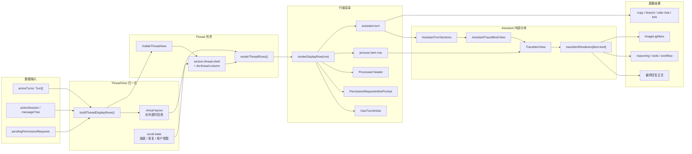

# Thread View 前端设计说明

更新日期：2026-06-03

## 1. 文档定位

本文记录桌面端 `ThreadView` 的当前前端设计。它是维护入口，不替代源码；当 `ThreadView` 的布局、信息层级、trace 呈现、side chat、权限确认或 composer 嵌套行为发生变化时，需要同步更新本文。

主要实现文件：

- `packages/desktop/src/renderer/src/app/thread/ThreadView.tsx`
- `packages/desktop/src/renderer/src/styles/thread.css`
- `packages/desktop/src/renderer/src/app/workbench/WorkbenchPaneSurface.tsx`
- `packages/desktop/src/renderer/src/styles/workbench.css`
- `packages/desktop/src/renderer/src/styles/composer.css`
- `packages/desktop/src/renderer/src/styles/responsive.css`

相关测试：

- `packages/desktop/src/renderer/src/app/thread/ThreadView.test.tsx`
- `packages/desktop/src/renderer/src/App.test.tsx`

## 2. 设计目标

Thread view 不是普通聊天窗口，而是 agent 工作台里的执行记录视图。它需要同时支持三类阅读：

1. 用户快速读取最终回复。
2. 开发者扫描 agent 的 reasoning、tool、workflow、file change 等执行轨迹。
3. 用户在不中断主会话上下文的前提下，对某条 assistant 回复开启 side chat。

因此当前设计优先级是：

- 主回复优先，trace 信息降噪。
- 桌面端高密度，可长时间扫描。
- 关键动作贴近对应消息，例如复制回复、打开 side chat、批准工具调用。
- 多 pane 工作台里保持固定宽度、可读行长和独立滚动。

## 3. 工作台嵌入关系

`ThreadView` 由 `WorkbenchPaneSurface` 渲染在 pane 的主体区域。代码层级是：

```text
section.workbench-pane  # Dockview panel 的内容根
└─ div.workbench-pane-stage  # pane 内容舞台
   └─ div.workbench-pane-live-region.is-dockview-managed  # pane 内实际渲染区
      ├─ SessionCanvasTopMenu  # 当前 session 的工具条
      ├─ ThreadView  # 主阅读与执行记录区
      └─ div.composer-stack  # 底部输入区栈
         ├─ ComposerPendingSteerDrawer  # 已提交但不打断运行的补充输入
         ├─ Composer  # 主输入框
         ├─ ComposerBranchParentNotice  # 分支续写提示
         ├─ ComposerPlanModeNotice  # plan mode 状态提示
         └─ ComposerUtilityBar  # workspace/model/context 辅助信息
```

Dockview 的 tab/header chrome 位于 `WorkbenchPaneSurface` 外部，不属于 `section.workbench-pane` 内容根。视觉调试截图中，pane 对应的是中间 Dockview 内的内容面板；它包含绿色 `SessionCanvasTopMenu`、蓝色 `ThreadView` 区、紫色 `Composer` 和底部浅绿 `ComposerUtilityBar`。左侧 sidebar、右侧 sidebar、顶层 Dockview tab 条都不是这个 pane 的主体内容。

从用户可见区域看，一个 pane 的主要结构是：

```text
PaneTabBar
SessionCanvasTopMenu
ThreadView
ComposerTaskProgress
Composer
ComposerUtilityBar
```

`workbench-pane-live-region` 使用 CSS grid 管理这些区域，其中 thread 占据 `minmax(0, 1fr)` 主滚动区，composer 固定在底部。`ThreadView` 内部的 `thread-column` 是独立滚动容器。

截图中的蓝色大块不是正常主题色，也不是 semantic token。它来自 debug region 模式：

```css
.window-shell.debug-ui-regions .thread-shell,
.window-shell.debug-ui-regions .thread-column {
  background: var(--debug-region-thread-shell);
}
```

`--debug-region-thread-shell` 当前值为 `#bee3f8`。普通模式下 `.thread-shell` 和 `.thread-column` 自身不设置背景，保持透明，露出父级 pane/shell 背景。

宽度策略：

- `workbench-pane-live-region` 定义 `--pane-content-max-width: 880px`。
- `thread-shell` 负责左右 gutter。
- `thread-column` 居中，最大宽度等于 pane 内容宽度。
- 多 pane 模式下仍保持 `width: 100%`，避免 split pane 中出现额外横向压缩。

## 4. 内容模型

`ThreadView` 输入的核心数据是 `activeTurns: Turn[]`。数据层级可以按下面的树理解：

```text
activeTurns: Turn[]
├─ UserTurn  # 用户输入回合
│  ├─ text / displayText  # 原始文本与展示文本
│  ├─ references[]  # @ 文件、链接等引用
│  ├─ attachments[]  # 图片、PDF 等附件
│  ├─ diffSummary?  # 该输入关联的变更摘要
│  └─ submissionMode?  # 普通发送或 steer
└─ AssistantTurn  # agent 输出回合
   ├─ messageID?  # 会话树中的消息 ID
   ├─ runtime  # 执行状态
   │  ├─ phase  # running/completed/cancelled 等阶段
   │  └─ tasks?  # 运行时任务信息
   ├─ diffSummary?  # assistant 产出的变更摘要
   └─ items: AssistantTraceItem[]  # 可渲染的 trace 单元
      ├─ kind  # renderer 分发依据
      ├─ section?  # 显式 section 覆盖
      ├─ status?  # pending/running/completed/error 等状态
      ├─ text?  # 主文本
      ├─ detail?  # 补充详情
      ├─ filePaths?  # 可跳转文件
      ├─ draftPatch?  # 流式或草稿补丁
      ├─ debugEntries?  # developer debug 元数据
      └─ questionPrompt? / image src? / patch payload?  # kind 专属负载
```

assistant trace 会按 section 分组渲染。section 不是简单等同于 `item.kind`，而是由 `traceSectionKeyForItem` 和 `defaultTraceSectionKeyForItem` 计算得出；是否显示某类 trace 由 `assistantTraceVisibility` 控制。

```text
AssistantTraceItem[]
├─ response  # 用户最应该阅读的最终回复
│  ├─ text：最终回复正文；可能被解析为 ProposedPlanCard
│  └─ question：需要用户回答的问题，也可能出现在 response 语境
├─ reasoning  # 模型思考或摘要式推理
│  └─ reasoning：模型思考或摘要式推理
├─ tools  # 工具调用与运行状态
│  └─ tool：工具调用、输入、输出、运行状态
├─ sources  # 来源信息
│  └─ source：来源信息
├─ approvals  # 审批或用户确认
│  └─ permission/question 相关审批信息
├─ file-change  # 文件与产物变更
│  ├─ patch：补丁或 draft patch
│  ├─ file：文件结果
│  └─ image：生成或展示的图片
├─ workflow  # 执行流程事件
│  ├─ step
│  ├─ retry
│  ├─ snapshot
│  ├─ task-state
│  ├─ subtask
│  └─ compaction
└─ debug  # 默认隐藏的开发调试信息
   └─ debugEntries / developer metadata
```

### 数据到渲染流程图

这张图表达从会话数据到屏幕 UI 的主路径。更适合视觉阅读的离线版本见 [`thread-view-render-flow.html`](./thread-view-render-flow.html)。



### UI 组件树

`ThreadView` 的组件层级用树表达最清楚：

```text
ThreadView
├─ InactiveThreadView  # 非 active panel 时保留占位
│  └─ section.thread-shell[aria-hidden]
│     └─ div.thread-column
└─ VisibleThreadView  # 正常可见状态
   └─ section.thread-shell  # thread 区域外壳
      ├─ div.thread-column  # 独立滚动列
      │  ├─ empty state: article.turn.assistant-turn
      │  │  └─ TraceItemView(system)
      │  └─ renderThreadRows()  # 根据虚拟化状态渲染 row
      │     ├─ direct rows: renderDisplayRow(row)[]
      │     └─ virtualized rows  # 长 thread 时只渲染可见窗口
      │        └─ div.thread-virtual-spacer
      │           └─ div.thread-virtual-row[]
      │              └─ renderDisplayRow(row)
      └─ ImageLightbox?  # 图片预览浮层
```

`renderDisplayRow()` 是 `thread-column` 的主要 UI 分发表：

```text
renderDisplayRow(row)
├─ row.kind = session-banner  # side chat 会话提示条
│  └─ article.thread-session-banner
├─ row.kind = user-turn  # 用户消息
│  └─ UserTurnArticle
│     ├─ UserTurnBubble
│     │  └─ CollapsibleUserTurnText
│     ├─ TurnDiffCard?
│     └─ copy user message button
├─ row.kind = permission-request  # 阻塞式权限决策
│  └─ PermissionRequestInlinePrompt
├─ row.kind = process-header  # 折叠的 Processed 汇总行
│  └─ article.assistant-process-trace-row
│     └─ button.assistant-process-trace-header
├─ row.kind = process-item  # 展开的单条 process trace
│  └─ article.assistant-process-item-row.assistant-section
│     └─ TraceItemView
└─ row.kind = assistant-turn  # assistant 回合主体
   └─ article.turn.assistant-turn
      └─ div.assistant-shell
         ├─ AssistantTurnPlaceholder?  # streaming/ephemeral 状态
         ├─ inserted UserTurnArticle[]?  # 流式插入的用户 steer
         ├─ AssistantTurnSectionsWithStreamInsertions
         │  └─ AssistantTurnSections
         │     ├─ AssistantProcessTraceDisclosure?
         │     └─ AssistantTraceBlockView[]
         │        └─ AssistantTraceSection
         │           └─ TraceItemView[]
         ├─ TurnDiffCard?
         └─ div.assistant-response-side-chat?  # 回复动作与 inline side chat
            ├─ InlineSideChatThread?
            └─ div.assistant-response-actions
               ├─ BranchSwitcher
               ├─ copy assistant response button
               ├─ side chat button
               └─ fork button
```

`TraceItemView` 按 `item.kind` 分发到不同 renderer。多数简单类型最终走 `GenericTraceItemView`，复杂类型会渲染专用 UI：

```text
TraceItemView
└─ TraceItemRenderBoundary  # 单条 trace 的错误隔离
   └─ traceItemRenderers[item.kind]  # 根据 kind 选择 renderer
      ├─ system → SystemTraceItemView → GenericTraceItemView
      ├─ source → SourceTraceItemView → GenericTraceItemView
      ├─ file → FileTraceItemView → GenericTraceItemView
      ├─ error → ErrorTraceItemView → GenericTraceItemView
      ├─ text → TextTraceItemView  # 普通文本或 proposed plan
      │  ├─ ProposedPlanCard?
      │  └─ GenericTraceItemView
      ├─ reasoning → ReasoningTraceItemView  # 可折叠推理内容
      ├─ question → QuestionTraceItemView  # ask-user 控件
      ├─ tool → ToolTraceItemView  # 工具调用与 input/output
      ├─ image → ImageTraceItemView  # thumbnail 与 lightbox 入口
      │  ├─ TraceItemHeader
      │  ├─ TraceImagePreview
      │  └─ TraceItemDebugEntries
      ├─ patch → PatchTraceItemView  # 文件变更预览
      │  └─ PatchFileChangePreview
      ├─ subtask → SubtaskTraceItemView
      ├─ compaction → CompactionTraceItemView
      ├─ step → StepTraceItemView
      ├─ retry → RetryTraceItemView
      ├─ snapshot → SnapshotTraceItemView
      └─ task-state → TaskStateTraceItemView
```

inline side chat 是 `ThreadView` 内部最重的嵌套组件。主线 assistant response 打开 side chat 后，会渲染：

```text
InlineSideChatThread  # 挂在某条 assistant response 下的分支讨论
├─ header.inline-side-chat-header  # 分支头部
│  ├─ inline side chat tabs  # 多个 side chat thread
│  ├─ create side chat tab button
│  └─ hide side chat button
├─ inline-side-chat-tab-menu portal?  # tab 右键菜单
└─ div.inline-side-chat-body  # 分支内容
   ├─ nested ThreadView?  # side chat 的消息历史
   └─ nested Composer  # side chat 专用输入框
```

注意：主 pane 底部的紫色主输入框 `Composer` 不是主 `ThreadView` 的子组件，它是 `WorkbenchPaneSurface` 中 `ThreadView` 后面的 sibling。只有 `InlineSideChatThread` 内部的 nested composer 才属于 `ThreadView` 子树。

## 5. 视觉层级

### 主回复

`response` section 被设计成最轻的形态：

- 外层 section 透明、无边框。
- response trace item 隐藏 header。
- 非 streaming 状态下使用 `ThreadMarkdown` 渲染 markdown。
- 文本颜色使用主文本色，行高适合长文阅读。

这让最终回复接近文档正文，而不是一张卡片。

### 用户消息

用户 turn 右对齐：

- `.user-turn` 使用 `justify-items: end`。
- `.user-bubble` 最大宽度为 `min(100%, 520px)`。
- 背景使用 `--surface-user-bubble`，区别于 assistant 正文。
- 附件以 chip strip 显示，长文件名省略。

用户消息的设计意图是明确“这是输入”，但不占满整个阅读宽度。

### Reasoning 与 Tools

reasoning 和 tools 默认弱化：

- 完成后的 reasoning/tool item 会折叠。
- 样式整体比 response 更低对比。
- tool 支持 input/output 二级 disclosure。
- streaming 时用轻微 pulse 和 caret 表达运行中。

当前实现末尾有较多 CSS override，会把早期卡片样式改成更轻的透明形态。后续调整时应优先收敛这些 override，避免同一类元素在文件前后出现冲突规则。

### File Change

file-change section 会汇总当前 assistant cycle 中的文件变更。为了避免长 trace 淹没回复，当前策略是：

- 如果有 image item，保留图片和最近的非图片变更。
- 否则优先显示最新 patch。
- patch/file chip 可点击，并通过 `onFileChangeSelect` 打开右侧检查区域。

### Debug

debug 信息由 developer mode 和 trace visibility 控制。默认不应该干扰普通使用者阅读。

## 6. 交互行为

### 自动滚动

`ThreadView` 维护 `isPinnedToBottomRef`：

- 切换 session 时强制滚动到底部。
- 如果用户当前接近底部，新的 turn 或权限请求到来时继续锁底。
- 如果用户向上阅读历史，后续更新不会强行打断阅读位置。

底部锁定阈值为 `THREAD_BOTTOM_LOCK_THRESHOLD_PX = 32`。

### 消息动作

assistant response 后方可显示动作行：

- copy assistant response。
- open/hide side chat。

桌面 hover 设备上，动作行默认隐藏；当 hover、focus-within、已复制、已有 side chat 或 side chat 正在打开时常驻显示。这样能保持正文干净，但会牺牲 side chat 的发现性。

用户消息也支持复制，但只显示 copy icon。

### Inline Side Chat

side chat 是挂在某条 assistant response 下的嵌套讨论：

- 只允许主 session 的非 streaming assistant response 打开。
- side chat 锚点为 `turn.messageID ?? turn.id`。
- 打开后渲染 `InlineSideChatThread`。
- `InlineSideChatThread` 内部再次渲染一个 `ThreadView`，并在下方放置专用 `Composer`。
- side chat composer 隐藏 model selector 和项目 tag command，placeholder 为 `Ask a follow-up about this reply.`。
- side chat session banner 在嵌套视图中关闭，避免重复说明。

视觉上，inline side chat 使用浅色面板、左侧强调线和较小间距，表达“这是挂在这条回复下的分支”，不是主线 continuation。

### 权限请求

权限请求以 thread 内 inline prompt 显示：

- `PermissionRequestInlinePrompt` 只显示当前第一个 pending request。
- 卡片内有风险 chip、summary、rationale、allow/deny 操作。
- details 默认折叠，包含 workdir、command、paths、body 等信息。
- 设计上使用 warning 语义色，强调这是阻塞主 session 的决策点。

### Ask User Question

agent 提问通过 `question` trace item 渲染：

- 单选可以直接点 option button。
- 多选用 checkbox，再提交。
- freeform 使用输入框。
- 已回答问题显示 answered note，避免重复提交。

这类卡片当前在 response section 中透明化处理，只保留问题本身和回答控件。

### 图片预览

图片 trace 支持 thumbnail 和 lightbox：

- thumbnail lazy load。
- lightbox 支持 fit width、fit contain、zoom、拖拽和关闭。
- 打开 lightbox 时 body 添加 `is-image-lightbox-open`，避免背景滚动干扰。

## 7. 响应式规则

主要响应式规则在 `responsive.css`：

- 小于 900px 时，assistant response actions、inline side chat header、session banner 纵向排列。
- 小屏下 inline side chat 去掉左 margin，减少横向挤压。
- 小屏下 pane content gutter 降低到 10px。
- composer、utility bar、菜单 panel 会全宽显示。
- permission request grid 在窄屏变成单列。

桌面端仍是主要目标；响应式规则保证窄窗口可用，但没有把 thread view 设计成移动优先体验。

## 8. 主题与 token

Thread view 使用项目的语义 token：

- `--seg-text-*`
- `--seg-border`
- `--seg-panel`
- `--surface-user-bubble`
- `--surface-trace`
- `--semantic-thread-response-text`
- `--semantic-thread-reasoning-text`
- `--semantic-markdown-text`
- `--semantic-question-card-surface`
- `--semantic-proposed-plan-card-surface`
- `--semantic-warning-*`

Thread view 的 assistant 文本有两组专用 semantic token：

- `semantic-thread-response-text`：assistant response 区域的普通 trace 文本。
- `semantic-thread-reasoning-text`：assistant reasoning 区域的 reasoning 文本。

运行时 CSS 使用无 light/dark 后缀的变量：

- `--semantic-thread-response-text`
- `--semantic-thread-reasoning-text`

它们在 light/dark theme 下分别映射到 `semantic-thread-response-text-light/dark` 和 `semantic-thread-reasoning-text-light/dark`。需要注意，assistant response 如果进入 `ThreadMarkdown`，`.thread-markdown` 内部还会把 `--md-text` 指向 `--semantic-markdown-text`，所以 markdown 段落的最终颜色可能服从 markdown token，而不是 thread response token。

`thread-shell` 和 `thread-column` 的面板背景当前没有对应的 `semantic-*` surface token。普通模式下它们透明；debug UI region 模式下才由 `--debug-region-thread-shell` 涂成蓝色。

历史样式中仍存在硬编码颜色，例如早期 trace、permission request、user bubble 的部分颜色定义。后续视觉调整应优先迁移到 token，避免 light/dark theme 或 appearance 设置下不一致。

## 9. 当前设计债

1. `thread.css` 是从 legacy styles 拆分出来的，存在“先定义卡片，再在文件末尾清空卡片”的覆盖链。
2. side chat 入口在无 hover 环境和首次发现时不够明显。
3. reasoning/tools/file-change 的视觉差异在最终 override 后偏弱，扫描执行状态时不够直观。
4. inline side chat 是完整嵌套 thread，长会话中会显著增加主线纵向长度。
5. `thread-column` 隐藏滚动条，界面更干净，但长 thread 中位置感较弱。
6. README 中提到的若干前端规格文档当前不存在，本文暂时作为 thread view 设计记录入口。

## 10. 维护约定

改动 thread view 时，按以下顺序检查：

1. 是否改变了 `Turn` 或 `AssistantTraceItem` 的分组、显示、折叠规则。
2. 是否影响 response、trace、file-change、permission、question、side chat 的视觉层级。
3. 是否影响多 pane、窄屏、inline side chat 嵌套场景。
4. 是否需要更新 `ThreadView.test.tsx` 或 `App.test.tsx` 中的行为断言。
5. 是否需要同步更新本文档。

如果只是调整颜色、间距、radius，优先改 token 或局部语义 class，不要继续增加文件末尾的大范围 override。
