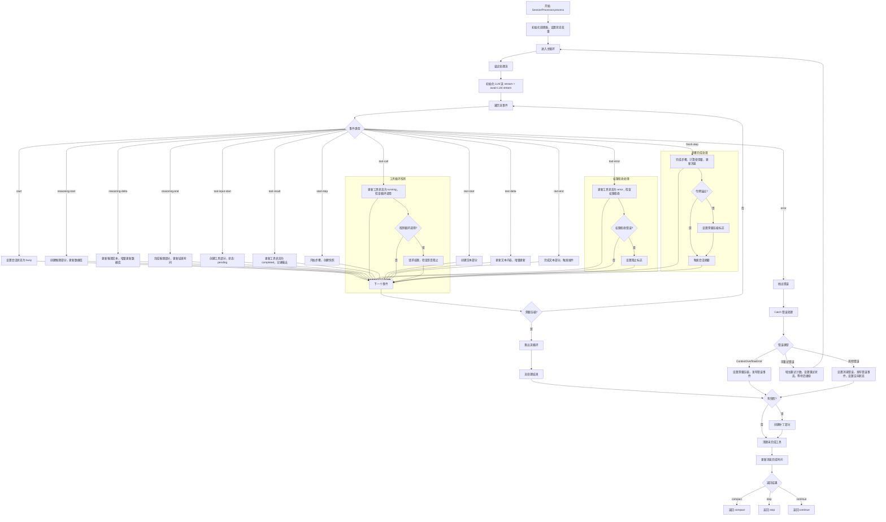

```mermaid
flowchart TD
    Start[开始 SessionProcessor.process] --> Init[初始化处理器，设置状态变量]
    
    Init --> LoopStart[进入主循环]
    
    LoopStart --> TryBlock[尝试处理流]
    
    TryBlock --> StreamInit[初始化 LLM 流 stream = await LLM.stream]
    
    StreamInit --> StreamLoop[遍历流事件]
    
    StreamLoop --> EventSwitch{事件类型}
    
    EventSwitch -->|start| SetBusy[设置会话状态为 busy]
    EventSwitch -->|reasoning-start| CreateReasoning[创建推理部分，更新数据库]
    EventSwitch -->|reasoning-delta| UpdateReasoning[更新推理文本，增量更新数据库]
    EventSwitch -->|reasoning-end| FinalizeReasoning[完成推理部分，更新结束时间]
    
    EventSwitch -->|tool-input-start| CreateToolPart[创建工具部分，状态: pending]
    EventSwitch -->|tool-call| UpdateToolRunning[更新工具状态为 running，检查循环调用]
    
    EventSwitch -->|tool-result| UpdateToolCompleted[更新工具状态为 completed，记录输出]
    EventSwitch -->|tool-error| UpdateToolError[更新工具状态为 error，检查权限拒绝]
    
    EventSwitch -->|start-step| StartStep[开始步骤，创建快照]
    EventSwitch -->|finish-step| FinishStep[完成步骤，计算使用量，更新消息]
    
    EventSwitch -->|text-start| CreateText[创建文本部分]
    EventSwitch -->|text-delta| UpdateText[更新文本内容，增量更新]
    EventSwitch -->|text-end| FinalizeText[完成文本部分，触发插件]
    
    EventSwitch -->|error| ThrowError[抛出错误]
    
    SetBusy --> NextEvent[下一个事件]
    CreateReasoning --> NextEvent
    UpdateReasoning --> NextEvent
    FinalizeReasoning --> NextEvent
    CreateToolPart --> NextEvent
    UpdateToolRunning --> NextEvent
    UpdateToolCompleted --> NextEvent
    UpdateToolError --> NextEvent
    StartStep --> NextEvent
    FinishStep --> NextEvent
    CreateText --> NextEvent
    UpdateText --> NextEvent
    FinalizeText --> NextEvent
    
    NextEvent --> CheckNeedsCompaction{需要压缩?}
    CheckNeedsCompaction -->|是| BreakStream[跳出流循环]
    CheckNeedsCompaction -->|否| StreamLoop
    
    ThrowError --> CatchBlock[Catch 错误处理]
    
    BreakStream --> StreamEnd[流处理结束]
    
    StreamEnd --> CheckSnapshot{有快照?}
    CheckSnapshot -->|是| CreatePatch[创建补丁部分]
    CheckSnapshot -->|否| CleanupTools[清理未完成工具]
    
    CreatePatch --> CleanupTools
    
    CleanupTools --> UpdateMessage[更新消息完成时间]
    
    UpdateMessage --> ReturnResult{返回结果}
    
    ReturnResult -->|compact| ReturnCompact[返回 compact]
    ReturnResult -->|stop| ReturnStop[返回 stop]
    ReturnResult -->|continue| ReturnContinue[返回 continue]
    
    CatchBlock --> ErrorType{错误类型}
    
    ErrorType -->|ContextOverflowError| SetNeedsCompaction[设置需要压缩，发布错误事件]
    ErrorType -->|可重试错误| IncrementAttempt[增加重试计数，设置重试状态，等待后继续]
    ErrorType -->|其他错误| SetError[设置消息错误，发布错误事件，设置空闲状态]
    
    SetNeedsCompaction --> CheckSnapshot
    IncrementAttempt --> LoopStart
    SetError --> CheckSnapshot
    
    subgraph 工具循环检测
        UpdateToolRunning --> CheckDoomLoop{检测循环调用?}
        CheckDoomLoop -->|是| AskPermission[请求权限，检查是否阻止]
        CheckDoomLoop -->|否| NextEvent
        AskPermission --> NextEvent
    end
    
    subgraph 权限拒绝处理
        UpdateToolError --> CheckPermissionDenied{权限拒绝错误?}
        CheckPermissionDenied -->|是| SetBlocked[设置阻止标志]
        CheckPermissionDenied -->|否| NextEvent
        SetBlocked --> NextEvent
    end
    
    subgraph 步骤完成处理
        FinishStep --> CheckOverflow{令牌溢出?}
        CheckOverflow -->|是| SetNeedsCompaction2[设置需要压缩标志]
        CheckOverflow -->|否| TriggerSummary[触发会话摘要]
        SetNeedsCompaction2 --> TriggerSummary
        TriggerSummary --> NextEvent
    end
```