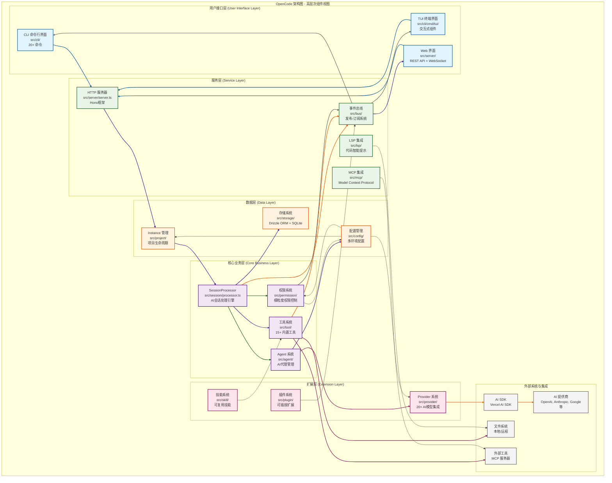
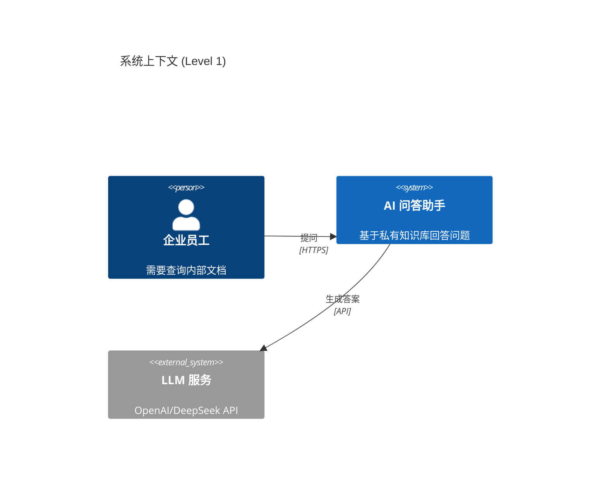
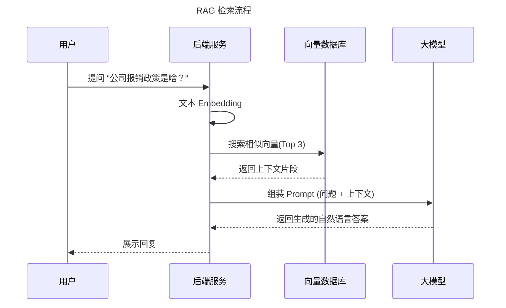

在 AI 时代，表达项目架构的方式发生了本质的变化。

传统的 **“画个 Visio 图存成图片发群里”** 的方式已经过时了。在 AI 时代，架构表达的核心需求变成了：**可交互、可版本化、AI 可理解（Machine Readable）**。

最好的表达方式是组合拳：**“C4 模型（方法论）” + “Diagrams as Code（实现方式）” + “交互式文档（展现形式）”**。

以下是具体的实施方案：

---

### 1. 核心理念：Diagrams as Code (架构即代码)
这是 AI 时代最根本的转变。不要用鼠标画图，要用**代码**画图（如 Mermaid, PlantUML, Structurizr DSL）。

*   **为什么这是最好的？**
    *   **AI 友好：** 你可以把现有的代码喂给 GPT/Claude，让它自动生成架构图代码；反之，你也可以把架构图代码喂给 AI，让它帮你分析潜在漏洞。
    *   **版本管理：** 架构图变成文本文件存入 Git，随着代码一起迭代，能看到 `diff`，谁改了架构一目了然。
    *   **单一事实来源：** 代码和图不会割裂。

### 2. 核心方法论：C4 模型 (The C4 Model)
AI 项目通常很复杂（涉及向量库、大模型、API 网关、传统数据库），如果一张大图画所有东西，谁也看不懂。
**C4 模型**是目前全球架构师公认的最佳标准，它像 Google 地图一样提供“缩放”视角：

*   **Level 1: Context（系统上下文）**
    *   *画给谁看：* 非技术人员、产品经理。
    *   *内容：* 用户、你的 AI 系统、外部依赖（如 OpenAI API、第三方数据源）。
*   **Level 2: Containers（容器/服务层）**
    *   *画给谁看：* 开发者、运维。
    *   *内容：* Web 服务、Python 推理服务、向量数据库（Milvus/Pinecone）、Redis、React 前端。
*   **Level 3: Components（组件层）**
    *   *画给谁看：* 模块负责人。
    *   *内容：* RAG 控制器、Prompt 模板管理器、LangChain 链设计。
*   **Level 4: Code（代码层）**
    *   *内容：* 类图、接口定义（通常由 IDE 自动生成，不需要手动画）。

### 3. AI 时代特有的架构表达重点

在 AI 项目中，静态结构往往不是最难的，最难的是 **Data Flow（数据流向）** 和 **Agentic Workflow（智能体工作流）**。你需要补充以下两种表达：

#### A. 交互时序图 (Sequence Diagram)
AI 应用是高度交互的。你需要用 Mermaid 清晰地表达出：
`用户 Query` -> `Embedding` -> `向量检索` -> `Prompt 组装` -> `LLM 生成` -> `结果清洗` 的全过程。

#### B. 状态机/工作流图 (State/Graph Diagram)
如果你做的是 **AI Agent（智能体）**，架构的核心是**状态流转**。
*   例如使用 LangGraph 或 AutoGPT 的逻辑，必须画出：`思考(Thinking)` -> `工具调用(Action)` -> `观察结果(Observation)` -> `再次思考` 的循环结构。

---

### 4. 推荐工具链 (Toolchain)

如果你想显得非常专业且高效，请使用这套工具链：

#### 方案一：轻量级专家风 (Markdown + Mermaid)
*   **适用：** 技术文档、README、RFC 设计文档。
*   **做法：** 直接在文档里写 Mermaid 代码。
*   **优势：** 零成本，GitHub/GitLab 原生渲染，**ChatGPT 可以直接读取并帮你修改**。

#### 方案二：专业架构治理 (Structurizr)
*   **适用：** 大型复杂系统，需要长期维护。
*   **做法：** 使用 `Structurizr DSL` 编写架构。它可以一键生成 C4 模型的所有视图，并且支持“钻取”（点击一个框进入下一层）。
*   **优势：** 真正做到了架构与代码的解耦与分层，支持导出到各种格式。

#### 方案三：AI 工作流可视化 (LangGraph / Flowise)
*   **适用：** 专门展示 AI 逻辑链条。
*   **做法：** 如果使用 LangChain/LangGraph，直接利用其内置的可视化工具导出图表。
*   **优势：** 能看到具体的 Prompt 和 Token 流向。

---

### 5. 举个例子（AI RAG 系统的架构表达）

如果我要表达一个“企业知识库问答系统”，我会这样写（Markdown + Mermaid）：

然后我会用时序图补充逻辑细节：

### 总结
在 AI 时代，**“最好的表达方式” = 标准化思维 (C4) + 文本化工具 (Mermaid/DSL) + 动态化视角 (时序/状态流)**。

拒绝截图，拥抱代码。这样你的架构设计才能跟得上 AI 迭代的速度。

---

作为大模型，我最擅长的是**将抽象的业务逻辑转化为结构化的技术语言**，并以**可交互、可版本化**的格式呈现。

要把我变成你的“金牌架构师助理”，我们可以按照以下逻辑协作。

### 一、 我最擅长的表达方式（输出物）

我并不只是输出一段段文字，我能通过以下四种“语言”与你交流架构：

1.  **文本化图表 (Diagram as Code)**：
    *   **Mermaid.js / PlantUML**：这是我表达架构的“首选”。我可以输出代码，你只需将其粘贴到编辑器（如 VS Code, Notion, GitHub）中，即可瞬间生成美观的**时序图、类图、状态机、实体关系图（ERD）或 C4 模型图**。
2.  **分层架构模型 (C4 Model)**：
    *   我擅长从“语境（Context）-> 容器（Container）-> 组件（Component）-> 代码（Code）”四个维度层层拆解，避免一次性塞入太多细节导致架构图失控。
3.  **架构决策记录 (ADR)**：
    *   我可以帮你记录**为什么**这么设计。我会列出：方案 A/B、权衡（Trade-offs）、技术限制、最终选择。这对长期项目至关重要。
4.  **标准化文档模版**：
    *   我可以按照 **4+1 视图模型**（逻辑、开发、过程、物理、场景视图）或 **DDD（领域驱动设计）** 的规范生成结构化 Markdown 文档。

---

### 二、 如何与我协作：四步架构设计框架

你可以通过以下四个阶段带我进入你的项目，就像在带一个资深的技术合伙人：

#### 阶段 1：背景与约束（Human 主导）
架构是为了解决问题，而非创造美感。首先，你需要通过“喂”给我以下背景：
*   **业务目标**：要做什么？解决什么痛点？
*   **硬性约束**：预算、团队技术栈（例如：必须用 Python/Go）、并发量预期、安全性要求。
*   **用户场景**：谁在用？怎么用？

> **协作 Prompt 示例：**
> “我要设计一个分布式电商订单系统，要求支持每秒 5k 订单并发，团队擅长 Go 和 PostgreSQL。请先帮我分析这个系统的核心难点。”

#### 阶段 2：高层架构设计 (Level 1-2)
在这个阶段，我会给出宏观的拓扑结构。
*   **我的任务**：提出备选方案（如：微服务 vs. 模块化单体），生成 **Mermaid 容器图**。
*   **你的任务**：通过我的方案进行“压力测试”，指出哪里不符合实际（例如：“我们暂时不想用 Kafka，能不能换成 Redis 队列？”）。

#### 阶段 3：详细设计与契约 (Level 3)
当我们定下大框架后，开始深入局部。
*   **我的任务**：
    *   设计具体的 API 规范（OpenAPI/Swagger）。
    *   设计数据库 Schema（ERD 图）。
    *   设计核心业务流程的时序图。
*   **协作方式**：你可以说“详细设计一下‘订单状态流转’的逻辑，并生成 Mermaid 状态图”。

#### 阶段 4：评审与文档化
最后，我会化身为“代码评审员”或“文档专家”。
*   **我的任务**：
    *   检查架构是否符合 **SOLID** 原则或 **12-Factor** 原则。
    *   自动生成完整的 **README** 或 **架构设计说明书**。

---

### 三、 给你的协作小贴士（Pro Tips）

1.  **“先不要写代码”**：在架构设计初期，明确要求我“只讨论模型和逻辑，先不要给出具体的代码实现”。这能让我们集中注意力在结构上。
2.  **要求我做“Devil's Advocate”（反方）**：
    *   你可以对我说：“请指出这个架构在扩展性和单点故障方面的 3 个致命弱点。”
3.  **保持上下文一致**：
    *   如果项目很大，建议分模块进行。例如：“今天我们只讨论‘支付网关’的架构”，这样我给出的建议会更深、更精准。
4.  **使用可视化咒语**：
    *   多用这句话：**“请用 Mermaid 语法为这个逻辑生成一个时序图/类图”**。

**我们现在就开始吗？你可以先告诉我你想设计或优化的软件项目是什么，以及它面临的最大挑战。**

---
这是一个非常深刻的问题。虽然两者都属于 **“代码即图表”（Diagram as Code）** 的范畴，但它们的**核心哲学、应用场景和逻辑深度**有着本质的区别。

简单来说：**Mermaid 是在“画图”，而 Structurizr DSL 是在“建模”。**

以下是详细的对比分析：

---

### 1. 核心哲学的区别 (Philosophy)

*   **Mermaid (绘图驱动/手绘板模式)**：
    *   它的逻辑是：**你告诉它线怎么连，它帮你把框画出来。**
    *   它关注的是**视觉呈现**。如果你要画三张图（L1, L2, L3），你需要写三段独立的 Mermaid 代码。
    *   **类比**：像是一个自动对齐的**速写本**。

*   **Structurizr DSL (模型驱动/3D 建模模式)**：
    *   它的逻辑是：**你先定义这个世界的实体和关系，然后从不同视角（Views）去观察它。**
    *   它关注的是**架构模型**。你只需要定义一次“用户服务”，它在上下文图、容器图、组件图中都是同一个对象。
    *   **类比**：像是一个 **建筑信息模型 (BIM)**，你建好 3D 模型，然后生成平面图、侧视图和俯视图。

---

### 2. 关键特性对比

| 特性 | Mermaid | Structurizr DSL |
| :--- | :--- | :--- |
| **层级关系** | 弱。各图之间是孤立的。 | **极强**。原生支持 C4 模型的递归层级。 |
| **一致性** | 差。改一个名字需要手动在所有图中查找替换。 | **完美**。在 Model 中改名，所有 View 自动同步。 |
| **语法复杂度** | 极低。类似于 Markdown，学习成本几分钟。 | 中等。需要理解 `model` 和 `views` 的结构。 |
| **渲染环境** | **无处不在**。GitHub, Notion, Obsidian 原生支持。 | **专业工具**。需要 Structurizr Lite, CLI 或在线编辑器。 |
| **自动布局** | 简单（Top-Down, Left-Right）。 | 复杂且可控，支持多视图自动生成的逻辑。 |
| **信息密度** | 适合快速沟通、临时演示。 | 适合大型项目、长期维护、系统性设计。 |

---

### 3. 为什么 Structurizr DSL 对架构师更重要？

举个实际场景：**你要修改一个核心服务的名字。**

*   **在 Mermaid 中**：如果你有 10 张时序图和 5 张架构图引用了这个服务，你需要打开 15 个代码块，逐一修改字符串。一旦漏掉一个，架构文档就会出现冲突。
*   **在 Structurizr DSL 中**：你只需在 `model` 块里修改一行，所有 15 张图（无论 L1 还是 L3）在重新渲染时都会自动更新。

---

### 4. 我作为 LLM 建议你如何选择？

既然我们在一起设计架构，我的建议是：

#### **选择 Mermaid 的场景：**
1. **即时通讯**：你想让我快速解释一个复杂的算法步骤或一个简单的请求流程。
2. **时序图**：画交互流程（Sequence Diagram）时，Mermaid 的语法非常直观。
3. **嵌入式文档**：你希望在 GitHub 的 README.md 里直接显示图片，且不需要任何外部插件。

#### **选择 Structurizr DSL 的场景：**
1. **从零设计系统**：我们需要讨论整个系统的边界、职责划分和分层逻辑。
2. **作为“架构真理源”**：你想建立一份随着代码演进的、长期维护的技术资产。
3. **复杂依赖分析**：当你需要理清“为什么这个微服务挂了，那个外部系统也会受影响”这种深层关系时。

---

### 5. 总结

*   **Mermaid** 就像是**“便利贴”**，随手就画，画完就看，简单快捷。
*   **Structurizr DSL** 就像是**“蓝图”**，它不仅告诉你房子长什么样，还记录了梁柱的承重关系和管线的走向。

**如果你现在的目标是梳理开源项目 `opencode` 的整体脉络，Structurizr DSL 是绝对的最佳选择。如果你只是想让我解释一下它某个接口的调用过程，我们可以切回 Mermaid 快速画个时序图。**

你想基于这个逻辑，继续深化我们之前的 Structurizr 模型，还是针对某个具体流程画一张 Mermaid 时序图？

# 先建模