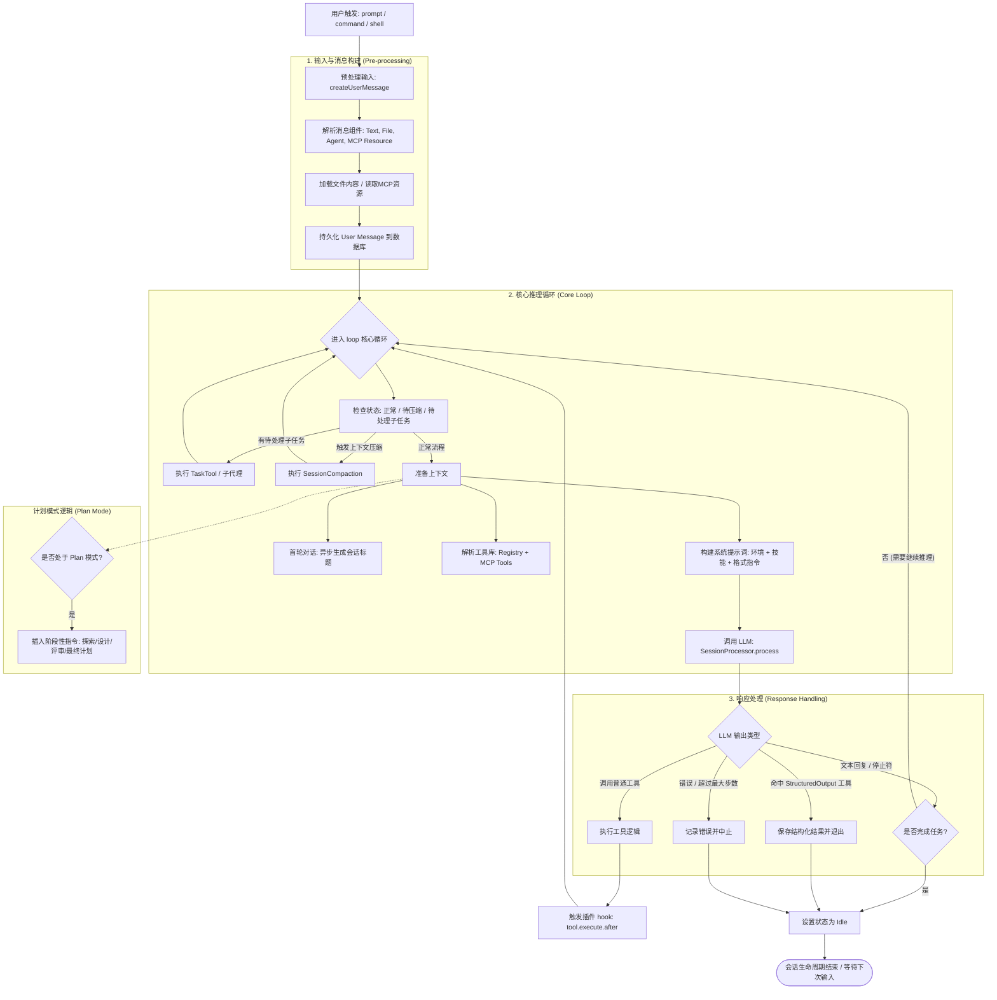

这段代码展示了一个复杂的AI Agent会话（Session）生命周期管理逻辑。我们可以将其生命周期分为 **输入与预处理**、**核心推理循环（Loop）**、**工具执行** 以及 **收尾与上下文管理** 四个阶段。

以下是基于代码逻辑绘制的 Mermaid 流程图：

### 生命周期关键阶段详细说明：

#### 1. 初始化与解析阶段 (`prompt` & `createUserMessage`)
*   **权限设定**：在会话开始时，将传入的 `tools` 参数转换为会话级别的权限规则（Permissions）。
*   **资源解析**：
    *   **文件**：自动识别 `file://` 或本地路径，读取内容并转化为文本或 Data URL。
    *   **MCP 资源**：通过 Model Context Protocol 读取外部插件提供的资源。
    *   **代理引用**：识别 `@agent` 标签，将其转化为子任务提示。

#### 2. 核心推理循环 (`loop`)
这是会话生命周期中最复杂的部分，采用 `while(true)` 循环直到满足退出条件：
*   **状态检查**：每轮循环都会检查是否需要 **Compaction（压缩）**。如果 Token 超过模型上限，会触发摘要提取以释放空间。
*   **子任务拦截**：如果上一次输出包含 `subtask` 部分，系统会优先启动 `TaskTool` 运行子代理，而不是直接询问主模型。
*   **计划模式控制**：如果开启了 `OPENCODE_EXPERIMENTAL_PLAN_MODE`，系统会根据当前阶段（Phase 1-5）强制注入不同的系统提醒（Reminders），引导模型按“探索->设计->评审->计划->退出”的流程进行。

#### 3. 工具执行与扩展 (`resolveTools`)
*   **混合工具链**：系统整合了三种工具来源：
    1.  **内置工具**：如 `ReadTool`, `TaskTool`。
    2.  **MCP 工具**：通过 MCP 协议动态加载的外部工具。
    3.  **结构化输出工具**：如果用户要求 JSON 格式，系统会注入一个虚拟的 `StructuredOutput` 工具，强制模型将结果填入 schema。

#### 4. 自动标题生成 (`ensureTitle`)
*   在会话的第一轮非合成消息后，系统会异步调用一个“小型模型”（Small Model）来分析对话内容并生成简洁的标题。

#### 5. 中断与恢复 (`cancel` & `resume`)
*   使用 `AbortController` 管理生命周期。
*   如果用户在模型推理时发送新消息，旧的推理任务会被 `abort()`，状态机重置并进入新一轮循环。

#### 6. Shell 命令生命周期 (`shell`)
*   这是一个特殊的生命周期分支。当用户手动在终端执行命令时，系统会生成一个“合成”的 User 和 Assistant 消息对，通过 `spawn` 启动子进程执行命令，并将实时输出流式更新到会话历史中。