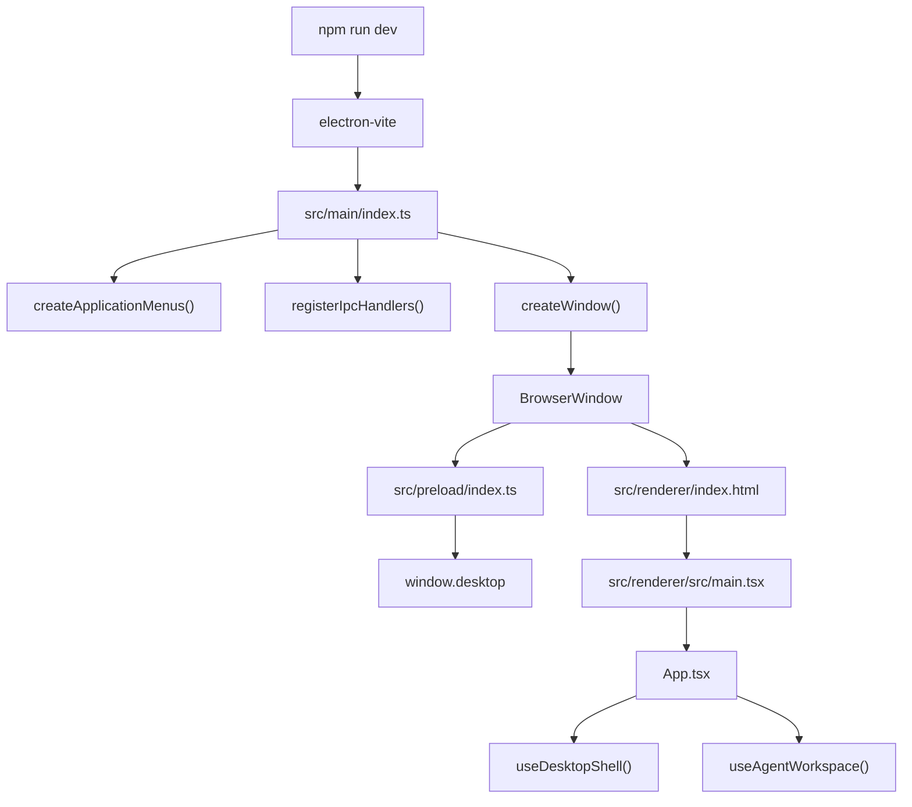
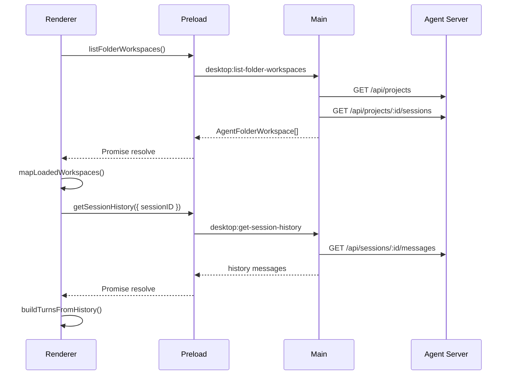
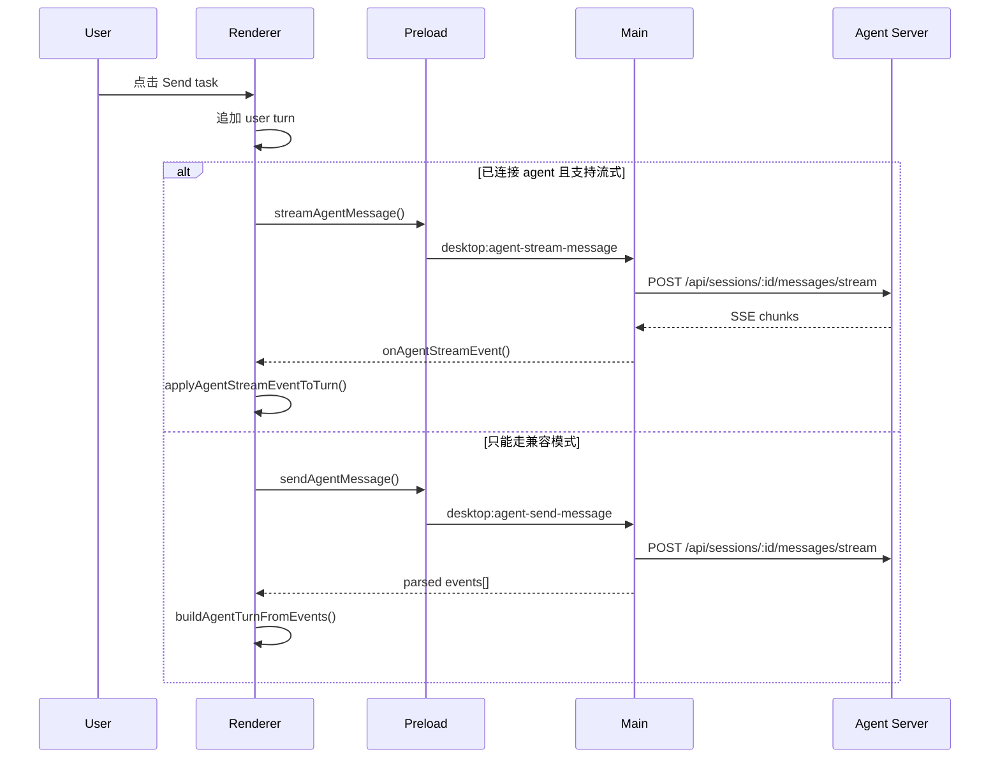

# Fanfande Desktop Frontend Architecture Guide

最后更新: 2026-04-02

这份文档不再重复 UI 规范或 API 契约，而是专门回答一个问题：当前 `packages/desktop` 的代码到底怎么分层、怎么读、怎么改。

## 1. 一句话先记住

当前项目的主链路是：

`React UI -> window.desktop bridge -> Electron main -> fanfandeagent`

其中：

- `renderer` 决定界面和状态流
- `preload` 决定页面能调用什么能力
- `main` 决定如何访问系统和后端

## 2. 启动总流程



## 3. 目录和职责

### 3.1 `src/main`

这是 Electron 主进程层，负责窗口、菜单、IPC 和后端网关。

关键文件：

- `src/main/index.ts`
  - 应用启动入口
  - 菜单初始化
  - IPC 注册
  - 创建主窗口
- `src/main/window.ts`
  - `BrowserWindow` 创建与 renderer/preload 装载
- `src/main/window-state.ts`
  - 无边框窗口的最大化/恢复兼容逻辑
- `src/main/menu.ts`
  - 原生菜单定义
- `src/main/ipc.ts`
  - 所有 `desktop:*` IPC 的注册点
  - 也是 desktop 与 server 的主要拼接层
- `src/main/agent-client.ts`
  - agent URL 解析
  - JSON 请求
  - SSE 解析和流式读取
- `src/main/types.ts`
  - main 层的共享类型定义

### 3.2 `src/preload`

这是唯一桥接层。

关键文件：

- `src/preload/index.ts`
  - 通过 `contextBridge.exposeInMainWorld("desktop", ...)` 暴露 API
  - renderer 只依赖这里，不直接依赖 `ipcRenderer`

设计原则：

1. preload 只暴露能力，不做业务编排。
2. 如果 renderer 需要新的系统能力，先加 main，再加 preload，再在 renderer 消费。

### 3.3 `src/renderer/src`

这是 React 页面层。

关键文件：

- `src/renderer/src/main.tsx`
  - React 挂载入口
- `src/renderer/src/App.tsx`
  - 页面装配层，只负责组合 hooks 与展示组件
- `src/renderer/src/styles.css`
  - 全局样式
- `src/renderer/src/App.test.tsx`
  - UI 集成测试
- `src/renderer/src/test-setup.ts`
  - Vitest + Testing Library 基础设置

### 3.4 `src/renderer/src/app`

这是 renderer 的真实业务层。

按职责划分：

- `components.tsx`
  - 纯展示组件
  - `Titlebar`
  - `Sidebar`
  - `SidebarResizer`
  - `CanvasTopMenu`
  - `ThreadView`
  - `Composer`
- `use-desktop-shell.ts`
  - 平台信息、窗口状态、sidebar 缩放、agent 连通性
- `use-agent-workspace.ts`
  - 工作区加载、会话切换、会话删除、发送消息、流式事件订阅
- `workspace.ts`
  - 文件夹工作区映射、排序和选中策略
- `conversation-state.ts`
  - 会话 turn 的纯函数更新
- `stream.ts`
  - 历史消息与 SSE 事件到 UI trace 的映射器
- `stream.test.ts`
  - SSE / trace 映射规则的纯逻辑测试
- `seed-data.ts`
  - 后端不可用时的本地回退数据
- `constants.ts`
  - 菜单、按钮、sidebar 尺寸常量
- `types.ts`
  - renderer 业务类型
- `utils.ts`
  - 工具函数

## 4. 当前数据流

### 4.1 启动加载



### 4.2 发送消息



## 5. 当前结构上的关键设计

### 5.1 `App.tsx` 现在是装配层，不是超级组件

当前 `App.tsx` 只做三件事：

1. 调 `useDesktopShell()`
2. 调 `useAgentWorkspace()`
3. 把状态和事件透传给展示组件

如果把新业务逻辑继续堆回 `App.tsx`，文档和实现会再次回到早期“单体组件”状态。

### 5.2 文件夹工作区是当前侧栏主视角

虽然 bridge 里仍有 project 视角方法，但 renderer 当前已经明确采用 folder-first：

1. 侧栏选中、展开、排序都围绕文件夹工作区。
2. project 名现在只作为文件夹行的辅助元信息显示。
3. 新 session 创建也以“当前文件夹”而不是“当前 project”作为用户心智入口。

### 5.3 `stream.ts` 是 assistant trace 的单一入口

所有这类数据都必须经过 `stream.ts`：

1. 持久化历史消息
2. 流式 SSE `delta`
3. 流式 SSE `part`
4. `done` / `error` 收尾

这样做的好处是：

1. 历史回放和实时流共用一套 UI 模型。
2. 测试可以聚焦在纯函数层，而不是只能测整页 UI。

## 6. 推荐阅读顺序

如果你第一次接手这个包，按下面顺序读：

1. `README.md`
2. `src/main/index.ts`
3. `src/preload/index.ts`
4. `src/renderer/src/App.tsx`
5. `src/renderer/src/app/use-desktop-shell.ts`
6. `src/renderer/src/app/use-agent-workspace.ts`
7. `src/renderer/src/app/components.tsx`
8. `src/renderer/src/app/stream.ts`
9. `src/main/ipc.ts`
10. `src/main/agent-client.ts`
11. `src/renderer/src/App.test.tsx`
12. `src/renderer/src/app/stream.test.ts`

## 7. 改功能时应该落在哪一层

### 7.1 只改界面和本地状态

优先改：

- `components.tsx`
- `use-desktop-shell.ts`
- `use-agent-workspace.ts`
- `styles.css`
- 对应测试

### 7.2 新增桌面能力

按这个顺序改：

1. `src/main/ipc.ts`
2. 需要的话补 `src/main/agent-client.ts` 或其他 main 模块
3. `src/preload/index.ts`
4. renderer 消费层
5. 测试和文档

### 7.3 新增后端流式 part 或历史消息结构

至少改：

1. `src/main/types.ts`
2. `src/renderer/src/app/types.ts`
3. `src/renderer/src/app/stream.ts`
4. `src/renderer/src/app/stream.test.ts`
5. `DESKTOP_SERVER_API_SPEC.md`

## 8. 测试面

当前测试主要分两层：

1. UI 集成测试
   - 文件：`src/renderer/src/App.test.tsx`
   - 覆盖启动、侧栏、会话切换、历史回放、发送消息、流式渲染、缩放等行为
2. 纯逻辑测试
   - 文件：`src/renderer/src/app/stream.test.ts`
   - 覆盖 trace 合并、tool 更新、done/error 收尾、历史消息重建等规则

标准命令：

```powershell
npm run typecheck
npm run test
```

## 9. 文档更新建议

改动后按这个规则更新文档：

1. 改 UI 行为和状态流：更新 `AI_AGENT_FRONTEND_SPEC.md`
2. 改 bridge / IPC / server route：更新 `DESKTOP_SERVER_API_SPEC.md`
3. 改模块边界或入口：更新本文档
4. 改入门路径或练习建议：更新 `ELECTRON_LEARNING_TODO.md`

## 10. Terminal Panel Architecture

The first-stage terminal feature lives inside the renderer canvas area as a bottom panel. It does not bypass the desktop bridge and it does not introduce a global state framework.

### 10.1 Renderer modules

The terminal feature is split under `src/renderer/src/app/terminal`:

- `types.ts`: terminal session, transport, snapshot, and workspace state types
- `storage.ts`: `localStorage` persistence for terminal workspace snapshots
- `client.ts`: thin wrapper around `window.desktop.*` PTY bridge methods
- `use-terminal-workspace.ts`: terminal workspace state, attach/detach, reconnect, snapshot persistence, and resize debounce
- `TerminalPanel.tsx`: bottom panel shell and resize handle
- `TerminalTabs.tsx`: tab strip, panel collapse toggle, create button, close button
- `TerminalView.tsx`: `xterm.js` mounting, output writer queue, fit/resizes, and per-terminal surface

### 10.2 Why it lives here

- `App.tsx` remains an assembly layer. It wires `useTerminalWorkspace()` into `ThreadView`, `Composer`, the collapsed canvas anchor, and the bottom terminal panel without absorbing terminal internals.
- PTY persistence and reconnect logic stay in a dedicated hook instead of the shared chat workspace hook.
- Storage is isolated in the terminal module so UI components stay declarative.
- `xterm.js` is mounted per active tab, while tab/session state is retained in the hook to avoid losing buffer content when switching tabs.

### 10.3 UI placement

- The terminal open/close entry point lives on the active surface: bottom-left canvas anchor while collapsed, terminal tab strip while expanded.
- `TerminalPanel` renders below `ThreadView` and above `Composer`.
- The panel keeps its own height state and resize handle.
- The first time the panel opens and no PTY exists, the hook auto-creates one terminal session.

### 10.4 State and recovery rules

- Local source of truth: `useTerminalWorkspace()`
- Persistent snapshot: `localStorage`
- Remote source of truth for PTY lifecycle/output: `fanfandeagent`
- Reconnect path: restore snapshot -> attach active PTY -> request replay from last cursor
- If the agent reports the PTY is missing, the terminal record is marked `invalid` and reconnect stops

### 10.5 Desktop integration points

Files touched in the desktop shell layer:

- `src/preload/index.ts`
- `src/main/ipc.ts`
- `src/main/agent-client.ts`
- `src/main/types.ts`
- `src/main/pty-proxy.ts`

The renderer still only talks to `window.desktop`. `src/main/pty-proxy.ts` is the only place that maps a renderer window to an agent PTY WebSocket.

### 10.6 Tests

Terminal coverage is split across:

- `src/renderer/src/app/terminal/storage.test.ts`
- `src/renderer/src/app/terminal/use-terminal-workspace.test.tsx`
- `src/renderer/src/App.test.tsx`

Current coverage focuses on:

- panel open/close
- first terminal auto-create
- tab switching
- snapshot restore
- reconnect with cursor-based replay
