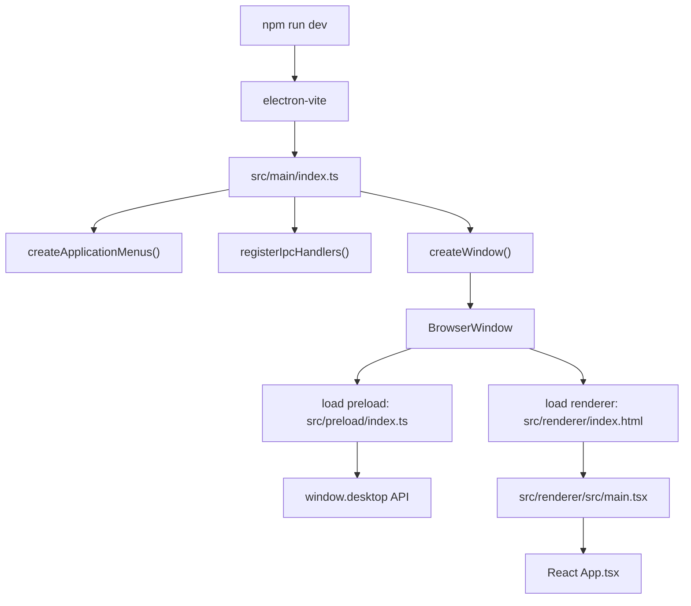
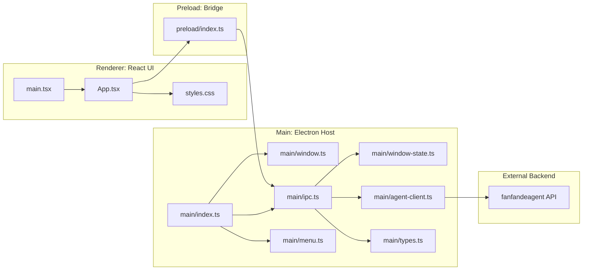
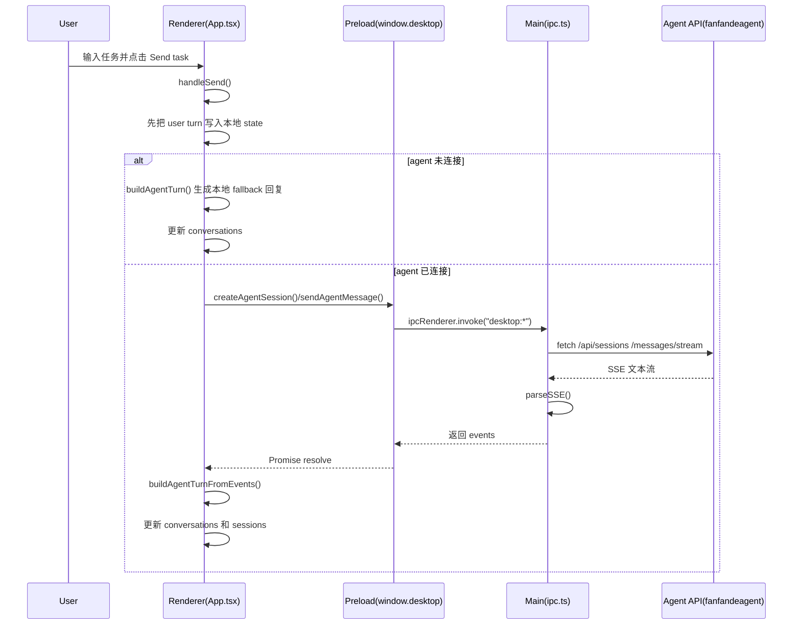

# Fanfande Desktop Frontend Architecture Guide

这份文档面向刚接触前端/Electron 的同学，用来快速理解 `packages/desktop` 的整体结构。

## 1. 先记住一句话

这个项目不是单层前端，而是 3 层：

- `main`：Electron 主进程，像“桌面操作系统里的控制中心”
- `preload`：安全桥，负责把允许使用的能力挂到 `window.desktop`
- `renderer`：React 页面，负责你真正看到和操作的 UI

再加一个外部服务：

- `fanfandeagent`：真正处理 AI session / message / stream 的后端

## 2. 启动流程图



## 3. 模块关系图



## 4. 每一层到底做什么

### `src/main`

这是 Electron 主进程层，核心职责是“管理桌面应用本身”：

- `index.ts`
  - 应用启动入口
  - 等待 `app.whenReady()`
  - 创建菜单
  - 注册 IPC
  - 创建窗口
- `window.ts`
  - 创建 `BrowserWindow`
  - 指定 `preload` 路径
  - 加载开发环境 URL 或打包后的 `index.html`
- `ipc.ts`
  - 所有 `desktop:*` IPC 通道都在这里注册
  - 包括窗口控制、菜单弹出、读取 agent 配置、健康检查、创建 session、发送消息
- `menu.ts`
  - 定义原生菜单和右键菜单
- `window-state.ts`
  - 维护无边框窗口的最大化/恢复状态
- `agent-client.ts`
  - 和 `fanfandeagent` 后端通信
  - 负责拼 URL、请求 JSON、解析 SSE 流

你可以把这一层理解成：`Electron 壳子 + 系统能力 + 后端网关`

### `src/preload`

这是“桥接层”。

浏览器页面不能直接访问 Electron 的危险能力，所以项目通过：

- `contextBridge.exposeInMainWorld("desktop", ...)`

把安全的 API 暴露给页面。

也就是说，React 里不是直接调 `ipcRenderer`，而是调：

- `window.desktop.getInfo()`
- `window.desktop.getWindowState()`
- `window.desktop.showMenu()`
- `window.desktop.windowAction()`
- `window.desktop.getAgentConfig()`
- `window.desktop.getAgentHealth()`
- `window.desktop.createAgentSession()`
- `window.desktop.sendAgentMessage()`

这是 Electron 项目里非常关键的一层，目的是：

- 限制页面权限
- 让前端 API 更稳定
- 让 UI 层不直接依赖 Electron 细节

### `src/renderer`

这是你最熟悉的“前端页面层”。

- `index.html`
  - 提供根节点 `#root`
- `src/main.tsx`
  - React 挂载入口
- `src/App.tsx`
  - 主要页面组件
  - 管理工作区、会话、消息流、输入框、按钮事件、窗口状态
- `src/styles.css`
  - 页面样式
- `App.test.tsx`
  - 针对 UI 行为的测试

这一层最重要的点是：

- 负责“显示什么”
- 负责“用户点了以后怎么改状态”
- 不负责真正创建窗口
- 不负责直接访问系统 API
- 不负责直接请求后端，而是通过 `window.desktop`

## 5. 一次“发送任务”的完整数据流

这是最值得新手理解的一条主链路。



### 这条链路里谁负责什么

- `App.tsx`
  - 收集用户输入
  - 更新界面状态
  - 决定走 fallback 还是走真实 backend
- `preload/index.ts`
  - 只是转发，不做复杂业务
- `main/ipc.ts`
  - 真正接收页面请求并调用 Electron / backend
- `main/agent-client.ts`
  - 处理 HTTP 请求和 SSE 解析
- `fanfandeagent`
  - 真正生成 AI 响应

## 6. 新手如何读这个项目

推荐按这个顺序：

1. `src/renderer/src/main.tsx`
   - 看 React 从哪里开始渲染
2. `src/renderer/src/App.tsx`
   - 看页面由哪些状态和事件组成
3. `src/preload/index.ts`
   - 看页面究竟能调用哪些桌面 API
4. `src/main/ipc.ts`
   - 看这些 API 最终做了什么
5. `src/main/window.ts`
   - 看 Electron 窗口怎么创建
6. `src/main/agent-client.ts`
   - 看项目怎么请求后端

如果你只想先抓主线，可以只盯这四个文件：

- `src/renderer/src/App.tsx`
- `src/preload/index.ts`
- `src/main/ipc.ts`
- `src/main/index.ts`

## 7. 用“前端框架视角”理解它

如果你以前只学过普通 Web 前端，可以这样类比：

- `renderer`
  - 像普通 React 单页应用
- `preload`
  - 像一个受控的前端 SDK
- `main`
  - 像“桌面版后端/宿主层”
- `fanfandeagent`
  - 像真正的服务端 API

所以这个项目不是单纯 MVC，也不是只有 React 组件树，而是：

`React UI -> Bridge API -> Electron Host -> Backend API`

## 8. 当前项目的核心状态分布

`App.tsx` 里集中管理了大部分前端状态，例如：

- 窗口状态：`isWindowMaximized`
- 侧边栏状态：`isSidebarCondensed`
- 数据状态：`workspaces`、`conversations`、`agentSessions`
- 业务状态：`activeSessionID`、`expandedProjectID`、`mode`
- 请求状态：`agentConnected`、`isSending`

这说明当前项目还是“单组件集中管理状态”的阶段。

优点：

- 新手容易跟
- 状态流很集中
- 迭代快

后续如果项目变大，通常会继续拆成：

- 自定义 hooks
- UI 子组件
- 独立的数据层 / store

## 9. 测试命令

在 `packages/desktop` 目录下：

```bash
npm test
```

作用：

- 跑 `Vitest + Testing Library`
- 检查 `App.tsx` 的主要交互是否正常
- 验证标题栏、项目树展开、发送消息、样式约束等行为

如果只做类型检查：

```bash
npm run typecheck
```

如果启动开发环境观察真实运行流程：

```bash
npm run dev
```

## 10. 你现在应该重点看什么

如果你的目标是“学习如何理解前端框架”，优先理解这 3 件事：

1. 入口在哪里
   - `main.tsx` 和 `main/index.ts`
2. 状态在哪里变化
   - `App.tsx` 的 `useState`、`useEffect`、事件函数
3. 数据怎么跨层流动
   - `window.desktop -> ipc -> backend`

当你能回答下面三个问题时，就说明已经看懂这个项目主结构了：

- 页面是从哪个文件挂载出来的？
- 用户点击 `Send task` 后，数据经过了哪几层？
- 为什么 React 代码不能直接调用 Electron，而要经过 `preload`？
## 11. 2026-04-01 Startup Project Tree

The sidebar startup flow is now:

1. `App.tsx` mounts and calls `window.desktop.listProjectWorkspaces()` when available.
2. The preload bridge forwards that request to the main process.
3. The main process requests `GET /api/projects` and then `GET /api/projects/:id/sessions`.
4. The renderer maps the returned data into the sidebar tree.
5. If the startup fetch fails, the seed sidebar data stays in place as a fallback.
