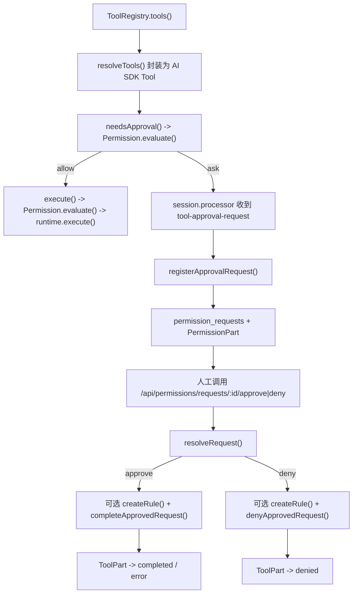

# Permission 模块源码分析

## 目的

本文只基于当前仓库源码，按 `temp.md` 提到的四个环节重新分析 `permission` 模块的实际设计与边界：

1. 工具列表的动态注入
2. LLM 输出的解析与参数校验
3. 执行前/后权限校验和上下文绑定
4. 人在环节的验证

本文不以任何既有 spec 为依据。

## 分析范围

本分析主要依据以下源码文件：

- `src/permission/permission.ts`
- `src/permission/schema.ts`
- `src/session/resolve-tools.ts`
- `src/session/processor.ts`
- `src/session/message.ts`
- `src/tool/tool.ts`
- `src/tool/registry.ts`
- `src/tool/shared.ts`
- `src/config/config.ts`
- `src/server/routes/permissions.ts`
- `src/server/server.ts`
- `Test/permission.test.ts`
- `Test/permission.api.test.ts`

## 一句话结论

当前 `permission` 模块的真实定位，不是“按用户身份裁剪工具的 IAM 系统”，而是一个：

`围绕 project / session / agent / tool / path / command 做决策的工具执行策略层 + 审批编排层`

它的四个环节完成度如下：

| 环节                 | 状态      | 结论                                                        |
| ------------------ | ------- | --------------------------------------------------------- |
| 1. 工具列表动态注入        | 部分实现    | 工具是动态注册给模型的，但不是按权限裁剪；当前默认把所有已注册工具都暴露给模型。                  |
| 2. LLM 输出解析与参数校验   | 部分实现    | 结构校验主要在 `tool` 层，`permission` 层主要做路径/命令提取、风险推导和少量语义拦截。    |
| 3. 执行前/后权限校验和上下文绑定 | 已实现，是核心 | `evaluate()` 是核心入口，结合规则、默认策略、审批状态、项目边界和风险做最终决策，并写审计。      |
| 4. 人在环节验证          | 已实现但较轻量 | 已有待审批、人工 approve/deny、可落持久化规则、可恢复执行；但没有审批人身份、认证、多因子、过期控制。 |

## 总体调用链

---

## 1. 工具列表的动态注入

### 当前实现了什么

模型可见工具不是写死在 prompt 文本里，而是运行时由 `src/session/resolve-tools.ts` 动态构建：

1. `ToolRegistry.tools()` 返回当前实例下所有已注册工具。
2. `resolveTools()` 对每个工具调用 `init({ agent })`，拿到 runtime。
3. 再把 runtime 包成 AI SDK 的 `tool({...})`，把：
   - `title`
   - `description`
   - `inputSchema`
   - `needsApproval`
   - `execute`
   注入给模型侧工具系统。
4. 工具按 `id + aliases` 一起暴露给模型，且会检查重名。

当前默认注册的工具来自 `src/tool/registry.ts`，包括：

- `read-file`
- `write-file`
- `replace-text`
- `apply-patch`
- `list-directory`
- `search-files`
- `exec_command`
- 以及实例态 `custom` 工具

### 当前没有实现什么

这一环节**没有按权限裁剪工具列表**。更准确地说：

- `permission` 模块不会在“暴露给模型之前”先删掉某些工具。
- `resolveTools()` 会把所有已注册工具都封装出来。
- 真正的权限控制发生在后面的 `needsApproval()` / `execute()` 阶段，而不是工具发现阶段。

因此，当前系统的形态是：

- `模型能看见所有工具`
- `但真正调用时会被 permission 再拦一次`

### 当前不是“按用户权限动态注入”

`temp.md` 第一环节强调“根据用户权限动态生成 Prompt / API 签名”。这在当前项目里**没有完整落地**。

当前缺失点包括：

- 没有用户主体 `user / principal / role` 参与工具暴露决策。
- 没有“某个用户只能看到某几个工具”的逻辑。
- 没有基于审批历史、角色、组织身份去裁剪工具描述。
- `permission` 规则也不会反向影响工具注册结果。

### 这一环节的准确定位

当前这一层更适合被描述为：

`动态工具装配`

而不是：

`基于权限的工具注入`

---

## 2. LLM 输出的解析与参数校验

这一环节当前是**分层实现**的，不是全部集中在 `permission` 模块里。

### 2.1 结构校验：主要在 tool 层

`src/tool/tool.ts` 的 `Tool.define()` 已经把每个工具的输入校验统一包起来了：

1. 先用工具自己的 `parameters` 做 Zod `safeParse`
2. 再执行工具自带的 `validate?()`
3. 再执行工具自带的 `authorize?()`
4. 最后才真正进入工具 `execute()`

这意味着“参数格式是否合法”这件事，主要由工具契约负责，而不是由 `permission` 负责。

例如：

- `read-file` 会约束 `path/startLine/endLine/maxLines`
- `exec_command` 会约束 `command/workdir/timeoutMs/maxOutputChars/allowUnsafe`
- `write-file` 会约束 `path/content`

### 2.2 语义提取：permission 层会做二次归纳

`src/permission/permission.ts` 的 `evaluate()` 不做完整 schema parse，但会从原始输入里抽取后续做策略判断所需的“派生信息”：

- 从 `path` / `workdir` / `paths` 抽路径
- 从 `patch` 里解析 diff 涉及的文件路径
- 从 `command` 里抽命令字符串
- 把路径统一归一化到 `cwd/worktree` 上下文下
- 标记是否越出项目边界

派生结果被放在：

- `derived.paths`
- `derived.command`

这一步的作用不是“验证每个参数都合法”，而是把参数转换成可被权限规则消费的统一形态。

### 2.3 当前 permission 层已经做的风险/语义拦截

虽然完整结构校验不在 `permission` 层，但它已经做了几类关键的执行前判定：

#### 1. 项目边界拦截

如果输入路径解析后落在当前 `cwd/worktree` 之外，`evaluate()` 会直接返回：

- `action: deny`
- `risk: critical`

这是当前最硬的一道前置拦截。

#### 2. 命令风险推导

`permission.ts` 内置了危险命令模式，例如：

- `rm -rf /`
- `mkfs`
- `dd of=/dev/...`
- `shutdown/reboot/poweroff/halt`
- fork bomb

如果命令命中这些模式，风险会被直接提升到 `critical`。

#### 3. 敏感路径风险推导

模块会把以下路径视为敏感：

- `.env`
- `.env.*`
- `*.pem`
- `*.key`
- `.git/**`
- `node_modules/**`

如果是对这些路径的写入/执行类操作，风险会提升为 `critical`；只读类通常提升为 `high`。

#### 4. 基于工具能力的基础风险分层

没有命中更强规则时，风险按工具能力大体划分为：

- `read/search -> low`
- `write -> medium/high`
- `exec -> high`

### 2.4 与 temp.md 的对应关系

如果按 `temp.md` 的表述，当前实现可以这样对应：

- 参数格式校验：已实现，但主要在 `tool` 层
- 语义校验：部分实现，主要是路径/命令/风险归纳
- 拒绝恶意参数：部分实现，集中在危险命令和越界路径
- 值范围校验：已实现，但主要依赖各工具自己的 Zod schema

### 2.5 当前没有实现什么

这一环节还没有做成一个“统一、强语义”的 permission 输入验证层。缺失点包括：

- `permission.evaluate()` 本身不校验完整工具 schema
- 没有通用的“敏感词/注入片段”过滤器覆盖所有字符串参数
- 没有基于真实用户身份的资源归属校验
- 没有“资源是否属于该用户/团队”的语义检查
- 没有对所有工具建立统一的高阶语义校验接口

因此当前更准确的理解是：

- `tool` 层负责“这个调用长得对不对”
- `permission` 层负责“这个调用危险不危险、该不该放行”

---

## 3. 执行前/后权限校验和上下文绑定

这是当前 `permission` 模块最完整、最核心的部分。

## 3.1 统一决策入口：`evaluate()`

所有真正的权限判断最终都收敛到 `Permission.evaluate(input)`。

`EvaluationInput` 绑定了当前调用所需的关键上下文：

- `sessionID`
- `messageID`
- `toolCallID`
- `projectID`
- `agent`
- `cwd`
- `worktree`
- `tool`
  - `id`
  - `kind`
  - `readOnly`
  - `destructive`
  - `needsShell`
- `input`

这说明当前系统的“权限上下文主体”并不是 user，而是：

`project + session + agent + tool + input + 文件边界`

### 3.2 判断发生在哪些时机

当前至少有三次触发点：

#### 1. `needsApproval()`

`src/session/resolve-tools.ts` 在模型准备发起工具调用时，先调用 `evaluate()`，如果结果是 `ask`，就告诉上层“此调用需要人工审批”。

#### 2. `execute()`

正式执行工具前，`resolve-tools.ts` 会再次调用 `evaluate()`。

这意味着：

- 即使前面判定过一次
- 真正执行前仍会重新检查

同一个 `toolCallID` 在同一轮里会走一个本地 `decisionCache`，避免不必要重复计算。

#### 3. `registerApprovalRequest()`

当流处理中真正进入 `waiting-approval` 状态后，`permission` 会再次 `evaluate()` 一次，用来落库请求记录和派生资源信息。

这意味着一条工具调用在生命周期里，可能生成多条 audit 记录；`evaluate()` 在当前实现里是“决策 + 记审计”的函数，不是纯函数。

### 3.3 决策顺序

`evaluate()` 的决策顺序可以概括为：

1. 如果 `FanFande_PERMISSION` 被关闭：直接 `allow`
2. 如果发现路径越出当前项目边界：直接 `deny`
3. 如果同 `toolCallID` 已有审批结果：
   - `approved -> allow`
   - `denied -> deny`
4. 根据输入推导 `risk`
5. 加载规则集合和默认策略
6. 用规则匹配当前调用
7. 如果命中规则：按规则 `allow/deny/ask`
8. 否则如果开启 `autoApproveSafeRead` 且是低风险 `read/search`：`allow`
9. 否则如果 `risk === critical`：默认 `deny`
10. 否则落到工具类别默认策略：
   - `read/search -> allow`
   - `write/exec/other -> ask`

### 3.4 规则来源

当前生效规则来自两类来源：

#### 1. 持久化规则

表：`permission_rules`

来源：

- 用户调用 `createRule()`
- 审批时通过 `resolveRequest()` 派生出的长期规则

#### 2. 配置规则

来源：

- 全局配置：`Config.get(GLOBAL_CONFIG_ID).permission`
- 项目配置：`Config.get(projectID).permission`

配置可提供：

- `defaults`
- `rules`
- `autoApproveSafeRead`

### 3.5 规则匹配字段

当前规则支持的匹配维度包括：

- `projectID`
- `sessionID`
- `agent`
- `tools`
- `toolKinds`
- `paths`
- `commands`
- `risk`
- `destructive`
- `readOnly`
- `needsShell`
- `enabled`

### 3.6 `scope` 的真实作用

`Rule.scope` 当前**主要影响优先级，不直接产生约束**。

真实的约束字段其实是：

- `projectID`
- `sessionID`
- `agent`

也就是说：

- `scope = session` 并不会自动限定某个 session
- 只有同时带上 `sessionID`，它才真正只匹配那个 session

当前代码里：

- 配置生成的 project rule 会自动补 `projectID`
- 审批派生的 session/project/global 规则也会补对应字段
- 但外部手动创建规则时，schema 本身**没有强制** `scope` 和这些字段成对出现

所以更准确地说：

`scope 是优先级标签，不是自动绑定器`

### 3.7 规则优先级

匹配到多个规则时，模块会：

1. 先按 `scope` 基础优先级排序
   - `session > project > global > default`
2. 再叠加 `priority`
3. 分数相同时，再按效果优先：
   - `deny > allow > ask`

这保证了“更局部、更明确、风险更保守”的规则优先。

### 3.8 执行后的处理

这一环节当前也已经实现了一部分 post-execution 逻辑：

#### 1. 审计落库

每次 `evaluate()` 都会写入 `permission_audits`：

- 决策动作
- 原因
- 风险
- 命中规则
- 输入摘要
- 时间

#### 2. 工具结果状态回写

审批通过后，`completeApprovedRequest()` 会真正执行工具，并把原来的 `ToolPart` 更新为：

- `completed`
- 或 `error`

审批拒绝后，`denyApprovedRequest()` 会把 `ToolPart` 更新为：

- `denied`

#### 3. 会话上下文回写

审批相关的变化不会只存在数据库请求表里，还会通过 `PermissionPart` 回写到消息 parts 中，让会话历史能表达：

- 发起了审批请求
- 最后是 allow 还是 deny
- scope 是什么
- reason 是什么

### 3.9 当前没有实现什么

这一环节虽然最完整，但仍有一些明显的“只做了一半”的点：

#### 1. 没有用户身份绑定

当前权限输入没有：

- `userID`
- `actor`
- `role`
- `approvedBy`
- `resolvedBy`

所以它不是面向用户主体的权限系统，而是面向执行上下文的策略系统。

#### 2. 没有输出脱敏

`temp.md` 第三环节提到“执行后过滤敏感信息”。当前实现里：

- 有 audit
- 有结果状态更新
- 但没有统一的工具输出脱敏/裁剪逻辑

#### 3. 没有审计查询能力

当前有 `permission_audits` 表，也会持续写入，但没有：

- `listAudits()`
- `/api/permissions/audits`

因此审计目前是“有记录、无查询接口”。

#### 4. `rememberable` 只是返回值，不驱动流程

`EvaluationResult` 里有 `rememberable` 字段，但当前代码没有看到后续消费方。

它目前更像一个“预留信号”，不是实际策略开关。

#### 5. `rememberApprovalsByDefault` 尚未落地

`schema.ts` 中有：

- `rememberApprovalsByDefault`

但当前执行链里没有使用它。

也就是说：

- 审批是否自动记忆
- 默认记忆到什么 scope

这些行为当前都没有实现。

#### 6. `expired` 状态未进入生命周期

`RequestStatus` 定义了：

- `pending`
- `approved`
- `denied`
- `expired`

但当前代码里没有任何地方会把请求转成 `expired`。

---

## 4. 人在环节的验证

这一环节当前已经真实存在，但实现比较轻量。

### 4.1 触发方式

当模型侧触发 `tool-approval-request` 事件时，`src/session/processor.ts` 会：

1. 把当前 `ToolPart` 改成 `waiting-approval`
2. 写回 parts
3. 调 `Permission.registerApprovalRequest(...)`
4. 把当前轮会话标记为 `blocked = true`
5. 结束当前 agent 循环

也就是说，人工审批不是“附加提示”，而是真正打断工具执行流程的阻塞点。

### 4.2 待审批请求如何落库

`registerApprovalRequest()` 会写入 `permission_requests`，包括：

- `approvalID`
- `sessionID`
- `messageID`
- `toolCallID`
- `projectID`
- `agent`
- `tool`
- `toolKind`
- `title`
- `risk`
- `status = pending`
- `input`
- `resource.paths`
- `resource.command`
- `resource.workdir`

同时还会写一个 `PermissionPart(action = ask)` 到消息历史。

### 4.3 人工如何审批

当前人工审批通过服务端 API 触发：

- `POST /api/permissions/requests/:id/approve`
- `POST /api/permissions/requests/:id/deny`

请求体支持：

- `scope`
  - `once`
  - `session`
  - `project`
  - `forever`
- `reason`
- `resume`

### 4.4 审批通过后的行为

`resolveRequest(id, { approved: true, ... })` 会：

1. 把请求状态改成 `approved`
2. 写 `resolvedAt / resolutionScope / resolutionReason`
3. 追加一个 `PermissionPart(action = allow)`
4. 如果 scope 不是 `once`，从该请求派生一条长期规则
5. 调 `completeApprovedRequest()` 真正执行原工具

如果工具执行成功，`ToolPart` 变 `completed`；失败则变 `error`。

### 4.5 审批拒绝后的行为

`resolveRequest(id, { approved: false, ... })` 会：

1. 把请求状态改成 `denied`
2. 追加一个 `PermissionPart(action = deny)`
3. 如果 scope 不是 `once`，派生一条 deny 规则
4. 调 `denyApprovedRequest()`，把原 `ToolPart` 标记为 `denied`

### 4.6 scope 与长期规则的映射

审批 scope 并不是只影响本次请求记录，它还会决定是否生成规则：

- `once` -> 不生成规则
- `session` -> 生成 session 规则
- `project` -> 生成 project 规则
- `forever` -> 生成 global 规则

### 4.7 会话历史如何表达审批结果

`src/session/message.ts` 会把审批链路编码进模型消息历史里：

- assistant 消息里有 `tool-approval-request`
- tool 消息里有 `tool-approval-response`

因此，从模型上下文视角看，它能知道：

- 某个工具调用曾要求审批
- 最终是否被批准
- 拒绝原因是什么

### 4.8 当前没有实现什么

这一环节相对 `temp.md` 仍缺几件关键能力：

#### 1. 没有审批人身份

请求和审批记录里没有：

- 谁批准的
- 谁拒绝的
- 是否来自哪个用户端

所以当前只有“发生了审批”，没有“是谁审批的”。

#### 2. 没有审批认证

`src/server/server.ts` 当前没有把 `FanFande_SERVER_USERNAME` / `FanFande_SERVER_PASSWORD` 接入请求鉴权中间件。

因此就当前代码而言，权限审批 API 没有自己的认证保护逻辑。

#### 3. 没有多因子或二次确认

当前 approve/deny 是单步 API 调用，没有：

- MFA
- OTP
- 二次确认口令
- 风险分级下的不同审批要求

#### 4. `critical` 默认不是“人工审批”，而是“直接拒绝”

当前默认策略是：

- `critical` 风险如果没有更高优先级规则命中，会直接 `deny`

所以高危操作默认不会进入“等人批准再执行”的分支，而是直接被挡掉。

换句话说：

- 人审主要覆盖 `ask`
- 不覆盖默认 `critical deny`

#### 5. 没有请求过期/超时

虽然 schema 有 `expired`，但当前没有：

- 自动过期
- TTL
- 超时撤销
- 过期后的重放保护

---

## 数据模型视角的总结

### 1. `permission_rules`

用途：

- 持久化 allow / deny / ask 规则

来源：

- 手工创建
- 审批派生

注意：

- `listRules()` 只返回这个表里的规则
- 配置里的规则不会出现在 `listRules()` 结果里

### 2. `permission_requests`

用途：

- 记录待审批或已审批的单次工具调用请求

关键锚点：

- `toolCallID`
- `approvalID`
- `sessionID`

### 3. `permission_audits`

用途：

- 记录每一次 `evaluate()` 的决策事件

特点：

- append-only
- 当前只写不查

### 4. `PermissionPart`

用途：

- 把审批请求和审批结果写回到会话历史

它解决的是“对话上下文可见性”，不是规则匹配本身。

---

## 对四个环节的最终归纳

### 环节 1：工具列表动态注入

当前实现：

- 动态装配工具

当前未实现：

- 按用户权限裁剪工具暴露

### 环节 2：LLM 输出解析与参数校验

当前实现：

- 工具 schema 校验
- 路径/命令提取
- 越界路径拦截
- 危险命令识别
- 风险分级

当前未实现：

- permission 层统一 schema 校验
- 基于用户身份的语义校验
- 全量恶意参数过滤

### 环节 3：执行前/后权限校验和上下文绑定

当前实现：

- `evaluate()` 统一决策
- 规则匹配
- 默认策略
- 审批状态复用
- 项目边界约束
- 审计落库
- 工具状态回写

当前未实现：

- 用户主体绑定
- 输出脱敏
- 审计查询接口
- `rememberApprovalsByDefault`
- `expired`

### 环节 4：人在环节验证

当前实现：

- `waiting-approval`
- pending request 落库
- approve/deny API
- scope 派生长期规则
- 审批后继续执行或拒绝

当前未实现：

- 审批人身份记录
- 审批接口认证
- 多因子确认
- 请求过期机制

---

## 最后结论

如果严格套用 `temp.md` 的四环节框架，当前项目的 `permission` 模块最成熟的是：

1. 第三环节：执行前/后权限校验和上下文绑定
2. 第四环节：人工审批编排

而相对薄弱的是：

1. 第一环节：按权限裁剪工具暴露
2. 第二环节：集中式、强语义的参数校验

因此，当前模块最准确的设计描述应当是：

`一个以工具执行安全为中心的 project/session 级权限决策与审批模块`

而不是：

`一个完整的、面向用户身份的 AI Agent 权限系统`
