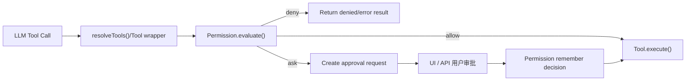

# Permission 模块设计方案

## 1. 文档目标

本文档定义 `fanfandeagent` 的权限系统设计，用于约束 AI Agent 在会话中对工具、文件系统、Shell 命令和后续扩展能力的访问方式。目标不是只做一个“是否登录”的认证层，而是建立一套面向 **工具执行链路** 的授权系统，使系统具备以下能力：

- 在工具执行前做统一的权限决策。
- 区分只读、写入、删除、执行命令等不同风险等级。
- 支持 `allow / deny / ask` 三种结果。
- 支持全局、项目、会话、agent 多层规则叠加。
- 支持用户审批、审批记忆、审计追踪和策略回放。
- 与当前仓库已有的 `tool.authorize()`、`session.processor`、`server`、`config`、`Instance` 机制自然集成。

## 2. 当前现状

基于当前代码，权限系统已经具备几个关键挂点，但尚未形成完整实现：

- `src/permission/permission.ts`
  - 目前只有 `Action = "allow" | "deny" | "ask"` 的枚举定义。
- `src/tool/tool.ts`
  - 每个工具已经支持 `validate()` 和 `authorize()`，这是权限收口点。
- `src/session/resolve-tools.ts`
  - 当前直接把工具暴露给模型，没有接入统一权限判断。
- `src/session/processor.ts`
  - 已预留 `tool-approval-request` 事件分支，但还没有真正处理审批。
- `src/config/config.ts`
  - 还没有正式的 permission schema。
- `src/agent/agent.ts`
  - `permission` 字段已被注释，说明 agent 级权限原本就在设计范围内。
- `src/tool/shared.ts`
  - 已具备项目边界检查，但只解决“路径越界”，还没有解决“是否被授权”。

结论：当前仓库适合建设的不是独立的认证系统，而是一个围绕 `tool -> authorize -> approval -> persistence -> audit` 的权限子系统。

## 3. 设计目标

### 3.1 必须达成

1. 任何工具执行都必须能被权限层拦截。
2. 权限判断必须和 `sessionID / messageID / toolCallID / cwd / worktree / agent` 关联。
3. 权限结果必须可审计，可回放，可解释。
4. 高风险操作必须支持显式审批。
5. 权限系统必须支持策略记忆，例如：
   - 仅本次允许
   - 本会话允许
   - 本项目允许
   - 永久允许 / 永久拒绝
6. 权限系统必须可扩展到未来 MCP、插件、网络请求、子 agent。

### 3.2 非目标

- 不在第一版实现完整 RBAC 用户组织体系。
- 不在第一版实现跨设备同步权限。
- 不在第一版做复杂 ABAC 表达式引擎。
- 不把权限判断分散到每个工具内部做“各写各的”。

## 4. 核心原则

### 4.1 默认最小授权

除非命中显式 `allow` 规则，否则高风险操作应默认进入 `ask` 或 `deny`。

### 4.2 决策集中化

所有工具授权必须走统一入口，不允许每个工具随意自定义审批流程。

### 4.3 工具能力先分类，再授权

先把工具抽象为能力，再做规则匹配。否则规则会散乱且难以扩展。

### 4.4 审批与执行解耦

审批模块只负责“是否允许”，不直接执行工具；工具执行仍留在原来的 `ToolRuntime.execute()`。

### 4.5 规则显式可解释

每次决策都必须能回答：

- 匹配了哪条规则
- 为什么是 `allow / deny / ask`
- 决策范围是什么
- 是静态策略还是用户审批结果

## 5. 威胁模型

此权限系统主要防御以下风险：

1. 模型误调用高风险工具。
2. 模型在用户意图不明确时进行 destructive 操作。
3. Shell 命令绕过结构化工具，执行危险行为。
4. 访问项目边界内但仍不应访问的敏感路径。
5. 同一会话中权限扩大后缺少审计。
6. 后续插件、MCP、外部 provider 将更高风险能力直接暴露给模型。

不主要解决：

1. 拥有本机权限的恶意本地用户攻击。
2. 操作系统级沙箱逃逸。
3. 第三方依赖库自身的 supply chain 风险。

## 6. 总体架构

权限系统放在工具层和会话层之间，成为工具执行前的统一决策器。



### 6.1 模块划分建议

建议把 `src/permission/` 拆成以下文件：

- `permission.ts`
  - 对外入口，导出 schema、service、核心方法。
- `schema.ts`
  - 所有 zod schema 和类型。
- `matcher.ts`
  - 路径、工具名、命令、风险标签匹配。
- `policy.ts`
  - 规则合并、优先级和决策逻辑。
- `store.ts`
  - SQLite 持久化。
- `approval.ts`
  - 审批请求创建、查询、决策提交。
- `events.ts`
  - bus 事件定义。
- `defaults.ts`
  - 默认规则集。

第一版如果想控制复杂度，也可以先只做 `permission.ts + store.ts + policy.ts`。

## 7. 领域模型

### 7.1 核心对象

| 对象 | 含义 |
| --- | --- |
| Subject | 谁在申请权限，通常是某个 agent / session / tool call |
| Resource | 被访问的资源，例如 tool、path、command、network、mcp server |
| Operation | 对资源做什么，例如 read、write、delete、exec |
| Decision | 权限决策结果，allow / deny / ask |
| Rule | 一条可匹配的权限策略 |
| Approval Request | 一次等待用户决策的审批请求 |
| Grant | 用户审批后形成的已授权记录，可带作用域与过期时间 |

### 7.2 授权粒度

第一版建议支持以下资源维度：

| 维度 | 示例 |
| --- | --- |
| tool | `read-file`、`write-file`、`exec_command` |
| tool kind | `read`、`write`、`search`、`exec` |
| path | `src/**/*.ts`、`.env`、`package.json` |
| command | `npm test`、`git status`、`rm -rf` |
| attachment / output | 是否允许产生文件、图片等附件 |

第二版可扩展：

| 维度 | 示例 |
| --- | --- |
| network | 域名、协议、端口 |
| mcp | server 名称、resource URI、tool 名称 |
| provider | 外部模型 provider 操作 |
| subagent | 创建子 agent、代理间消息 |

### 7.3 风险等级

建议引入统一风险标签，避免每条规则都重复写：

| 风险级别 | 典型行为 | 默认动作建议 |
| --- | --- | --- |
| low | 读文件、列目录、搜索 | allow |
| medium | 写普通源码文件、替换文本 | ask |
| high | 删除、批量改写、执行 Shell | ask |
| critical | 明显破坏性命令、敏感文件写入、越界访问 | deny |

## 8. 策略模型

### 8.1 Rule 结构

建议 Rule 至少包含以下字段：

```ts
type PermissionRule = {
  id: string
  effect: "allow" | "deny" | "ask"
  scope: "global" | "project" | "session" | "agent" | "temporary"
  enabled?: boolean
  priority?: number
  subject?: {
    agent?: string[]
    sessionID?: string[]
  }
  resource?: {
    tools?: string[]
    toolKinds?: Array<"read" | "write" | "search" | "exec" | "other">
    paths?: string[]
    commands?: string[]
    risk?: Array<"low" | "medium" | "high" | "critical">
  }
  conditions?: {
    destructive?: boolean
    readOnly?: boolean
    needsShell?: boolean
  }
  remember?: {
    ttlMs?: number
  }
  reason?: string
}
```

### 8.2 规则优先级

建议优先级按两层处理：

1. 先按作用域排序。
2. 同作用域内按显式 `priority` 排序。

默认作用域优先级建议如下：

1. `temporary`
2. `session`
3. `agent`
4. `project`
5. `global`
6. `default`

### 8.3 决策冲突规则

采用以下冲突解决策略：

1. 命中任意 `deny` 且优先级最高时，结果为 `deny`。
2. 否则命中任意 `allow` 且优先级最高时，结果为 `allow`。
3. 否则命中任意 `ask` 时，结果为 `ask`。
4. 未命中时，落到默认策略。

默认策略建议：

- `read/search` 默认 `allow`
- `write` 默认 `ask`
- `exec` 默认 `ask`
- `critical` 默认 `deny`

## 9. 权限上下文

权限决策输入不应只包含工具名，还必须包含完整上下文：

```ts
type PermissionContext = {
  sessionID: string
  messageID: string
  toolCallID?: string
  agent: string
  cwd?: string
  worktree?: string
  tool: {
    id: string
    aliases?: string[]
    kind?: "read" | "write" | "search" | "exec" | "other"
    readOnly?: boolean
    destructive?: boolean
    needsShell?: boolean
  }
  input: Record<string, unknown>
  derived: {
    paths?: string[]
    command?: string
    risk: "low" | "medium" | "high" | "critical"
  }
}
```

`derived` 字段由权限系统统一推导，工具自身不必重复计算。

## 10. 路径与命令的规范化

### 10.1 路径规范化

所有路径匹配必须在 `resolveToolPath()` 之后进行，并采用统一规范：

- 转成绝对路径
- 转成系统规范路径分隔符
- 再生成相对 `Instance.directory` 或 `Instance.worktree` 的显示路径
- 路径规则匹配基于规范化后的相对路径

### 10.2 命令规范化

Shell 权限不能只按原始字符串比较，应保留以下层次：

- 原始命令：`git status`
- shell 类型：`bash`
- 风险标签：`high`
- 命令类别：`git`、`package-manager`、`destructive`、`unknown`

第一版不做完整 shell parser，但要支持最基本模式：

- 前缀匹配，例如 `git *`
- 正则匹配，例如 `^npm (test|run lint)\b`
- 危险模式黑名单，例如 `rm -rf`, `shutdown`, `mkfs`

## 11. 决策输出模型

权限决策结果不能只返回一个字符串，建议返回结构化结果：

```ts
type PermissionDecision = {
  action: "allow" | "deny" | "ask"
  reason: string
  matchedRuleID?: string
  matchedScope?: string
  risk: "low" | "medium" | "high" | "critical"
  rememberable: boolean
  expiresAt?: number
}
```

这样上层可以：

- 渲染 UI
- 写审计日志
- 给模型返回更清晰的 denied 原因
- 后续支持策略分析

## 12. 审批流设计

### 12.1 触发时机

当 `Permission.evaluate()` 返回 `ask` 时：

1. 不执行工具。
2. 创建一条 `approval_request` 记录。
3. 向 `session.processor` 投递审批事件。
4. 将当前 tool call 标记为 `waiting-approval`。
5. 会话进入 `waiting-user` 或“半阻塞”状态。

### 12.2 用户可选操作

建议 UI / API 提供以下操作：

- 拒绝
- 允许一次
- 本会话允许
- 本项目允许
- 永久允许
- 永久拒绝

### 12.3 审批结果回写

审批结果应生成一条 `grant` 或 `rule`：

- 临时授权写入 `approval_grants`
- 永久或项目级授权转为 `permission_rules`

然后重新调度原工具调用，避免模型再次生成整段 tool call。

### 12.4 Deny 后的行为

结合已有配置 `experimental.continue_loop_on_deny`，建议行为如下：

- `false`
  - 工具拒绝后结束本轮执行，等待用户。
- `true`
  - 把拒绝结果作为 tool error 返回模型，由模型选择继续计划。

## 13. 会话层状态建模

当前 `Message.ToolState` 只有：

- `pending`
- `running`
- `completed`
- `error`

建议扩展为：

- `waiting-approval`
- `denied`

推荐结构：

```ts
type ToolStateWaitingApproval = {
  status: "waiting-approval"
  input: Record<string, unknown>
  requestID: string
  title?: string
  metadata?: Record<string, unknown>
  time: { start: number }
}

type ToolStateDenied = {
  status: "denied"
  input: Record<string, unknown>
  reason: string
  metadata?: Record<string, unknown>
  time: { start: number; end: number }
}
```

同时建议新增一种 Part：

```ts
type PermissionPart = {
  id: string
  sessionID: string
  messageID: string
  type: "permission"
  requestID: string
  tool: string
  decision: "allow" | "deny" | "ask"
  scope?: "once" | "session" | "project" | "forever"
  reason?: string
  created: number
}
```

这样会话历史能完整记录审批轨迹。

## 14. 持久化设计

### 14.1 permission_rules

存储长期规则：

| 字段 | 含义 |
| --- | --- |
| id | 规则 ID |
| scope | global / project / agent |
| projectID | 可空 |
| agent | 可空 |
| effect | allow / deny / ask |
| pattern | JSON 规则内容 |
| priority | 优先级 |
| enabled | 是否启用 |
| createdAt | 创建时间 |
| updatedAt | 更新时间 |
| createdBy | system / user / migration |

### 14.2 permission_approval_requests

存储等待审批的请求：

| 字段 | 含义 |
| --- | --- |
| id | 请求 ID |
| sessionID | 会话 ID |
| messageID | 消息 ID |
| toolCallID | 工具调用 ID |
| tool | 工具名 |
| payload | 原始上下文 |
| decision | pending / approved / denied / expired |
| createdAt | 创建时间 |
| resolvedAt | 处理时间 |
| resolvedBy | user / system |

### 14.3 permission_grants

存储审批后形成的临时授权：

| 字段 | 含义 |
| --- | --- |
| id | grant ID |
| sourceRequestID | 来源审批请求 |
| scope | once / session / project / forever |
| effect | allow / deny |
| matcher | 匹配条件 |
| expiresAt | 过期时间，可空 |
| createdAt | 创建时间 |

### 14.4 permission_audit_logs

存储每次授权判断：

| 字段 | 含义 |
| --- | --- |
| id | 审计 ID |
| sessionID | 会话 ID |
| messageID | 消息 ID |
| toolCallID | 工具调用 ID |
| tool | 工具名 |
| inputSummary | 输入摘要 |
| decision | allow / deny / ask |
| reason | 原因 |
| matchedRuleID | 命中的规则 |
| risk | 风险等级 |
| createdAt | 时间 |

第一版如需控制复杂度，可先不单独建 `audit_logs` 表，而把决策结果写入 message part；但长期来看单独建表更合适。

## 15. 配置模型设计

建议在 `src/config/config.ts` 中新增：

```ts
permission: z.object({
  default: z.object({
    read: z.enum(["allow", "ask", "deny"]).optional(),
    write: z.enum(["allow", "ask", "deny"]).optional(),
    exec: z.enum(["allow", "ask", "deny"]).optional(),
  }).optional(),
  rules: z.array(PermissionRuleSchema).optional(),
  autoApproveSafeRead: z.boolean().optional(),
  rememberApprovalsByDefault: z.boolean().optional(),
}).optional()
```

分层建议：

- 全局配置
  - 默认策略、内置 deny 列表
- 项目配置
  - 项目本地规则，例如对某个仓库放宽测试命令
- session 配置
  - 临时覆盖
- agent 配置
  - 特定 agent 的能力边界

## 16. Agent 权限设计

`AgentInfo` 中建议正式加入：

```ts
permission?: {
  inherit?: boolean
  rules?: PermissionRule[]
  preset?: "planner" | "coder" | "reviewer" | "safe-readonly"
}
```

默认建议：

- `plan`
  - 只允许 `read/search`
  - `write/exec` 默认 `deny` 或 `ask`
- `build`
  - 允许 `read/search`
  - `write` 默认 `ask`
  - `exec` 默认 `ask`
- `review`
  - 基本只读

## 17. 工具接入方案

### 17.1 接入点

统一在 `src/session/resolve-tools.ts` 内对所有 tool runtime 做包装，而不是让每个工具自己调用权限服务。

推荐流程：

1. `registry.tools()` 返回 `ToolInfo[]`
2. `item.init()` 生成 `runtime`
3. 在封装后的 `execute()` 中：
   - 收集权限上下文
   - 调用 `Permission.authorize()`
   - 根据 `allow / deny / ask` 走不同分支
4. 只有 `allow` 才真正调用 `runtime.execute()`

### 17.2 工具到权限的映射

| 工具 | kind | 默认风险 | 补充说明 |
| --- | --- | --- | --- |
| `read-file` | read | low | 读取敏感文件时可提升到 high |
| `list-directory` | read | low | 遍历敏感目录时可提升 |
| `search-files` | search | low | 大范围搜索可维持 low |
| `write-file` | write | medium | 覆盖敏感路径时升 high |
| `replace-text` | write | medium | 多次替换或敏感文件时升 high |
| `apply_patch` | write | high | 可创建/删除/改名，默认比普通写入更高 |
| `exec_command` | exec | high | 危险命令直接 critical |

### 17.3 敏感路径建议

第一版内置敏感路径列表：

- `.env`
- `.env.*`
- `*.pem`
- `*.key`
- `.git/**`
- `node_modules/**`
- 系统配置目录

这些路径即使在项目边界内，也不应简单按普通 `read/write` 处理。

## 18. Server API 设计

建议新增权限相关路由：

### 18.1 查询规则

- `GET /api/permissions/rules`
- `POST /api/permissions/rules`
- `PATCH /api/permissions/rules/:id`
- `DELETE /api/permissions/rules/:id`

### 18.2 查询审批

- `GET /api/permissions/requests`
- `GET /api/permissions/requests/:id`
- `POST /api/permissions/requests/:id/approve`
- `POST /api/permissions/requests/:id/deny`

### 18.3 查询审计

- `GET /api/permissions/audit`

响应风格应继续沿用当前 `server` 模块的 envelope：

```json
{
  "success": true,
  "data": {},
  "requestId": "..."
}
```

## 19. Bus 事件设计

建议增加以下事件：

- `permission.requested`
- `permission.approved`
- `permission.denied`
- `permission.rule.updated`
- `permission.audit.logged`

用途：

- UI 实时订阅审批请求
- 会话状态变更
- 审计异步入库
- 后续插件监听

## 20. 默认策略建议

### 20.1 Planner 模式

- `read/search`: allow
- `write`: deny
- `exec`: deny

### 20.2 Normal coder 模式

- `read/search`: allow
- `write`: ask
- `exec`: ask

### 20.3 CI / automation 模式

- 通过显式项目规则白名单放开固定命令
- 其他仍 `ask` 或 `deny`

### 20.4 永久 deny 列表

以下行为建议硬编码 deny，不允许通过普通记忆规则放开：

- 明显破坏系统的命令
- 越界路径
- 未声明工作目录下的危险 shell 模式

## 21. 审批 UI 建议

前端展示建议至少包含：

- 工具名
- 风险等级
- 操作摘要
- 目标路径或命令
- 为什么触发审批
- 授权范围选项
- 审批后影响说明

示例：

- 工具：`exec_command`
- 风险：`high`
- 命令：`npm test`
- 工作目录：`packages/fanfandeagent`
- 建议：允许本会话内重复执行同类测试命令

## 22. 与当前代码的集成点

### 22.1 `src/tool/tool.ts`

保留 `authorize()` 钩子，但不建议让业务工具自己做最终权限判断。更适合：

- 工具本地 `authorize()`
  - 处理工具内部约束
- 权限模块 `Permission.authorize()`
  - 处理全局授权策略

最终执行顺序建议：

1. schema 校验
2. tool.validate()
3. permission.authorize()
4. tool.authorize()
5. tool.execute()

### 22.2 `src/session/resolve-tools.ts`

这是第一优先级接入点，应负责：

- 组装 `PermissionContext`
- 调用权限模块
- 在 `ask` 时返回审批结果而非直接执行

### 22.3 `src/session/processor.ts`

应补齐：

- `tool-approval-request` 事件处理
- `waiting-approval` 状态持久化
- 用户审批后恢复工具执行

### 22.4 `src/session/message.ts`

应补齐：

- 新的 `ToolState`
- `PermissionPart`
- denied / approved 的历史记录结构

### 22.5 `src/config/config.ts`

应补齐：

- `permission` schema
- 默认配置读取与 merge

### 22.6 `src/agent/agent.ts`

应恢复并正式启用：

- `permission` 字段
- 不同 agent 的默认权限 preset

## 23. 第一版落地范围

为了控制实现复杂度，建议 v1 只做以下内容：

1. 统一权限决策入口。
2. 三种结果：`allow / deny / ask`。
3. 基于工具种类和路径的规则匹配。
4. Shell 命令的基础风险识别。
5. 审批请求持久化。
6. 本次 / 本会话 / 本项目三个记忆范围。
7. 审计日志。

v1 不做：

1. 复杂条件表达式
2. 多用户协作审批
3. 网络权限
4. MCP 细粒度权限
5. 可视化策略编辑器

## 24. 分阶段实施计划

### Phase 1: 核心决策引擎

目标：

- 实现 schema、rule matching、decision engine。

输出：

- `Permission.evaluate(context)`
- 默认规则
- 风险分类器

验收标准：

- 输入一个 tool context，能稳定给出结构化决策。

### Phase 2: 工具接入

目标：

- 接入 `resolve-tools.ts`。

输出：

- 所有工具执行前统一走权限判断。

验收标准：

- `read-file` 可自动通过
- `write-file` 能触发 ask
- `exec_command` 危险命令能 deny

### Phase 3: 审批流

目标：

- 打通审批请求、用户决策、会话恢复。

输出：

- `permission_approval_requests`
- 新的 ToolState
- server API

验收标准：

- 用户批准后无需模型重新生成，原工具调用能继续执行。

### Phase 4: 规则持久化与配置

目标：

- 引入全局 / 项目 / agent 规则。

输出：

- `permission_rules`
- `config.permission`
- `agent.permission`

验收标准：

- 项目级规则能覆盖全局默认规则。

### Phase 5: 审计与治理

目标：

- 提供分析和排障能力。

输出：

- audit log
- 查询接口
- 策略命中原因

验收标准：

- 任意一次 deny 或 ask 都能追踪到命中的规则和输入摘要。

## 25. 测试策略

建议补充以下测试：

### 单元测试

- 规则优先级
- 路径匹配
- 命令匹配
- 风险分类
- 默认策略回退

### 集成测试

- `resolve-tools` 中的 allow / deny / ask
- 审批请求创建
- grant 生效
- session 恢复执行

### API 测试

- 审批接口
- 规则 CRUD
- 审计查询

## 26. 验收标准

当以下条件全部满足，可认为权限系统 v1 可用：

1. 所有内置工具都经过统一权限判断。
2. 任意高风险工具调用都可触发审批。
3. 用户能选择审批记忆范围。
4. 审批与拒绝都能在会话历史中留痕。
5. 系统能解释每次决策命中了什么规则。
6. 默认策略足够保守，不会无提示执行高风险操作。

## 27. 推荐实现顺序

如果接下来进入编码，建议按下面顺序提交：

1. `src/permission/schema.ts`
2. `src/permission/policy.ts`
3. `src/permission/store.ts`
4. `src/session/resolve-tools.ts` 接入
5. `src/session/message.ts` 扩展状态
6. `src/session/processor.ts` 审批流
7. `src/config/config.ts` 新增 schema
8. `src/server/routes/permissions.ts`
9. 测试与文档补充

## 28. 一句话总结

`fanfandeagent` 的权限系统不应被设计成“用户是否已认证”，而应被设计成“AI 在当前项目、当前会话、当前 agent 身份下，是否被允许执行某个具体工具行为”的统一授权与审批框架。
