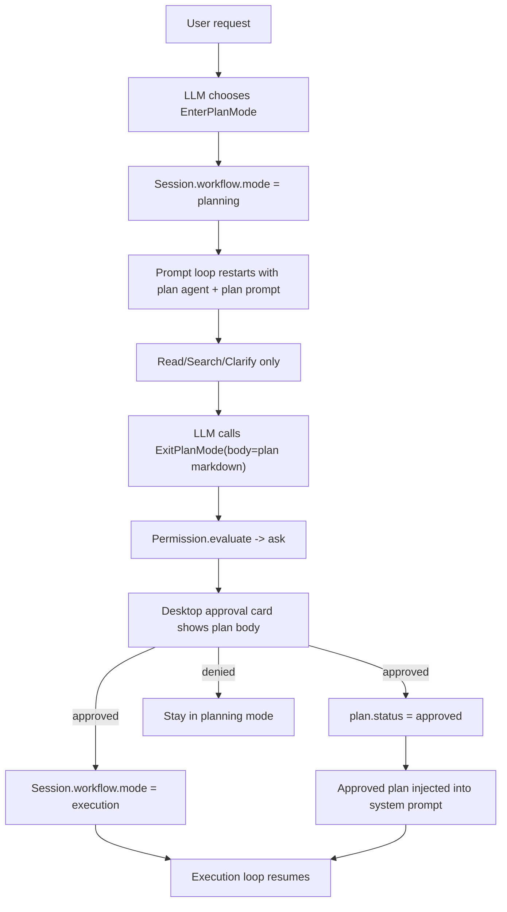

# EnterPlanMode / ExitPlanMode 设计与实现说明

本文档说明当前项目中 `EnterPlanMode` 与 `ExitPlanMode` 两个元工具的设计目标、状态机、后端实现、前端承接方式，以及后续可扩展点。

本文档描述的是当前仓库已经采用的实现框架，不是单纯的提示词约束方案。

## 1. 设计目标

这两个工具的目标不是“让模型口头上说自己进入规划模式”，而是把复杂任务显式拆成两段：

1. `planning mode`
   只允许研究、读取、搜索、提问、整理计划。
2. `execution mode`
   只有在计划被批准之后，才允许真正执行写入、命令、副作用操作。

核心要求：

- 规划和执行必须由宿主状态控制，而不是只靠 prompt 自觉遵守。
- 规划态必须是硬边界，不能被 `full-access` 之类的宽权限模式穿透。
- 计划提交必须进入审批流，审批通过后再恢复执行。
- 已批准计划要能回流到 execution 阶段，作为后续执行上下文的一部分。

## 2. 为什么不能只靠 Prompt

如果只在提示词里写：

- “现在你是 planning mode”
- “未经批准不要执行”

那么它本质上仍然是软约束，问题包括：

- 模型可能误触写工具或执行工具。
- 权限系统无法识别“这是计划提交”还是“这是普通工具调用”。
- UI 无法给出独立的“计划待批准”视图。
- 批准结果无法稳定回写到 session 状态中。

所以本项目采用的是：

- `Session.workflow` 持久化状态
- `EnterPlanMode` / `ExitPlanMode` 作为显式工具入口
- permission 层硬限制
- approval UI 复用现有审批机制
- approved plan 回注 system prompt

## 3. 总体架构



这个方案的关键点是：

- `EnterPlanMode` 负责切模式
- `ExitPlanMode` 负责提交计划并请求批准
- permission 负责边界控制
- processor 负责在模式切换后重启 loop
- desktop 负责承接审批卡片与状态展示

## 4. Session 状态模型

### 4.1 持久化位置

状态定义在：

- `packages/fanfandeagent/src/session/session.ts`

当前增加了 `SessionInfo.workflow`，结构为：

```ts
workflow?: {
  mode: "execution" | "planning"
  plan: {
    status: "idle" | "draft" | "pending-approval" | "approved"
    draftMarkdown?: string
    pendingRequestID?: string
    approvedMarkdown?: string
    updatedAt: number
    approvedAt?: number
  }
}
```

### 4.2 状态含义

- `mode = "execution"`
  正常执行态。
- `mode = "planning"`
  规划态，禁止写入和执行。

计划子状态：

- `idle`
  当前没有活跃计划。
- `draft`
  已进入 planning，正在整理计划草稿。
- `pending-approval`
  已调用 `ExitPlanMode`，计划正文正在等待批准。
- `approved`
  计划已获批准，execution 阶段可引用该计划。

### 4.3 为什么计划状态要放在 Session 里

因为 planning/execution 切换不是单条消息的局部属性，而是整段会话工作流状态。把它放进 session 有几个好处：

- 权限层可以在任何工具调用时读取真实模式。
- prompt 构建时可以选择正确 agent。
- desktop 可以直接展示当前 session 的 workflow badge。
- 审批被拒绝时可以回退到 planning，而不是丢失上下文。

## 5. 工具契约设计

## 5.1 EnterPlanMode

文件：

- `packages/fanfandeagent/src/tool/enter-plan-mode.ts`

职责：

- 把 session 切到 `planning`
- 初始化或重置计划草稿状态
- 请求 processor 重启 loop，让下一轮在真正的 plan prompt 下运行

建议参数：

```ts
{
  goal?: string
  reason?: string
}
```

设计原则：

- 默认自动允许，不走审批
- 它不提交计划，只负责“切入规划态”
- 它不执行任何副作用业务逻辑

执行后的典型效果：

```ts
workflow.mode = "planning"
workflow.plan.status = "draft"
workflow.plan.pendingRequestID = undefined
workflow.plan.approvedMarkdown = undefined
```

## 5.2 ExitPlanMode

文件：

- `packages/fanfandeagent/src/tool/exit-plan-mode.ts`

职责：

- 将完整计划正文提交给宿主审批
- 只有批准后，才把 session 切回 execution
- 若拒绝，则继续保持 planning

建议参数：

```ts
{
  title?: string
  body: string
}
```

其中 `body` 必须是结构化、可读的 markdown 计划正文，而不是一句口头说明。

设计原则：

- 在 `planning mode` 外调用应直接拒绝
- `describeApproval()` 必须把计划正文放入 approval details
- `execute()` 只在批准通过后真正执行

批准通过后的典型效果：

```ts
workflow.mode = "execution"
workflow.plan.status = "approved"
workflow.plan.draftMarkdown = body
workflow.plan.approvedMarkdown = body
workflow.plan.pendingRequestID = undefined
workflow.plan.approvedAt = now
```

## 6. Prompt 与 Agent 切换

涉及文件：

- `packages/fanfandeagent/src/session/prompt.ts`
- `packages/fanfandeagent/src/session/system.ts`
- `packages/fanfandeagent/src/agent/agent.ts`

### 6.1 effectiveAgent

当前实现不再只看 `lastUser.agent`，而是先读取 session workflow：

```ts
const effectiveAgentName =
  workflow.mode === "planning" ? "plan" : requestedAgentName
```

也就是说，只要 session 处在 `planning`，本轮 loop 就强制使用 `plan` agent。

### 6.2 system prompt 注入

在 `system.ts` 中：

- planning 时追加 `PROMPT_PLAN`
- execution 且已有 approved plan 时，把批准后的计划包进：

```xml
<approved-plan>
...
</approved-plan>
```

这样 execution 阶段不是“忘记计划后重新做一遍”，而是继续执行一份已批准的明确方案。

## 7. Processor 如何处理模式切换

文件：

- `packages/fanfandeagent/src/session/processor.ts`

模式切换的一个关键实现点，是工具调用结束后不能继续沿用旧 prompt 上下文。

因此当前实现加入了：

- `workflow-control` 元数据
- `restartLoop = true`

当 `EnterPlanMode` 返回：

```ts
metadata.kind === "workflow-control"
metadata.restartLoop === true
```

processor 会：

1. 把当前 assistant finish reason 标成 `tool-calls`
2. 返回 `"restart"`
3. 外层 prompt loop 重新读取 session
4. 新一轮按 `planning` 的 effectiveAgent 和 system prompt 执行

这个机制解决的是：

- 工具已经切了模式，但当前 loop 还停留在旧 agent/旧 prompt 的问题

## 8. Permission 设计

文件：

- `packages/fanfandeagent/src/permission/permission.ts`
- `packages/fanfandeagent/src/permission/schema.ts`
- `packages/fanfandeagent/src/tool/tool.ts`

这是整套设计里最重要的硬约束层。

### 8.1 planning 下的硬规则

当前实现将 planning 规则放在 `full-access` 判断之前，确保不会被宽权限覆盖。

规则可概括为：

- `EnterPlanMode`：`allow`
- `ExitPlanMode`：`ask`
- `read/search/ask-user-question`：`allow`
- 其他 `write/exec/destructive`：`deny`

这意味着：

- planning 下可以研究和提问
- planning 下不能改文件、不能执行命令、不能绕过审批

### 8.2 为什么 ExitPlanMode 是 ask 而不是 allow

因为 `ExitPlanMode` 不是单纯切状态，而是在提交一个拟执行计划。宿主必须看到计划正文并明确批准，否则规划态就失去价值。

### 8.3 approval payload 扩展

为了让 UI 显示完整计划，approval details 增加了：

```ts
body?: string
```

这样 approval card 不只是显示命令、路径，还能显示 markdown 计划正文。

### 8.4 pending / denied 时同步 workflow

当前实现还在 permission 流程里同步维护计划状态：

- 注册 `ExitPlanMode` 审批请求时：
  - `mode = planning`
  - `plan.status = pending-approval`
  - `draftMarkdown = body`
  - `pendingRequestID = request.id`

- 拒绝审批时：
  - 保持 `mode = planning`
  - `plan.status = draft`
  - 清空 `pendingRequestID`
  - 保留 `draftMarkdown`

这保证了拒绝后可以继续修改计划，而不是丢掉草稿重新开始。

## 9. Desktop UI 承接方式

涉及文件：

- `packages/desktop/src/shared/permission.ts`
- `packages/desktop/src/renderer/src/app/components.tsx`
- `packages/desktop/src/renderer/src/styles.css`
- `packages/desktop/src/renderer/src/app/session-workflow.ts`

### 9.1 approval card

计划提交审批复用了现有 permission request card，没有单独造一套 UI。

扩展点：

- details 增加 `body`
- approval card 可以渲染 markdown 计划正文对应的文本块

### 9.2 workflow badge

为了让用户在 UI 上能看见当前状态，desktop 增加了统一 badge 计算逻辑：

- `Planning`
- `Plan Pending Approval`
- `Executing Approved Plan`

当前 badge 已接入：

- 左侧 session row
- canvas session tab
- pane tab
- active session top menu

这样用户在三个层面都能感知 session 正处于哪一阶段。

### 9.3 为什么还要参考 pending permission requests

顶部 badge 的判断除了看 `session.workflow.plan.status`，还会结合当前 session 的 pending permission requests。

原因是：

- 在流式处理中，UI 刷新与 session 持久化不是完全同一步抵达
- 结合 pending approval request 能更快显示 `Plan Pending Approval`

这是一层 UX 补偿，不替代后端真实状态。

## 10. 流程分解

## 10.1 进入规划态

1. 用户提出复杂任务
2. 模型调用 `EnterPlanMode`
3. tool 执行后更新 `Session.workflow`
4. processor 检测到 `workflow-control`
5. loop restart
6. 新一轮以 `plan` agent + `PROMPT_PLAN` 运行

## 10.2 提交计划审批

1. 模型在 planning 中收集信息
2. 模型调用 `ExitPlanMode({ body })`
3. permission.evaluate 判断为 `ask`
4. approval request 被创建
5. session workflow 变成 `pending-approval`
6. desktop 展示计划正文并等待用户决策

## 10.3 批准后恢复执行

1. 用户批准
2. `ExitPlanMode.execute()` 真正运行
3. session 切回 `execution`
4. `approvedMarkdown` 被持久化
5. 恢复执行流
6. 后续 system prompt 自动注入 approved plan

## 10.4 拒绝后继续规划

1. 用户拒绝
2. permission resolve 回写 planning 状态
3. `pending-approval -> draft`
4. 模型继续停留在 planning mode
5. 重新修订计划后再次提交

## 11. 文件级职责清单

### 后端

- `src/session/session.ts`
  负责 workflow 状态定义、归一化、持久化更新。
- `src/tool/enter-plan-mode.ts`
  负责进入 planning。
- `src/tool/exit-plan-mode.ts`
  负责提交计划、审批通过后退出 planning。
- `src/tool/registry.ts`
  注册这两个工具。
- `src/session/prompt.ts`
  计算 effectiveAgent。
- `src/session/system.ts`
  注入 plan prompt 和 approved plan。
- `src/session/processor.ts`
  识别 workflow-control，并在切换时重启 loop。
- `src/permission/permission.ts`
  实现 planning 的硬权限边界与审批态同步。

### 前端

- `packages/desktop/src/main/ipc.ts`
  透传 session.workflow 到 desktop。
- `packages/desktop/src/renderer/src/app/types.ts`
  定义前端 session workflow 类型。
- `packages/desktop/src/renderer/src/app/session-workflow.ts`
  统一计算 workflow badge。
- `packages/desktop/src/renderer/src/app/components.tsx`
  承接 badge 与 approval body 渲染。

## 12. 当前测试覆盖

后端已针对核心行为补了测试，重点覆盖：

- `EnterPlanMode` / `ExitPlanMode` 切换 workflow
- planning 模式下的 permission 边界
- `ExitPlanMode` 审批请求创建后的 `pending-approval`
- 拒绝审批后回退到 `draft`

桌面端已补了 workflow badge 渲染用例，验证：

- 左侧列表可见
- tab 可见
- active session 顶部状态可见

## 13. 这个设计的优点

### 13.1 优点

- 不靠 prompt 自律，靠宿主状态机约束
- planning 与 execution 职责边界清晰
- approval 复用现有 permission 体系，成本低
- approved plan 能真实回流到 execution
- UI 可见性强，用户知道系统当前在干什么

### 13.2 与“普通工具方案”的区别

如果只是把这两个能力当成普通工具：

- 工具可以调用，但状态没有宿主级约束
- planning 下仍然可能误用写工具
- 审批不会天然获得“计划正文”上下文

当前方案把它们放进 session workflow + permission + processor + UI 里，才真正形成闭环。

## 14. 后续推荐扩展

这套框架后面还可以继续扩展：

### 14.1 计划结构化 schema

现在 `ExitPlanMode.body` 是 markdown 文本。后续可以进一步约束为结构化 schema，例如：

```ts
{
  goal: string
  scope: string[]
  assumptions: string[]
  risks: string[]
  steps: Array<{ title: string; detail: string }>
  validation: string[]
}
```

然后在 UI 中按结构化区块展示。

### 14.2 plan revision 历史

目前保存的是当前草稿和已批准版本。后续可加 revision history：

- draft v1
- draft v2
- approved v3

方便对比计划修订过程。

### 14.3 更显式的 runtime phase

当前 UI 侧已经能看到 badge，但 runtime phase 文案还可以进一步细化，例如：

- `planning`
- `plan-pending-approval`
- `executing-approved-plan`

这样 runtime inspector 与 thread trace 的表达会更一致。

### 14.4 “按计划执行”检查

execution 阶段还可以增加一个轻量校验：

- 当前工具调用或操作是否偏离 approved plan

这不一定要阻断，但可以作为 debug / audit 信息暴露出来。

## 15. 最终结论

`EnterPlanMode` 与 `ExitPlanMode` 在本项目中的正确实现方式，不是简单新增两个工具名称，而是把它们接入一个完整的工作流框架：

- session 持久化状态
- prompt/agent 切换
- permission 硬约束
- approval 审批闭环
- approved plan 回注执行阶段
- desktop 可见状态

只有这样，规划态和执行态才不是“语言上的承诺”，而是系统层面的真实边界。
