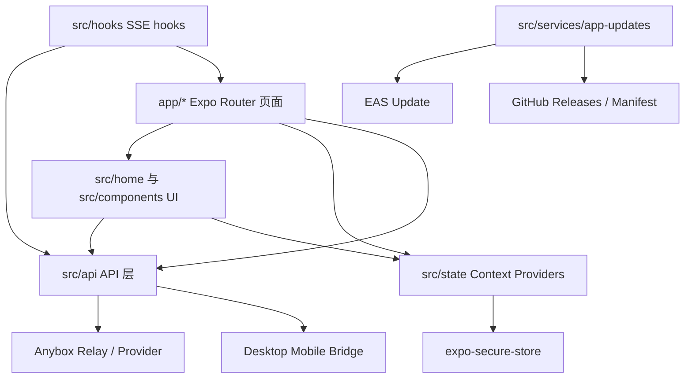
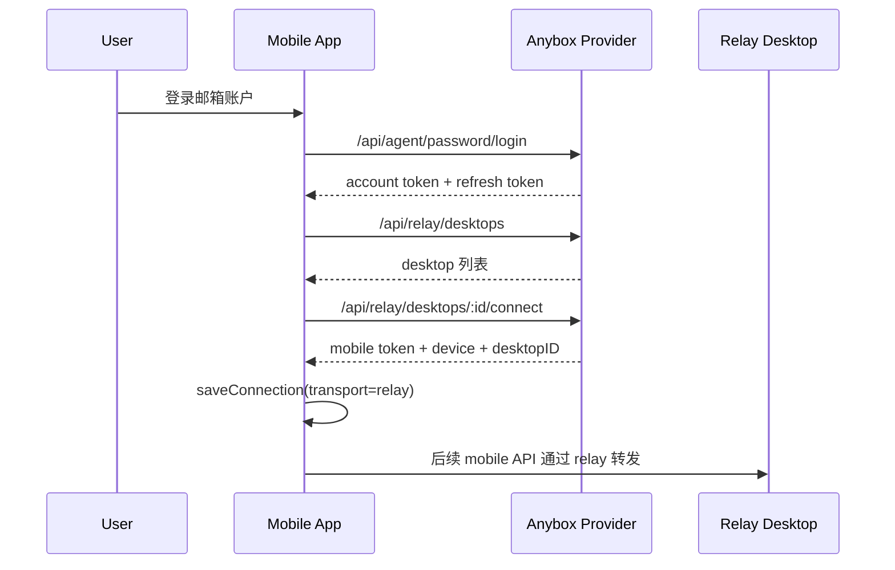

# Anybox Mobile 架构说明

本文档基于当前 `packages/mobile-app` 源码整理，描述手机端项目的模块边界、运行流程、数据流、更新发布和扩展入口。

## 1. 项目定位

Anybox Mobile 是 Anybox 桌面端的 Expo/React Native 手机客户端。它本身不承载核心业务后端，而是通过以下两类通道连接桌面端能力：

- 账户中继通道：手机端登录 Anybox Provider 后，访问云端中继服务，选择在线桌面设备并建立 relay 连接。
- 本地/深链配对通道：手机扫描二维码或打开 `anybox-mobile://` deep link，经过配对后直接连接桌面端 mobile bridge，或通过 relay pairing 连接桌面。

手机端的主要职责是：

- 登录/注册 Provider 账户。
- 保存当前桌面连接和当前工作区/会话焦点。
- 查看工作区、会话、消息、任务、审批、文件和 diff。
- 向桌面 agent 发送 prompt、继续/停止会话、处理审批。
- 检查 OTA 更新和原生包更新。

## 2. 技术栈

| 层级 | 当前实现 |
| --- | --- |
| 应用框架 | Expo `56.x`，React Native `0.85.x`，React `19.x` |
| 路由 | `expo-router`，文件路由位于 `app/` |
| 状态 | React Context + hooks，持久化使用 `expo-secure-store` |
| 网络 | `fetch` + Bearer token，实时事件使用 `react-native-sse` |
| 原生能力 | `expo-camera` 扫码，`expo-updates` OTA，`expo-secure-store` 安全存储 |
| 类型系统 | TypeScript strict mode，`@/*` 指向 `src/*` |
| 构建发布 | Expo/EAS，Android 脚本，iOS native 工程已在 `ios/` |

## 3. 顶层架构



核心设计是让页面和 UI 组件只依赖统一的 `MobileConnection`，由 `src/api/mobile-api.ts` 在内部判断当前连接是 local bridge 还是 relay。这样大部分业务页面不用关心底层通道差异。

## 4. 目录结构

```text
packages/mobile-app/
  app/                       Expo Router 页面与路由入口
  src/api/                   Provider API 与 mobile bridge API
  src/state/                 Account、Connection、Focus 三个 Context
  src/hooks/                 SSE 实时事件订阅 hooks
  src/components/            通用基础 UI 组件
  src/home/                  首页工作台的专用 UI 与格式化逻辑
  src/services/              App 更新检查与版本信息
  src/utils/                 消息、格式化、平台工具
  scripts/                   Android 构建、验收、smoke、release 辅助脚本
  ios/                       Expo prebuild 后的 iOS native 工程
  design/                    移动端设计 mockup
  app.config.js              动态 Expo 配置
  app.json                   Expo 静态配置
  eas.json                   EAS build profile
```

## 5. 路由与页面职责

| 路由文件 | 页面职责 |
| --- | --- |
| `app/_layout.tsx` | 根布局，挂载 `AccountProvider`、`ConnectionProvider`、`FocusProvider`、`UpdateGate` 和 Stack 路由 |
| `app/index.tsx` | 主工作台。处理账户桌面列表、自动连接、deep link、工作区/会话焦点、消息发送与流式展示 |
| `app/account.tsx` | Provider 邮箱登录、注册、刷新、登出 |
| `app/provider.tsx` | 当前 Provider/连接诊断页，展示连接、账户、桌面设备和上下文 |
| `app/scan.tsx` | 相机扫码，只接受 Anybox pairing QR |
| `app/connect.tsx` | 配对确认页，预览 pairing、执行 pair、保存连接、替换旧连接 |
| `app/approvals.tsx` | 全局或会话级审批列表，支持 pending/history 和 allow/deny |
| `app/updates.tsx` | OTA 与原生 app 更新检查、下载/打开更新 |
| `app/workspaces/[workspaceID].tsx` | 工作区详情、会话列表、文件浏览、文件搜索、git diff 摘要 |
| `app/workspaces/[workspaceID]/file.tsx` | 文件预览，支持文本和图片，其他类型显示 unsupported |
| `app/sessions/[sessionID].tsx` | 独立会话页，支持消息、任务、审批、发送、resume、cancel |

首页 `app/index.tsx` 是当前最核心的编排层。它把连接前页面 `ConnectionHomePage`、连接后抽屉 `SessionDrawerPage` 和对话页 `ThreadViewPage` 组合成横向 paging 工作台。具体 UI 被拆到 `src/home/*`，页面文件负责数据获取、状态流转和路由跳转。

## 6. 全局状态

### AccountProvider

文件：`src/state/account.tsx`

负责 Provider 账户会话：

- 从 SecureStore 读取 `anybox.mobile.account.session`。
- 登录、注册、刷新 token、登出。
- token 临近过期时自动 refresh。
- 默认 relay URL 来自 `src/api/account-api.ts` 的配置读取，缺省为 `https://anybox.com.cn`。

账户不是连接的唯一来源。用户可以没有账户，但通过 QR/deep link 保存一个 legacy/local connection。

### ConnectionProvider

文件：`src/state/connection.tsx`

负责当前桌面连接：

- 保存 `baseUrl`、`token`、`deviceID`、`transport`、`desktopID`。
- 使用 `normalizeConnectionInput` 规范化 URL、token、pairing code。
- 存储键包括 `anybox.mobile.baseUrl`、`anybox.mobile.token`、`anybox.mobile.deviceID`、`anybox.mobile.transport`、`anybox.mobile.desktopID`。

当 `transport === "relay"` 且存在 `desktopID` 时，API 层会走 relay adapter；否则走本地 mobile bridge。

### FocusProvider

文件：`src/state/focus.tsx`

负责当前 UI 焦点：

- `workspaceID`
- `sessionID`

这些值也写入 SecureStore，用于重启后恢复上次打开的项目和会话。

## 7. API 层

### Provider/账户 API

文件：`src/api/account-api.ts`

主要接口：

- `registerAccountWithEmail`
- `loginAccountWithEmail`
- `getAccountProfile`
- `refreshAccountSession`
- `logoutAccount`
- `listAccountRelayDesktops`
- `connectAccountRelayDesktop`

它访问 Provider/relay 服务，例如：

- `/api/agent/password/register`
- `/api/agent/password/login`
- `/api/agent/me`
- `/api/agent/oauth/refresh`
- `/api/relay/desktops`
- `/api/relay/desktops/:desktopID/connect`

返回值会在 API 层做 normalization，页面层使用稳定的 TypeScript 类型。

### Mobile bridge API

文件：`src/api/mobile-api.ts`

这是手机端业务 API 的核心。它定义了连接、工作区、会话、消息、任务、文件、审批和事件类型，并统一封装本地 bridge 与 relay bridge。

本地 bridge 直接请求：

```text
{baseUrl}/api/mobile/...
```

relay 连接会通过中继服务转发：

```text
POST {baseUrl}/api/relay/commands
type: mobile.http
payload: { desktopID, method, path, body, headers }
```

流式请求会通过：

```text
POST {baseUrl}/api/relay/mobile/stream
```

主要能力：

- 配对与预览：`previewPairing`、`pairDevice`
- 状态：`getStatus`
- 工作区：`getWorkspaces`、`getWorkspaceDiff`
- 文件：`getWorkspaceFiles`、`searchWorkspaceFiles`、`getWorkspaceFileContent`
- 会话：`createSession`、`getMessages`、`sendPrompt`、`resumeSession`、`cancelSession`
- 任务：`getSessionTasks`
- 审批：`getApprovals`、`getApprovalHistory`、`respondApproval`
- 设备：`revokeCurrentDevice`
- SSE URL：`mobileEventsURL`、`mobileSessionEventsURL`

## 8. 连接与配对流程

### 账户中继连接



首页会在无 connection 且账户已登录时加载桌面设备。如果只有一个在线桌面，会尝试自动连接；也可以由用户手动选择桌面连接。

### QR/deep link 配对

支持的 deep link：

```text
anybox-mobile://connect?url=...
anybox-mobile://pair?code=...&url=...
```

流程：

1. `app/scan.tsx` 通过 `expo-camera` 扫描二维码，或 `app/index.tsx` 通过 `Linking` 接收 deep link。
2. `readConnectionUrlFromDeepLink` 和 `normalizeConnectionInput` 解析连接信息。
3. `app/connect.tsx` 调用 `previewPairing` 展示桌面信息和过期状态。
4. 用户确认后调用 `pairDevice` 获取 device token。
5. `ConnectionProvider.saveConnection` 写入 SecureStore。
6. 如果存在旧连接，会尝试 `revokeCurrentDevice` 撤销旧设备 token。

## 9. 数据刷新与实时同步

项目使用 “SSE 事件触发重新拉取” 的策略，而不是维护复杂的客户端缓存。

### 全局事件

文件：`src/hooks/use-mobile-events.ts`

订阅：

```text
/api/mobile/events/stream
```

关注事件：

- `sync.updated`
- `workspace.updated`
- `session.created`
- `session.updated`
- `approval.requested`
- `approval.updated`

收到事件后延迟约 500ms 调用页面传入的 `onEvent`，通常会重新拉取 status、workspaces、approvals 或 diff。

### 会话事件

文件：`src/hooks/use-session-events.ts`

订阅：

```text
/api/mobile/sessions/:sessionID/events/stream
```

关注 `runtime` 事件，收到后延迟约 350ms 刷新当前会话消息、任务和审批。

`app/sessions/[sessionID].tsx` 还保留轮询兜底：

- SSE 正常但本地有 running action 时，约 10s 轮询。
- SSE 不可用时，约 2.5s 轮询。

## 10. 消息发送与流式展示

发送 prompt 的主要逻辑在 `app/index.tsx` 和 `app/sessions/[sessionID].tsx`：

1. 读取当前 draft。
2. 没有会话时先调用 `createSession`。
3. 添加本地 optimistic user message。
4. 添加本地 streaming assistant overlay。
5. 调用 `sendPrompt`。
6. `requestMobileStream` 读取 SSE 响应，解析 `delta` 或 `runtime/text.part.delta`。
7. `onTextDelta` 持续更新 assistant overlay。
8. 流结束后清理 overlay，并重新拉取真实 messages。

消息显示文本由 `src/utils/message.ts` 负责从 mobile message parts 中解析，optimistic/streaming 合并也在这个工具文件中完成。

## 11. 审批与任务

审批数据类型在 `src/api/mobile-api.ts` 中定义。页面层有两个入口：

- `app/approvals.tsx`：全局或会话级审批列表，支持 pending/history。
- `app/sessions/[sessionID].tsx`：会话内联展示最多两个 pending approvals，并可进入完整列表。

审批动作调用：

```text
POST /api/mobile/approvals/:approvalID/approve
POST /api/mobile/approvals/:approvalID/deny
```

默认带 `resume: true`，表示审批后让桌面 agent 继续工作。

任务数据通过 `getSessionTasks` 读取，用于会话页展示 current、blocked、next 等运行态信息。

## 12. 文件与工作区

`app/workspaces/[workspaceID].tsx` 聚合工作区相关能力：

- 会话列表
- 新建会话
- 文件列表
- 文件名搜索
- git diff 摘要

文件内容页 `app/workspaces/[workspaceID]/file.tsx` 根据 `MobileWorkspaceFileDocument.kind` 渲染：

- `text`：展示文本内容。
- `image`：用 `Image` 加载 `previewUrl`。
- `unsupported`：展示不支持原因。

## 13. 更新与发布

### Expo 配置

`app.config.js` 在 `app.json` 基础上动态注入：

- EAS update URL
- Provider/relay URL
- 原生发布 manifest URL
- GitHub mobile release 配置

`app.json` 配置了：

- scheme：`anybox-mobile`
- Android package：`com.anybox.mobile`
- iOS bundle identifier：`com.anybox.mobile`
- runtimeVersion policy：`appVersion`
- Android 权限：`INTERNET`、`CAMERA`
- iOS 本地网络与相机说明
- Expo plugins：`expo-router`、`expo-secure-store`、`expo-camera`

### App 更新服务

文件：`src/services/app-updates.ts`

支持两类更新：

- OTA：通过 `expo-updates` 检查、下载并 reload。
- 原生包：通过自定义 manifest 或 GitHub Releases 检查新 APK/IPA/TestFlight/App Store 链接。

Android 默认读取 GitHub 仓库 `fanfan-de/anybox`，只接受 `mobile-v*` tag，并寻找：

```text
anybox-mobile.apk
anybox-mobile-release.json
```

`src/components/update-gate.tsx` 会在 app 启动约 2.5s 后检查 required binary update。如果 manifest 标记强制更新或最低版本高于当前版本，会弹出不可取消的更新提示。

## 14. 构建、检查与验收脚本

常用 npm scripts：

| 脚本 | 作用 |
| --- | --- |
| `start` | 启动 Expo dev server |
| `ios` / `ios:dev` | 本地 iOS 运行 |
| `android` / `android:dev` | 本地 Android 运行 |
| `typecheck` | `tsc --noEmit` |
| `doctor` | 移动端环境检查 |
| `smoke` | 移动端 smoke 检查 |
| `android:setup` | Windows Android toolchain 检查/安装辅助 |
| `android:build:debug` | 构建 debug APK |
| `android:install:debug` | 安装 debug APK |
| `android:smoke:debug` | 安装、启动、截图和 fatal log 检查 |
| `android:smoke:pairing` | mock bridge 深度配对 smoke |
| `android:smoke:bridge` | 真实桌面 bridge smoke |
| `android:delivery-check` | APK、截图、校验和交付检查 |
| `android:handoff-check` | 综合交付门禁 |
| `release:github:prepare` | 准备 GitHub mobile release 资产 |
| `update:preview` / `update:production` | 发布 EAS OTA update |

EAS profile 位于 `eas.json`：

- `development`：development client，internal APK。
- `preview`：internal APK。
- `production`：Android app bundle，自动递增版本。

## 15. 当前架构特征

- 页面即编排层：页面文件负责数据请求、错误状态、loading 状态和路由跳转，UI 片段下沉到 `src/home` 或 `src/components`。
- API 层统一通道：所有业务 API 都通过 `MobileConnection` 调用，relay 与 local bridge 的差异被封装在 `mobile-api.ts`。
- 状态轻量：没有 Redux/Zustand 等全局 store，只有三个 Context 和页面本地 state。
- 持久化清晰：账户、连接、焦点分别写入 SecureStore，便于控制 token 和敏感信息。
- 事件驱动刷新：SSE 只作为通知信号，收到事件后重新拉取服务端权威数据。
- 连接可替换：新连接成功后会保存新 token，并尝试撤销旧 device token。
- 更新双轨：JS/UI 走 EAS OTA，原生能力变更走 GitHub Releases 或 manifest 指向的二进制包。

## 16. 扩展建议

新增功能时建议遵循现有边界：

1. 新 mobile bridge 能力先在 `src/api/mobile-api.ts` 增加类型和函数。
2. 跨页面持久状态放入 `src/state/*`，页面局部状态保留在页面内。
3. 通用 UI 放 `src/components/*`，首页专用 UI 放 `src/home/*`。
4. 需要实时更新时优先复用 `useMobileEvents` 或 `useSessionEvents` 的 “事件后重新拉取” 模式。
5. 新路由放入 `app/`，并在 `app/_layout.tsx` 注册 Stack screen。
6. 涉及原生权限、scheme、更新源或 build profile 时同步修改 `app.json`、`app.config.js` 或 `eas.json`。

