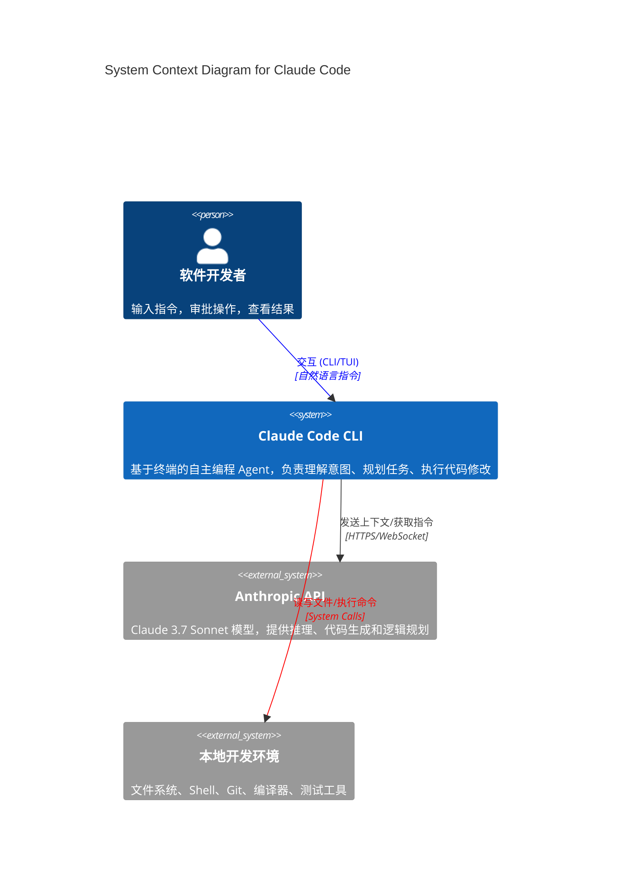
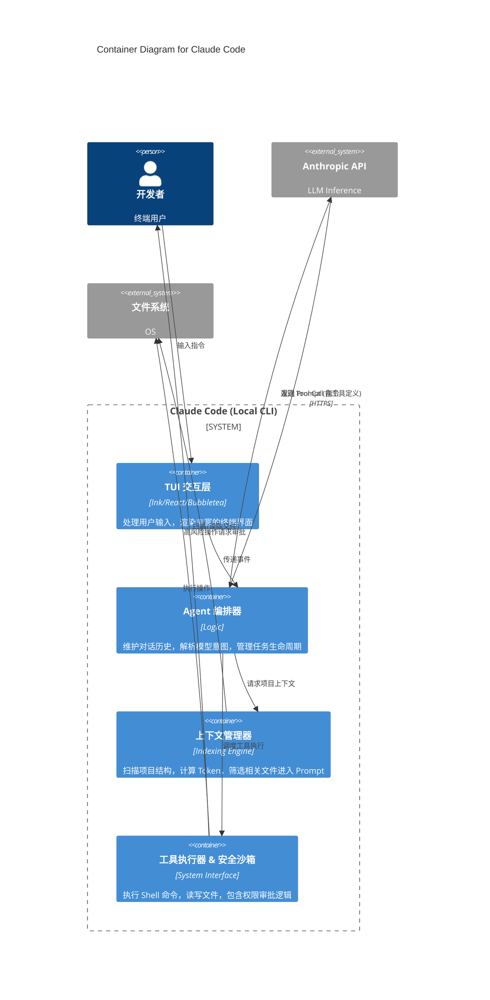
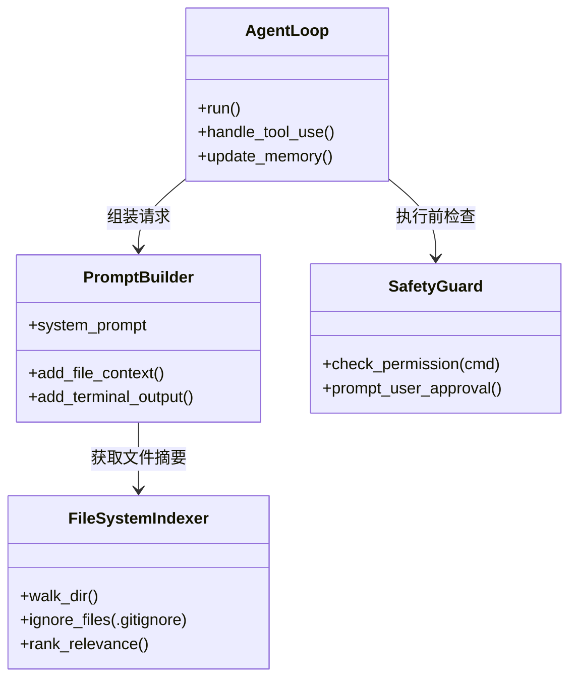

这是一个非常好的实战题目。**Claude Code** 是 Anthropic 最新发布的基于终端（Terminal）的 AI 编程助手（Agent）。与 GitHub Copilot（IDE 插件）不同，Claude Code 是一个**自主代理（Autonomous Agent）**，它直接运行在你的 shell 中，拥有操作文件系统和运行命令的权限。

用 **C4 模型** 来拆解它，能非常清晰地展现 **“端云协同（Edge-Cloud Collaboration）”** 和 **“Agent 架构”** 的特点。

---

### Level 1: System Context Diagram (系统上下文)
**目标：** 展示 Claude Code 在宏观世界中的位置，它与谁交互？

*   **核心对象：**
    *   **Developer (用户)：** 发出指令，审批高风险操作。
    *   **Claude Code (待分析系统)：** 运行在本地终端的 CLI 工具。
    *   **Anthropic API (外部系统)：** 提供大模型智力（Claude 3.7 Sonnet）。
    *   **Local Environment (外部系统)：** 用户的操作系统、文件系统、Git 仓库、其他开发工具（如 npm, pytest）。

**分析重点：**
*   Claude Code 充当了**“大脑（API）”**和**“手（本地环境）”**之间的**桥梁**。
*   安全边界（Trust Boundary）非常关键：AI 想要在本地执行 `rm -rf`，必须经过用户审批（Human-in-the-loop）。

---

### Level 2: Container Diagram (容器/服务架构)
**目标：** 打开 Claude Code 这个“黑盒”，看看它由哪些独立运行的技术单元组成。

由于 Claude Code 是一个单体 CLI 应用（通常是 TypeScript/Rust/Go 编译的二进制），这里的“容器”更多指逻辑上的**子系统**。

*   **User Interface (TUI)：** 漂亮的终端交互界面，负责渲染 Markdown、Diffs。
*   **Agent Orchestrator (核心引擎)：** 维护会话状态，管理“思考-行动”循环（ReAct Loop）。
*   **Tool Sandbox (工具箱)：** 封装了文件读写、Bash 执行、Git 操作的能力。
*   **Context Manager (上下文管理)：** 最关键的部分。如何把几万个文件的仓库塞进 Prompt？它负责做 RAG（检索增强生成）或文件树压缩（Pruning）。

**分析重点：**
1.  **Context Manager 是核心壁垒：** Claude Code 之所以好用，是因为它懂得如何“阅读”你的代码库。它不会把所有文件都发给 API（太贵且超长），而是通过文件树摘要、相关性搜索来构建 Context。
2.  **安全沙箱（Tool Executor）：** 这是企业级 Agent 的必备组件。它拦截了模型发出的 `execute_command` 指令，判断是否需要用户确认（Y/N）。

---

### Level 3: Component Diagram (组件详情)
**目标：** 深入 **Agent Orchestrator** 和 **Context Manager** 内部。

我们假设 Claude Code 是用 TypeScript 编写的（基于 Anthropic 团队的技术栈偏好），内部组件可能如下：

**关键组件解析：**

1.  **Thinking Loop (AgentLoop):**
    *   这是 Agent 的心脏。它是一个 `While` 循环：
    *   `观察(Observation)` -> `思考(Thought)` -> `行动(Action)` -> `结果(Result)`。
    *   Claude Code 的特点是它具有**“多步规划能力”**，它可以连续执行：`grep 查找错误` -> `根据结果 cat 读取文件` -> `edit 修改代码` -> `pytest 验证修复`。

2.  **Permission System (SafetyGuard):**
    *   分类拦截：
        *   **安全操作（Safe）：** `ls`, `grep`, `cat` (只读操作，自动放行)。
        *   **风险操作（Risky）：** `rm`, `mv`, `edit`, `git push` (通常需要用户按回车确认)。
    *   这解决了“AI 发疯删库”的恐惧。

3.  **Cost Controller (成本控制组件):**
    *   (图中未画出但逻辑存在) 监控 Token 使用量，并在 TUI 中实时显示“本次操作预计花费 $0.05”。这也是架构的一部分。

---

### 总结：Claude Code 的架构启示

通过 C4 分析，我们可以看出 Claude Code 与传统 IDE 插件（如 Copilot）的本质架构区别：

1.  **主动权反转：** Copilot 是“补全”，是你写一半它帮你写；Claude Code 是“代理”，是你下命令，它自己去跑一连串的命令。架构重心从 **Text Editor** 转移到了 **Shell Environment**。
2.  **状态管理：** Level 2 中的 Orchestrator 极其重要。它必须记住之前的报错信息、尝试过的修复方案，这需要一个强大的本地 Session 存储。
3.  **宽带上下文：** 为了让 AI 理解整个项目，**Context Manager** 组件做的事情比 LLM 本身还多（文件树剪枝、相关性排序）。

如果你想成为具有架构能力的程序员，试着模仿 Claude Code 写一个简单的 **CLI Agent**（哪怕只是封装一个 API 调用的 Loop），你会深刻理解 **Tool Calling** 和 **System Prompt** 的架构设计挑战。